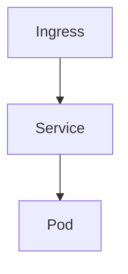

# AXIT 플랫폼 연동 계획

> [복원] 2026-08-01 — 에이전트 질의 이력(원문 인용 구간) 및 구현 코드 기준으로 복원함.  
> 83–138행 등 일부 구간은 원문이 남아 있지 않아 재구성했으며, 표기·오타는 원 질의를 우선함.

## agentruntime 테이블 정의
다음 환경변수를 테이블에 저장한다.
- 컬럼
  - idx int pk, auto increment
  - type int, 0 -> mockup, 1 -> 외부연동(https)
  - token_url varchar(200)
  - agent_url varchar(200)
  - agent_name varchar(50)
  - agent_id varchar(50)
  - description varchar(255)
  - registered_date date
  - service_id varchar(20)

- 로컬 테스트용 초기 데이터는 다음과 같다.
  - type : 0
  - token_url : "http://127.0.0.1:8080/portal/auths/v1/token"
  - agent_url : "http://127.0.0.1:8080/aihub/agents/v1"
  - agent_name : 기존 agents 테이블의 name
  - agent_id : "00000000-0000-4000-8000-000000000001" 포맷으로 랜덤 생성
  - desription : 기존 agents 테이블의 role
  - service_id : "prvops"

## 로컬 목업은 다음 API 를  제공한다. 백엔드와 목업은 정의된 API로 연동/통신한다
- 토근 발급
  - endpoint : {agentruntime:token_url}
- agent chat
  - endpoint : {agentruntime:agent_url}/{agentruntime:agent_id}

## 스키마 보완
- registered_date 는 date 가 아닌 datetime 으로 시각이 포함되도록 변경한다.
- mock 모드용 로컬 에이전트 매핑을 위해 `local_agent_id` 컬럼을 추가한다.

## 정의 소스 통합
1. 정의 소스 통합
- 로컬에서 테스트 할 수 없는 서버 환경에서는 AGENT_DEFINITIONS를 사용하지 않는다. 서버 환경은 에이전트 동작을 모두 외부 시스템으로 deligate 한다. 즉 외부 시스템이 제공하는 API 만 사용할 수 있다.
- 목업을 사용한 로컬 테스트에서는 AGENT_DEFINITIONS(코드) 중심으로 처리가 되게 하며 서버가 제공할 API를 최대한 흉내낸다
- agentrumtime 은 서버에서 제공하게 될 agent의 명세를 저장한다. 주요 내용은 에이전트 이름, ID, token API endpoint, chat API endpoint, service id 이다.
2. agentruntime 시드
- agents 테이블에서 동적으로 읽어오지 말고 AGENT_DEFINITION을 기준하도록 한다
3. resolve_local_agent_id
— build_axit_agent_id 역매핑을 agentruntime 기반으로 변경
4. 사용자 할당 검증
— list_stored_agents → AGENT_DEFINITIONS
5. job_planning은 연관 기능과 테이블을 제거한다.
6. agent_records API·UI — 제거 또는 agentruntime 기반으로 교체
7. DB 초기화 — seed_initial_agents, sync_missing_agents, schema.sql의 agents DDL 제거
8. inventory 에이전트 제거, 관련 기능 모두 삭제

## AGENT_RUNTIME_MODE
AGENT_RUNTIME_MODE = mock 인 경우 agentruntime 의 type = 0 을 참조한다.
AGENT_RUNTIME_MODE = http 인 경우 agentruntime 의 type = 1 을 참조한다.

## 에이전트 > 에이전트 연결 메뉴 추가
"에이전트 연결" 메뉴는 agentruntime 테이블을 관리하기 위한 메뉴이다.
- 에이전트 연결 메뉴 클릭시 popup 이 아닌 전체 화면으로 다음 타이틀로 목록을 출력한다
  - 에이전트 연결 목록
    - idx 컬럼은 표시하지 않는다.
    - 오른쪽 상단에 추가 버튼을 두고 추가 버튼 클릭시 팝업으로 입력 폼을 생성
    - row의 마지막 컬럼에 수정/삭제 버튼을 배치
    - 수정 버튼 클릭시 수정 폼 팝업
      - 수정폼에 업데이트/닫기 버튼 배치, 업데이트 버튼시 확인을 통해 다시 물어본다
      - 닫기 버튼시 팝업창을 닫는다
    - 삭제 버튼 클릭시 확인을 통해 다시 물어본다.
    - row 에 복제 버튼을 추가한다
      - 추가 기능과 동일한 팝업을 띄우고 해당 row의 데이터를 미리 설정한다
- 추가/복제 폼에 type(유형) 입력 필드를 둔다.
  - 0 = 목업(mock), 1 = 외부연동(http)
  - 복제 시 원본 row 의 type 을 미리 채운다.

## 관리자 작업 메뉴에 postman debugging 기능 추가
환경설정 > 관리자 작업 > postman 추가, 선택시 popup 창으로 다음 정보를 입력, 실행할 수 있는 기능을 추가한다.
- 입력 정보
  - 호출정보 : text 박스로 입력받음
  - 전송/닫기 버튼
  - 전송 버튼 클릭시 호출정보의 원문 그대로 http 전송, 결과를 받음
- 출력 정보
  - 동일한 입력 popup 창 하단에 결과를 출력한다.

## AXIT 플랫폼 HTTP 연동 (서버 환경) [재구성]
`AGENT_RUNTIME_MODE=http` 일 때 외부 AXIT 플랫폼 API 로 에이전트를 실행한다.

### 환경변수
다음 값은 환경변수로 관리한다. (`TOKEN_URL`, `AGENT_URL`, `CLIENT_ID`, `CLIENT_SECRET`, `SERVICE_ID` 또는 `AXIT_*` 별칭)

| 모드 | TOKEN_URL / AGENT_URL 기본값 |
|------|------------------------------|
| mock (type=0) | `{CONTROL_PLANE_BASE_URL}/portal/auths/v1/token`, `{CONTROL_PLANE_BASE_URL}/aihub/agents/v1` |
| http (type=1) | `https://test.nudp.lguplus.co.kr/portal/auths/v1/token`, `https://test.nudp.lguplus.co.kr/aihub/agents/v1` |

- mock 기본 인증: `mock-client-id` / `mock-client-secret`
- http 기본 인증: `4afb927e-74fe-400f-81d6-c01c369757ae` / `23pXFlLdy5LhYbHbJvBZcDe5P84EXVmZPjxzI-hEwX8`
- `SERVICE_ID` 기본: `prvops`

### 토큰 발급
- `POST {TOKEN_URL}`
- `Authorization: Basic base64(client_id:client_secret)`
- `Content-Type: application/x-www-form-urlencoded`
- body: `grant_type=client_credentials`
- `access_token` 이 null 이면 실패 처리
- 발급된 토큰은 60분 TTL 로 캐시한다.
- 토큰 발급 요청/응답은 상세 로그를 남긴다.

### 에이전트 invoke
- 일반 에이전트(type=1): `POST {AGENT_URL}/{agent_id}/invoke`
- 일반 에이전트 목업(type=0): `POST {AGENT_URL}/{agent_id}`
- 협업 에이전트(`is_orchestrator=1`): `POST {ORCHESTRATOR_URL}/{agent_id}/invoke`
  - 기본 경로: `/aihub/orchestrators/v1/{agent-id}/invoke`
- `Authorization: Bearer {access_token}`
- 요청 JSON:
  - `service_id`, `session_id`(UUID), `session_attributes`, `prompt_session_attributes`, `enable_trace`, `text`
- 응답 JSON:
  - `text`, `retrieval_results`, `trace`

### 로컬 목업 API (`axit_mock.py`)
- 백엔드가 위 계약을 직접 제공하여 mock 모드에서 외부 AXIT 를 흉내낸다.
- 목업 invoke 수신 후 `local_agent_id` 로 로컬 LangGraph 실행에 위임한다.

### 헬스체크 정책 (http 모드)
- AXIT 플랫폼과 관리하는 에이전트들은 모두 람다로 개발되어 헬스체크의 의미가 없다. 무조건 살아 있다고 가정한다.
- 단, 한번이라도 invoke API 호출에 오류가 있다면 상태이상(`degraded`)으로 간주한다.
- 상태이상일 때도 클라이언트의 요청을 받을 수는 있다.

## agentruntime 테이블 정리
- agentruntime 테이블의 불필요 컬럼 정리
  - token_url, agent_url 은 환경변수로 고정 설정하여 더이상 테이블에서 필요 없다. 삭제

## 대시보드 반영
- agentruntime 에 에이전트 연결이 추가·수정·삭제되면 실시간으로 대시보드에 반영한다.
- Runtime(sandbox) 표시 명칭을 **Runtime (AX플랫폼)** 으로 변경한다.

## UI 정리
- 대시보드의 메뉴바 아래에 있는 API, Runtime 등 헬스체크 배지는 불필요하다. 삭제한다.
  - 관련 기능도 dead code 인 경우 삭제한다
- 다음 정보는 추출이 불가하므로 삭제한다.
  - 대시보드 에이전트 타일의 등록된 MCP 도구 목록
- 전체 화면 비율을 조정한다.
  - 대시보드/상세정보(중앙 패널) : 대화형 터미널(오른쪽 패널) 의 가로 비욜을 마우스 드래그로 조절할 수 있게 변경

## 중간 체크 - 260801

## UI 정리
- 사용자 조회 화면에서 테이블 컬럼의 체크박스는 삭제하고, 대신 삭제/수정 버튼은 각 row 의 마지막 컬럼에 배치한다. 체크박스 선택없이 삭제/수정하도록 변경한다
- 공지사항 목록 조회에서 체크박스는 삭제하고 삭제 버튼을 각 row의 마지막 버튼 컬럼에 배치한다. 체크박스 선택없이 삭제되도록 변경한다.(수정 버튼과 동일)

## 목업 에이전트 추가
- agentruntime 에 다음 에이전트를 추가한다. 이 에이전트 정보는 init schema 에 추가하지 않는다
  1. 에이전트 이름 : Whatap 이벤트 수신 
    타입 : 목업
    agent_id : 랜덤 생성
    local agent id : whatap-event
    설명 : Whatap 에서 이벤트를 수신하고 처리
    service id : prvops

  2. 에이전트 이름 : 작업 접수/계획
    타입 : 목업
    agent_id : 랜덤 생성
    local agent id : job-scheduler
    설명 : 채널을 통해 작업 요청을 수신/계획 수립
    service id : prvops

  3. 에이전트 이름 : 아키텍처 분석
    타입 : 목업
    agent_id : 랜덤 생성
    local agent id : archi-analysis
    설명 : 인프라의 설계 구성 분석/도식화
    service id : prvops

  4. 에이전트 이름 : 헬프데스크
    타입 : 목업
    agent_id : 랜덤 생성
    local agent id : helpdesk
    설명 : 문의응대
    service id : prvops

- 위 네 개의 에이전트는 목업 테스트시만 에이전트로 등록되며 다음 정보를 목업 정의 코드에 정적으로  적용한다.
  1. whatap-event
    - 도구 : 없음
    - 다음 에이전트를 호출할 수 있다.
      - dprv-k8s, dprv6-k8s, pcicd-k8s, dprmn-k8s, dtest-k8s, dpvs-k8s, dprsv-k8s, dprrt-k8s, dkvrt-k8s
    - 시스템 프롬프트
      - 당신은 Whatap APM 으로부터 이상징후 발생시 webhook를 통해 이벤트를 수신받을 수 있다. 수신받은 이벤트의 인프라를 찾아 적절한 에이전트에 분석을 요청한다.
  2. job-scheduler
    - 도구 : 없음
    - 다음 에이전트를 호출할 수 있다.
      - dprv-k8s, dprv6-k8s, pcicd-k8s, dprmn-k8s, dtest-k8s, dpvs-k8s, dprsv-k8s, dprrt-k8s, dkvrt-k8s
    - 시스템 프롬프트
      - 당신은 요청받은 사용자 요청을 분석하고 작업 계획을 수립합니다.
  3. archi-analysis
    - 도구 : 없음
    - 다음 에이전트를 호출할 수 있다.
      - dprv-k8s, dprv6-k8s, pcicd-k8s, dprmn-k8s, dtest-k8s, dpvs-k8s, dprsv-k8s, dprrt-k8s, dkvrt-k8s
    - 시스템 프롬프트
      - 당신은 인프라 아키텍처를 분석하고 도식화하는 에이전트입니다. 인프라의 구조도를 mermaid 차트로 출력합니다.
  4. helpdesk
    - 도구 : 없음
    - 다음 에이전트를 호출할 수 있다.
      - dprv-k8s, dprv6-k8s, pcicd-k8s, dprmn-k8s, dtest-k8s, dpvs-k8s, dprsv-k8s, dprrt-k8s, dkvrt-k8s
    - 시스템 프롬프트
      - 당신은 인프라 문의 응대 에이전트입니다. 사용자의 요청을 받으면 어떤 인프라인지를 확인하고 적절한 에이전트를 호출하여 정확한 답변을 전달합니다.

- agentruntime 에서 사용자 직접 문의 가능을 구분한다.
  - agentruntime 에 다음 컬럼을 추가한다.
    - talkable boolean : default true
  - 테이블에서 다음을 제외하고 모두 talkable 을  true 로 설정한다.
    - whatap-event, job-scheduler
  - talkable 이 true 인 경우에만 대화식 터미널의 에이전트 선택창에 표시한다(즉 UI를 통해 사용자가 메시지를 보낼 수 있다)

- agentruntime 테이블에 컬럼 추가
  - is_orchestrator boolean : default false
  - helpdesk, whatap-event, job-scheduler, achi-analysis 는 true 이다.
  

- archi-analysis 에이전트의 system prompt 에 다음 내용을 보완한다

1. Select an appropriate agent capable of extracting information about the requested infrastructure and extract the infrastructure information.
2. Create a Mermaid diagram text block based on the extracted infrastructure information.
3. Add a Mermaid diagram text block to the agent response.

- 대화형 터미널 > 대화창 영역에 세션 초기화 버튼을 추가한다. 세션 초기화 버튼 클릭시 에이전트를 호출할 때 SESSION UUID 를 새로 생성한다.

## 목업용 LLM 선택
환경설정 > 관리자 작업 > (목업)LLM 변경 메뉴 추가
- 목업 환경에서 선택가능한 LLM 은 두 가지 이다.
  - 기존 local llm : 경로 등 설정 정보는 동일함
  - OpenAI
    - https://api.openai.com/v1
    - API key : sk-proj-8Pr3XXXXXXXXXXXXXXPqSrMA

- mermaid diagram redering 기능 추가 이후, diagram 이 표시되면 주기적인 refresh 가 발생한다. 원인을 파악
- openai API 를 호출할때는 과금이 발생하므로 응용에서 호출하기 전에 확인 창을 통해 확인 후 수행하도록 변경하고 확인시 질의 prompt 를 표시

- mermaid diagram 출력 시 오른쪽 상단에 다음 버튼을 추가한다
  1. 다운로드 버튼
  2. 확대/축소 버튼 

- archi-analysis 에이전트의 system prompt 에 다음 내용을 보완한다. 주요 변경사항은 mermaid diagram 대신, D2 diagram을 사용한다. 3번 prompt 아래 간단한 D2 다이어그램 샘플 텍스트를 추가한다

1. Select an appropriate agent capable of extracting information about the requested infrastructure and extract the infrastructure information.
2. Create a D2 diagram text block based on the extracted infrastructure information.
3. Add a D2 diagram text block to the agent response.

- archi-analysis 에이전트의 시스템 프롬프트에 다음 내용을 추가한다(영문으로 변환 후 적용)

다음은 각 인프라 manifest 별 다이어그램 형식이다.
- configmap : document
- pvc : cylinder
- secret : document
- pod : oval
- VM 인스턴스 : rectangle
- deployment : page
- statefulset : page
- daemonset : page
- serviceaccount : person
- ingress / route : circle
- service : rectangle
- datastore : cylinder
- datacenter : cloud
- network : hexagon
- namespace : cloud
- resourcequota : rectangle

각 다이어그램은 이름과 인프라의 manifest 타입을 함께 출력한다 

- archi-analysis 에이전트의 시스템 프롬프트에 다음 내용을 추가한다(영문으로 변환 후 적용)
각 인프라 분석 및 다이어그램 작성시 유의사항
1. namespace 와 resourcequota
2. secret, configmap, serviceaccount, pvc 는 어떤 pod 에서 참조되는지를 확인하고 참조될 경우 이를 표현한다.
3. pvc 는 pod 에서 마운트 된 경로를 파악하고 다이어그램에 표시한다.
4. ingress / route 는 서비스 도메인과 secure 여부(https/http) 확인하고 다이어그램에 표시
5. service 분석시 port 를 확인, 다이어그램에 표시
6. deployment, statefulset 은 replica 개수 표시
7. daemonset 은 nodeSelector 표시

## 협업 에이전트 API 경로 변경
agentruntime.is_orchestrator 값이 1인 경우 협업 에이전트이다.
협업 에이전트는 다른 에이전트를 사용할 수 있다.
협업 에이전트의 API 호출 경로는 다음과 같이 변경한다.
- /aihub/orchestrators/v1/{agent-id}/invoke

## init data 제외
백엔드 재시작시 agentruntime 테이블에 init 데이터는 추가하지 않는다.

## 작업요청서 수신기 데몬을 추가
작업요청서 수신기는 AI 에이전트가 아니며 백엔드의 기능으로 API 로 노출한다.
이 데몬은 mock/http 모드 모두 사용한다.
json 포맷으로 전송을 받는다. job_format.json 참조
요청받은 job 은 다음 테이블에 저장한다.

- jobs
 - srnum varchar, format : {"SR" + YYMMDD + "_" + #####} 자동 생성
 - status_code int, 0:접수, 1:승인자배당완료, 2:에이전트처리요청, 10:처리완료(성공), 11:처리완료(실패), 12:작업반려
   - 작업요청서 수신 데몬에 최초 접수, record 생성시 status_code 는 0 이다
 - approver_registered_date : datetime
 - 그 외 컬럼
   - job_format.json 포맷에 맞춰 컬럼 생성

### api/jobs 기능 보완
api/jobs 를 통해 DB에 입력시 job_content 의 html 양식은 모두 제거한다. plain text 로 DB에 입력 -> 원복

## api/jobs 를 처리할 UI 구현하기 위한 UI 레이아웃 변경
대시보드의 전체 레이아웃을 다음과 같이 수정한다.
- 에이전트 노드 목록
  - 에이전트 노드를 grid 배열이 아닌 stack 으로 세로 한줄로 배열한다.
  - "작업 노트" 창을 새로 생성한다. "작업 노트" 의 레이아웃 배치는 다음과 같다.
    - 에이전트 노드 목록 | 작업 노트 | 대화형 터미널
    - 하단 "상세 정보" 창은 상단 "에이전트 노드 목록" + "작업 노트" 창 의 합산 가로 길이를 유지한다.

## 작업 노트
작업 노트 창에 다음 탭을 추가한다.
- 작업 검토 : jobs 테이블에 적재된 작업을 관리한다.
  - 작업 검토 탭
    -  left : "작업 목록", right : "작업 상세" 로 레이아웃 한다.
    - 작업 목록
      - row 에 srnum 를 텍스트 레이블 버튼으로 렌더링하여 표시
      - row 클릭시 right 패널에 세부 정보를 표시한다.
        - job_title
        - requester_name
        - request_date
        - job_content : html 포맷을 렌더링 하여 화면 표시
  - jobs 태이블 컬럼 추가
    - approver varchar(20)
  - 작업목록 보완
    - approver가 없는 경우 "작업 목록" 의 레이블 버튼은 분혹색으로 표시한다.
  - 작업 상세 패널 : 작업 승인자 지정
    - jobs.approver 가 없는 경우 하단에 "작업 승인자"를 지정할 수 있게 한다. 작업 승인자 대상은 users 테이블의 전체 사용자이며 username 으로 표시한다.
    - 작업 승인자 적용 버튼을 같은 행에 배치한다. 적용버튼을 클릭하면 확인을 통해 물어보고 적용(jobs.approver에 update) 하고 jobs.approver_registered_date 에 현재 시간을 업데이트 한다. status_code 는 1 로 변경한다.

  - 작업 승인자 적용 teams 회신 - 보류
방안 문의) 작업 승인자가 지정되면 원 메시지를 전송한 팀즈의 채널/게시글에 스레드 답글로 지정되었다는 메시지를 보내고 싶다. 팀즈 채널 설정(웹훅) 등 설정 방안과 백엔드에서 수정해야 할 부분을 검토, jobs 테이블에는 team_id, channel_id, message_id 가 저장되어 있다

  - 작업 승인자 지정 적용 버튼 옆에 직접승인 버튼을 배치한다. 직접승인시 확인을 하고 다음과 같이 처리된다.
    - jobs.approver 는 로그인한 사용자(직접승인을 클릭한 사용자)이다.
    - status_code 를 2 로 업데이트한다.
  
작업 노트 창에 다음 탭을 추가한다.
- 나의 검토작업 : jobs.status_code 가 1인 job 목록 중 approver 가 로그인 한 사용자인 job 을 출력한다. 패널의 형식은 "작업 검토"와 동일하다.
- "작업 상세" 패널의 하단 작업 승인자 적용은 없다. 대신 승인 / 반려 버튼을 배치한다.
  - 승인 시 확인을 하고 승인된 작업은 status_code : 2 로 업데이트한다.
  - 반려 시 확인을 하고 status_code : 12 로 업데이트한다.

## 작업요청서 수신기 데몬에서 에이전트에 작업 위임
- jobs.status_code = 2 인 작업에 대해 에이전트에 작업을 지시하고 결과를 받는다.
  - 주기적으로 jobs.status_code 를 폴링한다. 폴링 주기는 60초이다.
  - 비동기 처리한다.
  - 요청을 전송할 에이전트는 다음과 같다.
    - 목업 환경에서는 agent id : helpdesk 로 요청한다.
    - axit runtime 환경에서는 agent id : HELPDESK_AGENT 로 요청한다.
  - 답변의 결과를 다음 테이블에 업데이트한다.
    - jobs_result
      - srnum varchar
      - result text
      - complete_date datetime
    
작업 노트 창에 다음 탭을 추가한다.
- 나의 작업결과 : jobs.status_code 가 10 이상인 job 목록 중 approver 가 로그인 한 사용자인 job 을 출력한다. 
- 패널의 형식은 left 는 동일하나 right 는 "작업 결과" 패널이다.
- "작업 결과" 패널에는 jobs_result, complete_date 를 보여주며, jobs_result가 md 인 경우 렌더링해서 출력한다.
  - jobs.status_code 가 실패(11)라도 동일하게 result 결과를 보여준다.
  - 재작업 버튼을 배치한다. 재작업 시 확인 후 jobs.status_code 를 2로 업데이트하고 재처리하도록 한다.
  
작업 노트 창에 다음 탭을 추가한다.
- 나의 노트 : 이 탭은 작업결과, 채팅응답 등에서 내용을 복사하여 편집할 수 있도록 하는 작업 공간이다.

  - mynotes 테이블 생성
    - userid varchar : 로그인한 사용자의 userid
    - note_name varchar(50) : 노트의 이름. 없을시 {생성시각} 으로 자동 생성
    - create_date datetime : 노트 생성 시각
    - origin_file varchar(200): 실제 파일 경로
    - last_update datetime : 마지막 업데이트 시각
  - 컨텐트 원본은 파일로 저장한다.
    - 경로 : data/mynotes/{userid}/{create_date}.md
  - 패널 구성
    - left : 노트 목록을 텍스트 레이블 버튼으로 표시, note_name 을 기반으로 한다.
    - right : 노트 편집 화면, 신규 생성시 빈공간이며, 컨텐트 원본에 내용이 있는 경우 md 를 렌더링한다. d2 다이어그램이 있는 경우 d2 도 렌더링한다.
      - right 패널의 내용은 10초에 한번씩 자동 저장한다.
  - 패널 바깥쪽 상단 헤더 오른쪽에 다음 버튼을 배치한다.
    - 세로운 노트 -> 추가적인 확인을 하지 않고 바로 mynotes 테이블에 record 를 insert 하고 원본 파일을 생성한다.
    - 노트 삭제 -> 이 버튼은 right 패널에서 노트가 선택되었을 경우만 활성화된다.
      - 노트 삭제를 클릭하면, 확인을 거쳐 노트를 삭제한다. 삭제 대상은 mynotes 테이블 레코드와 컨텐트 원본 파일이다.
    - 이름 변경 -> 이 버튼은 right 패널에서 노트가 선택되었을 경우만 활성화된다.
      - 팝업창을 띄우고 노트 이름을 입력받는다. 저장시 별도로 확인하지 않는다. note_name 에 업데이트한다.

  - 나의 작업결과 탭에서 처리결과 의 내용을 출력하는 블럭의 오른쪽 상단에 "노트로 복사" 버튼을 생성한다.
    - "노트로 복사" 시 mynotes 에 신규 노트를 생성하고 내용을 복사한다. 
    - 복사가 성공하면 "나의 노트" 탭으로 자동 이동하고, 복사된 노트를 자동 선택하도록 한다.

  - 대화형 터미널에서 응답 메시지 영역에도 "노트로 복사" 버튼을 오른쪽 상단에 생성한다.
    - 복사가 성공하면 "나의 노트" 탭으로 자동 이동하고, 복사된 노트를 자동 선택하도록 한다.

  - 나의 노트 > 노트 편집 패널
    - 미리보기를 함께 출력하지 않고 텍스트 레이블 버튼으로 구분한다.
    - "노트 편집" "미리보기" 두 개의 버튼을 배치하고 default 화면은 "노트 편집"이다 

  - d2 다이어그램 스케일
    - 대화형 터미널에서 d2 다이어그램 렌더링시 width를 대화창의 가로 크기에 맞춰서 확대/축소 하고 세로 길이는 scroll 이 생기지 않도록 렌더링 창의 크기를 설정한다.
    - 대화창이 전체화면이 되면 가로 100% 스케일하고 세로는 마찬가지로 스크롤바를 만들지 않는다.
    - 나의 노트로 복사한 경우도 동일하다

## Redis 추가
Redis를 세션 서버, 캐시 용도로 사용하기 위해 추가한다. 향후 프로세스는 3개(redis, backend, frontend) 가 동작한다.
Redis는 배포시 패키징 하지 않는다.
- ver : 8.10.0

백엔드는 Redis 와 연결해야 한다.
세션 버버 용도로 사용하고, 앞서 제시한 방안B 를 구현한다.
 - B-2 옵션으로 진행한다.
 - B-3 madang 연동은 madang IDP 에서 ID/PW 만 체크하며 세션 관리는 B-2 와 동일하다. -> 일반적으로: madang 로그인 성공 → 자체 session_id 발급
 - 슬라이딩 + 백엔드 조합으로 진행

작업 노트 > 나의 노트 에서 문서 편집은 redis 를 메인으로 사용한다.
  - userid + 노트명 조합으로 key 를 생성하고 컨텐트는 redis 에 저장한다.
  - redis에 저장되는 컨텐트는 자동저장 로직이 필요하지 않지만 파일시스템으로 영구 저장이 필요하다. 300초 주기로 파일 write 를 한다.
  - redis가 재기동되어 key 가 없을 경우를 감안하여 없을 경우 DB 에서 redis 로 적재하는 로직도 검토한다.

작업검토 : 작업상세 패널, 나의 작업검토 : 작업상세 패널, 나의 작업 : 작업결과 패널 에서
각 항목의 레이블의 가시성이 떨어진다. 텍스트 레이블 버튼 형식으로 가시성을 보강한다

이 케이스는 텍스트 레이블 버튼이 더 어울리지 않는것 같다. 볼드체 + 밑줄 + 폰트 크기증가(+2px) 로 바꾸고 이모지 뷸릿을 앞에 붙인다. 그리고, 처리결과를 제외하고 모두 레이블 오른쪽에 내용을 붙인다.

"작업 내용" 항목의 내용을 아래에 붙인다.
모든 각 레이블 끝에 구분자 "ex) : " 를 붙인다.

작업 결과 > 상태 의 내용은 텍스트 레이블 버튼으로 한다

## 작업요청서 수신기에서 작업 승인후 에이전트 호출 오류
작업요청서 수신기 데몬에서 에이전트에 작업 위임시 agentruntime.is_orchestrator 값을 고려하여 에이전트 URL 을 적용하지 않는다. 

## 모든 에이전트 응답시간에 따른 504 에러
http 모드에서 에이전트의 응답시간이 길어질 수 있다. 에이전트는 실제로 수분 동안 처리, 성공하였으나 백엔드에서 504 bad gateway 가 발생한다.

AXIT 플랫폼 120초 타임아웃(504)에 대해 추가 분석 샘플이 있다.
- server-samples/agentApi.js, server-samples/apiClient.js 추가 분석

## SRNUM
jobs.srnum 마지막 5자리 숫자 인덱스 생성에 오동작이 있음. 아래 정의된 포맷에서 YYMMDD 가 바뀌면(즉 날짜가 바뀌면) 5자리 인덱스는 다시 00001 부터 시작한다.
- jobs
 - srnum varchar, format : {"SR" + YYMMDD + "_" + #####} 자동 생성

## madang IDP 를 연동
server-samples/oauth , server-samples/oauth/ENVS 를 참고하여 madang 인증인 경우 API콜하고 인증 결과를 받아 로그인하는 로직을 추가한다. 인증 방식은 현재 DB 기반 인증과 madang IDP 인증을 환경변수로 선택할 수 있다.
- madang 인증인 경우 users 테이블의 password는 비교하지 않는다.
- madang 인증인 경우 로그인 창에서 마당 인증임을 표시한다.
- 이 프로젝트에 맞게 python으로 포팅한다.
- 인증 API 콜을 통해 ID/PW 매칭이 성공인 경우
  - users 테이블에 userid 가 존재하는 경우 그대로 인증 성공으로 간주한다.
  - users 테이블에 userid 가 없는 경우 신규 사용자로 판단한다.
    - 새로운 사용자 정보 입력을 위한 팝업을 띄운다.
    - 새로운 사용자 등록 팝업에는 다음 정보를 기입한다.
      - 이메일 도메인 : @lguplus.co.kr, @lgupluspartners.co.kr 둘 중 하나를 선택하게 한다.
      - 사용자 이름
      - 요청 사유
      - 조직
      - 직급 : band 값 중 선택한다(1:사원, 2:선임, 3:책임)
      - role 은 입력받지 않는다. 5(승인대기) 로 넣으며, 화면에 표시하지 않는다.

- jobs.reject_reason varchar(200) 컬럼을 추가한다.
- users.request_reason varchar(200) 컬럼을 추가한다.

- 승인 대기 상태인 사용자는 인증이 성공해도 화면 진입이 불가하다.
  - 승인 대기 중이며 관리자에게 문의하라는 내용의 문구를 팝업으로 출력하고 관리자 정보는 다음으로 표시한다.
    - IT플랫폼운영팀 윤인수
  - 창을 닫으면 로그인 화면으로 돌아간다.
- 신규 가입자가 정보를 저장하면 가입 요청서가 발송된다. 가입 요청은 jobs 테이블에 입력된다.
  - srnum : 동일 규칙으로 생성
  - status_code : 0
  - job_title : "[신규사용자] 접속 권한 신청서"
  - requester_name : users.username + " " + users.depart
  - requester_email : users.email
  - job_content : users.request_reason
  - request_date : 레코드 입력 일시
  - madang_id : users.userid
  - team_id, channel_id, message_id : 공백
  - received_at : 레코드 입력 일시
  - job_type : 1

- jobs.job_type int 컬럼 추가
  - 1 : AX 인프라 작업 요청서 : default
  - 10 : 신규 가입 요청서
  - 값이 없는 경우 1로 입력한다.

- 

