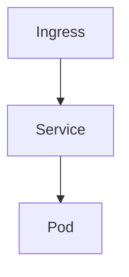

# AXIT 플랫폼 연동 계획

> [복원] 2026-08-01 — 에이전트 질의 이력(원문 인용 구간) 및 구현 코드 기준으로 복원함.  
> 83–138행 등 일부 구간은 원문이 남아 있지 않아 재구성했으며, 표기·오타는 원 질의를 우선함.

## agentruntime 테이블 정의
다음 환경변수를 테이블에 저장한다.
- 컬럼
  - idx int pk, auto increment
  - type int, 0 -> mockup, 1 -> 외부연동(https)
  - token_url varchar(200)
  - agent_url varchar(200)
  - agent_name varchar(50)
  - agent_id varchar(50)
  - description varchar(255)
  - registered_date date
  - service_id varchar(20)

- 로컬 테스트용 초기 데이터는 다음과 같다.
  - type : 0
  - token_url : "http://127.0.0.1:8080/portal/auths/v1/token"
  - agent_url : "http://127.0.0.1:8080/aihub/agents/v1"
  - agent_name : 기존 agents 테이블의 name
  - agent_id : "00000000-0000-4000-8000-000000000001" 포맷으로 랜덤 생성
  - desription : 기존 agents 테이블의 role
  - service_id : "prvops"

## 로컬 목업은 다음 API 를  제공한다. 백엔드와 목업은 정의된 API로 연동/통신한다
- 토근 발급
  - endpoint : {agentruntime:token_url}
- agent chat
  - endpoint : {agentruntime:agent_url}/{agentruntime:agent_id}

## 스키마 보완
- registered_date 는 date 가 아닌 datetime 으로 시각이 포함되도록 변경한다.
- mock 모드용 로컬 에이전트 매핑을 위해 `local_agent_id` 컬럼을 추가한다.

## 정의 소스 통합
1. 정의 소스 통합
- 로컬에서 테스트 할 수 없는 서버 환경에서는 AGENT_DEFINITIONS를 사용하지 않는다. 서버 환경은 에이전트 동작을 모두 외부 시스템으로 deligate 한다. 즉 외부 시스템이 제공하는 API 만 사용할 수 있다.
- 목업을 사용한 로컬 테스트에서는 AGENT_DEFINITIONS(코드) 중심으로 처리가 되게 하며 서버가 제공할 API를 최대한 흉내낸다
- agentrumtime 은 서버에서 제공하게 될 agent의 명세를 저장한다. 주요 내용은 에이전트 이름, ID, token API endpoint, chat API endpoint, service id 이다.
2. agentruntime 시드
- agents 테이블에서 동적으로 읽어오지 말고 AGENT_DEFINITION을 기준하도록 한다
3. resolve_local_agent_id
— build_axit_agent_id 역매핑을 agentruntime 기반으로 변경
4. 사용자 할당 검증
— list_stored_agents → AGENT_DEFINITIONS
5. job_planning은 연관 기능과 테이블을 제거한다.
6. agent_records API·UI — 제거 또는 agentruntime 기반으로 교체
7. DB 초기화 — seed_initial_agents, sync_missing_agents, schema.sql의 agents DDL 제거
8. inventory 에이전트 제거, 관련 기능 모두 삭제

## AGENT_RUNTIME_MODE
AGENT_RUNTIME_MODE = mock 인 경우 agentruntime 의 type = 0 을 참조한다.
AGENT_RUNTIME_MODE = http 인 경우 agentruntime 의 type = 1 을 참조한다.

## 에이전트 > 에이전트 연결 메뉴 추가
"에이전트 연결" 메뉴는 agentruntime 테이블을 관리하기 위한 메뉴이다.
- 에이전트 연결 메뉴 클릭시 popup 이 아닌 전체 화면으로 다음 타이틀로 목록을 출력한다
  - 에이전트 연결 목록
    - idx 컬럼은 표시하지 않는다.
    - 오른쪽 상단에 추가 버튼을 두고 추가 버튼 클릭시 팝업으로 입력 폼을 생성
    - row의 마지막 컬럼에 수정/삭제 버튼을 배치
    - 수정 버튼 클릭시 수정 폼 팝업
      - 수정폼에 업데이트/닫기 버튼 배치, 업데이트 버튼시 확인을 통해 다시 물어본다
      - 닫기 버튼시 팝업창을 닫는다
    - 삭제 버튼 클릭시 확인을 통해 다시 물어본다.
    - row 에 복제 버튼을 추가한다
      - 추가 기능과 동일한 팝업을 띄우고 해당 row의 데이터를 미리 설정한다
- 추가/복제 폼에 type(유형) 입력 필드를 둔다.
  - 0 = 목업(mock), 1 = 외부연동(http)
  - 복제 시 원본 row 의 type 을 미리 채운다.

## 관리자 작업 메뉴에 postman debugging 기능 추가
환경설정 > 관리자 작업 > postman 추가, 선택시 popup 창으로 다음 정보를 입력, 실행할 수 있는 기능을 추가한다.
- 입력 정보
  - 호출정보 : text 박스로 입력받음
  - 전송/닫기 버튼
  - 전송 버튼 클릭시 호출정보의 원문 그대로 http 전송, 결과를 받음
- 출력 정보
  - 동일한 입력 popup 창 하단에 결과를 출력한다.

## AXIT 플랫폼 HTTP 연동 (서버 환경) [재구성]
`AGENT_RUNTIME_MODE=http` 일 때 외부 AXIT 플랫폼 API 로 에이전트를 실행한다.

### 환경변수
다음 값은 환경변수로 관리한다. (`TOKEN_URL`, `AGENT_URL`, `CLIENT_ID`, `CLIENT_SECRET`, `SERVICE_ID` 또는 `AXIT_*` 별칭)

| 모드 | TOKEN_URL / AGENT_URL 기본값 |
|------|------------------------------|
| mock (type=0) | `{CONTROL_PLANE_BASE_URL}/portal/auths/v1/token`, `{CONTROL_PLANE_BASE_URL}/aihub/agents/v1` |
| http (type=1) | `https://test.nudp.lguplus.co.kr/portal/auths/v1/token`, `https://test.nudp.lguplus.co.kr/aihub/agents/v1` |

- mock 기본 인증: `mock-client-id` / `mock-client-secret`
- http 기본 인증: `4afb927e-74fe-400f-81d6-c01c369757ae` / `23pXFlLdy5LhYbHbJvBZcDe5P84EXVmZPjxzI-hEwX8`
- `SERVICE_ID` 기본: `prvops`

### 토큰 발급
- `POST {TOKEN_URL}`
- `Authorization: Basic base64(client_id:client_secret)`
- `Content-Type: application/x-www-form-urlencoded`
- body: `grant_type=client_credentials`
- `access_token` 이 null 이면 실패 처리
- 발급된 토큰은 60분 TTL 로 캐시한다.
- 토큰 발급 요청/응답은 상세 로그를 남긴다.

### 에이전트 invoke
- 외부 연동(type=1): `POST {AGENT_URL}/{agent_id}/invoke`
- 목업(type=0): `POST {AGENT_URL}/{agent_id}`
- `Authorization: Bearer {access_token}`
- 요청 JSON:
  - `service_id`, `session_id`(UUID), `session_attributes`, `prompt_session_attributes`, `enable_trace`, `text`
- 응답 JSON:
  - `text`, `retrieval_results`, `trace`

### 로컬 목업 API (`axit_mock.py`)
- 백엔드가 위 계약을 직접 제공하여 mock 모드에서 외부 AXIT 를 흉내낸다.
- 목업 invoke 수신 후 `local_agent_id` 로 로컬 LangGraph 실행에 위임한다.

### 헬스체크 정책 (http 모드)
- AXIT 플랫폼과 관리하는 에이전트들은 모두 람다로 개발되어 헬스체크의 의미가 없다. 무조건 살아 있다고 가정한다.
- 단, 한번이라도 invoke API 호출에 오류가 있다면 상태이상(`degraded`)으로 간주한다.
- 상태이상일 때도 클라이언트의 요청을 받을 수는 있다.

## agentruntime 테이블 정리
- agentruntime 테이블의 불필요 컬럼 정리
  - token_url, agent_url 은 환경변수로 고정 설정하여 더이상 테이블에서 필요 없다. 삭제

## 대시보드 반영
- agentruntime 에 에이전트 연결이 추가·수정·삭제되면 실시간으로 대시보드에 반영한다.
- Runtime(sandbox) 표시 명칭을 **Runtime (AX플랫폼)** 으로 변경한다.

## UI 정리
- 대시보드의 메뉴바 아래에 있는 API, Runtime 등 헬스체크 배지는 불필요하다. 삭제한다.
  - 관련 기능도 dead code 인 경우 삭제한다
- 다음 정보는 추출이 불가하므로 삭제한다.
  - 대시보드 에이전트 타일의 등록된 MCP 도구 목록
- 전체 화면 비율을 조정한다.
  - 대시보드/상세정보(중앙 패널) : 대화형 터미널(오른쪽 패널) 의 가로 비욜을 마우스 드래그로 조절할 수 있게 변경

## 중간 체크 - 260801

## UI 정리
- 사용자 조회 화면에서 테이블 컬럼의 체크박스는 삭제하고, 대신 삭제/수정 버튼은 각 row 의 마지막 컬럼에 배치한다. 체크박스 선택없이 삭제/수정하도록 변경한다
- 공지사항 목록 조회에서 체크박스는 삭제하고 삭제 버튼을 각 row의 마지막 버튼 컬럼에 배치한다. 체크박스 선택없이 삭제되도록 변경한다.(수정 버튼과 동일)

## 목업 에이전트 추가
- agentruntime 에 다음 에이전트를 추가한다. 이 에이전트 정보는 init schema 에 추가하지 않는다
  1. 에이전트 이름 : Whatap 이벤트 수신 
    타입 : 목업
    agent_id : 랜덤 생성
    local agent id : whatap-event
    설명 : Whatap 에서 이벤트를 수신하고 처리
    service id : prvops

  2. 에이전트 이름 : 작업 접수/계획
    타입 : 목업
    agent_id : 랜덤 생성
    local agent id : job-scheduler
    설명 : 채널을 통해 작업 요청을 수신/계획 수립
    service id : prvops

  3. 에이전트 이름 : 아키텍처 분석
    타입 : 목업
    agent_id : 랜덤 생성
    local agent id : archi-analysis
    설명 : 인프라의 설계 구성 분석/도식화
    service id : prvops

  4. 에이전트 이름 : 헬프데스크
    타입 : 목업
    agent_id : 랜덤 생성
    local agent id : helpdesk
    설명 : 문의응대
    service id : prvops

- 위 네 개의 에이전트는 목업 테스트시만 에이전트로 등록되며 다음 정보를 목업 정의 코드에 정적으로  적용한다.
  1. whatap-event
    - 도구 : 없음
    - 다음 에이전트를 호출할 수 있다.
      - dprv-k8s, dprv6-k8s, pcicd-k8s, dprmn-k8s, dtest-k8s, dpvs-k8s, dprsv-k8s, dprrt-k8s, dkvrt-k8s
    - 시스템 프롬프트
      - 당신은 Whatap APM 으로부터 이상징후 발생시 webhook를 통해 이벤트를 수신받을 수 있다. 수신받은 이벤트의 인프라를 찾아 적절한 에이전트에 분석을 요청한다.
  2. job-scheduler
    - 도구 : 없음
    - 다음 에이전트를 호출할 수 있다.
      - dprv-k8s, dprv6-k8s, pcicd-k8s, dprmn-k8s, dtest-k8s, dpvs-k8s, dprsv-k8s, dprrt-k8s, dkvrt-k8s
    - 시스템 프롬프트
      - 당신은 요청받은 사용자 요청을 분석하고 작업 계획을 수립합니다.
  3. archi-analysis
    - 도구 : 없음
    - 다음 에이전트를 호출할 수 있다.
      - dprv-k8s, dprv6-k8s, pcicd-k8s, dprmn-k8s, dtest-k8s, dpvs-k8s, dprsv-k8s, dprrt-k8s, dkvrt-k8s
    - 시스템 프롬프트
      - 당신은 인프라 아키텍처를 분석하고 도식화하는 에이전트입니다. 인프라의 구조도를 mermaid 차트로 출력합니다.
  4. helpdesk
    - 도구 : 없음
    - 다음 에이전트를 호출할 수 있다.
      - dprv-k8s, dprv6-k8s, pcicd-k8s, dprmn-k8s, dtest-k8s, dpvs-k8s, dprsv-k8s, dprrt-k8s, dkvrt-k8s
    - 시스템 프롬프트
      - 당신은 인프라 문의 응대 에이전트입니다. 사용자의 요청을 받으면 어떤 인프라인지를 확인하고 적절한 에이전트를 호출하여 정확한 답변을 전달합니다.

- agentruntime 에서 사용자 직접 문의 가능을 구분한다.
  - agentruntime 에 다음 컬럼을 추가한다.
    - talkable boolean : default true
  - 테이블에서 다음을 제외하고 모두 talkable 을  true 로 설정한다.
    - whatap-event, job-scheduler
  - talkable 이 true 인 경우에만 대화식 터미널의 에이전트 선택창에 표시한다(즉 UI를 통해 사용자가 메시지를 보낼 수 있다)

- agentruntime 테이블에 컬럼 추가
  - is_orchestrator boolean : default false
  - helpdesk, whatap-event, job-scheduler, achi-analysis 는 true 이다.
  

- archi-analysis 에이전트의 system prompt 에 다음 내용을 보완한다

1. Select an appropriate agent capable of extracting information about the requested infrastructure and extract the infrastructure information.
2. Create a Mermaid diagram text block based on the extracted infrastructure information.
3. Add a Mermaid diagram text block to the agent response.

- 대화형 터미널 > 대화창 영역에 세션 초기화 버튼을 추가한다. 세션 초기화 버튼 클릭시 에이전트를 호출할 때 SESSION UUID 를 새로 생성한다.

## 목업용 LLM 선택
환경설정 > 관리자 작업 > (목업)LLM 변경 메뉴 추가
- 목업 환경에서 선택가능한 LLM 은 두 가지 이다.
  - 기존 local llm : 경로 등 설정 정보는 동일함
  - OpenAI
    - https://api.openai.com/v1
    - API key : sk-proj-8Pr3XXXXXXXXXXXXXXPqSrMA

- mermaid diagram redering 기능 추가 이후, diagram 이 표시되면 주기적인 refresh 가 발생한다. 원인을 파악
- openai API 를 호출할때는 과금이 발생하므로 응용에서 호출하기 전에 확인 창을 통해 확인 후 수행하도록 변경하고 확인시 질의 prompt 를 표시

- mermaid diagram 출력 시 오른쪽 상단에 다음 버튼을 추가한다
  1. 다운로드 버튼
  2. 확대/축소 버튼 

- archi-analysis 에이전트의 system prompt 에 다음 내용을 보완한다. 주요 변경사항은 mermaid diagram 대신, D2 diagram을 사용한다. 3번 prompt 아래 간단한 D2 다이어그램 샘플 텍스트를 추가한다

1. Select an appropriate agent capable of extracting information about the requested infrastructure and extract the infrastructure information.
2. Create a D2 diagram text block based on the extracted infrastructure information.
3. Add a D2 diagram text block to the agent response.

