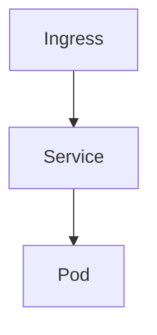

# AXIT 플랫폼 연동 계획

> [복원] 2026-08-01 — 에이전트 질의 이력(원문 인용 구간) 및 구현 코드 기준으로 복원함.  
> 83–138행 등 일부 구간은 원문이 남아 있지 않아 재구성했으며, 표기·오타는 원 질의를 우선함.

## agentruntime 테이블 정의
다음 환경변수를 테이블에 저장한다.
- 컬럼
  - idx int pk, auto increment
  - type int, 0 -> mockup, 1 -> 외부연동(https)
  - token_url varchar(200)
  - agent_url varchar(200)
  - agent_name varchar(50)
  - agent_id varchar(50)
  - description varchar(255)
  - registered_date date
  - service_id varchar(20)

- 로컬 테스트용 초기 데이터는 다음과 같다.
  - type : 0
  - token_url : "http://127.0.0.1:8080/portal/auths/v1/token"
  - agent_url : "http://127.0.0.1:8080/aihub/agents/v1"
  - agent_name : 기존 agents 테이블의 name
  - agent_id : "00000000-0000-4000-8000-000000000001" 포맷으로 랜덤 생성
  - desription : 기존 agents 테이블의 role
  - service_id : "prvops"

## 로컬 목업은 다음 API 를  제공한다. 백엔드와 목업은 정의된 API로 연동/통신한다
- 토근 발급
  - endpoint : {agentruntime:token_url}
- agent chat
  - endpoint : {agentruntime:agent_url}/{agentruntime:agent_id}

## 스키마 보완
- registered_date 는 date 가 아닌 datetime 으로 시각이 포함되도록 변경한다.
- mock 모드용 로컬 에이전트 매핑을 위해 `local_agent_id` 컬럼을 추가한다.

## 정의 소스 통합
1. 정의 소스 통합
- 로컬에서 테스트 할 수 없는 서버 환경에서는 AGENT_DEFINITIONS를 사용하지 않는다. 서버 환경은 에이전트 동작을 모두 외부 시스템으로 deligate 한다. 즉 외부 시스템이 제공하는 API 만 사용할 수 있다.
- 목업을 사용한 로컬 테스트에서는 AGENT_DEFINITIONS(코드) 중심으로 처리가 되게 하며 서버가 제공할 API를 최대한 흉내낸다
- agentrumtime 은 서버에서 제공하게 될 agent의 명세를 저장한다. 주요 내용은 에이전트 이름, ID, token API endpoint, chat API endpoint, service id 이다.
2. agentruntime 시드
- agents 테이블에서 동적으로 읽어오지 말고 AGENT_DEFINITION을 기준하도록 한다
3. resolve_local_agent_id
— build_axit_agent_id 역매핑을 agentruntime 기반으로 변경
4. 사용자 할당 검증
— list_stored_agents → AGENT_DEFINITIONS
5. job_planning은 연관 기능과 테이블을 제거한다.
6. agent_records API·UI — 제거 또는 agentruntime 기반으로 교체
7. DB 초기화 — seed_initial_agents, sync_missing_agents, schema.sql의 agents DDL 제거
8. inventory 에이전트 제거, 관련 기능 모두 삭제

## AGENT_RUNTIME_MODE
AGENT_RUNTIME_MODE = mock 인 경우 agentruntime 의 type = 0 을 참조한다.
AGENT_RUNTIME_MODE = http 인 경우 agentruntime 의 type = 1 을 참조한다.

## 에이전트 > 에이전트 연결 메뉴 추가
"에이전트 연결" 메뉴는 agentruntime 테이블을 관리하기 위한 메뉴이다.
- 에이전트 연결 메뉴 클릭시 popup 이 아닌 전체 화면으로 다음 타이틀로 목록을 출력한다
  - 에이전트 연결 목록
    - idx 컬럼은 표시하지 않는다.
    - 오른쪽 상단에 추가 버튼을 두고 추가 버튼 클릭시 팝업으로 입력 폼을 생성
    - row의 마지막 컬럼에 수정/삭제 버튼을 배치
    - 수정 버튼 클릭시 수정 폼 팝업
      - 수정폼에 업데이트/닫기 버튼 배치, 업데이트 버튼시 확인을 통해 다시 물어본다
      - 닫기 버튼시 팝업창을 닫는다
    - 삭제 버튼 클릭시 확인을 통해 다시 물어본다.
    - row 에 복제 버튼을 추가한다
      - 추가 기능과 동일한 팝업을 띄우고 해당 row의 데이터를 미리 설정한다
- 추가/복제 폼에 type(유형) 입력 필드를 둔다.
  - 0 = 목업(mock), 1 = 외부연동(http)
  - 복제 시 원본 row 의 type 을 미리 채운다.

## 관리자 작업 메뉴에 postman debugging 기능 추가
환경설정 > 관리자 작업 > postman 추가, 선택시 popup 창으로 다음 정보를 입력, 실행할 수 있는 기능을 추가한다.
- 입력 정보
  - 호출정보 : text 박스로 입력받음
  - 전송/닫기 버튼
  - 전송 버튼 클릭시 호출정보의 원문 그대로 http 전송, 결과를 받음
- 출력 정보
  - 동일한 입력 popup 창 하단에 결과를 출력한다.

## AXIT 플랫폼 HTTP 연동 (서버 환경) [재구성]
`AGENT_RUNTIME_MODE=http` 일 때 외부 AXIT 플랫폼 API 로 에이전트를 실행한다.

### 환경변수
다음 값은 환경변수로 관리한다. (`TOKEN_URL`, `AGENT_URL`, `CLIENT_ID`, `CLIENT_SECRET`, `SERVICE_ID` 또는 `AXIT_*` 별칭)

| 모드 | TOKEN_URL / AGENT_URL 기본값 |
|------|------------------------------|
| mock (type=0) | `{CONTROL_PLANE_BASE_URL}/portal/auths/v1/token`, `{CONTROL_PLANE_BASE_URL}/aihub/agents/v1` |
| http (type=1) | `https://test.nudp.lguplus.co.kr/portal/auths/v1/token`, `https://test.nudp.lguplus.co.kr/aihub/agents/v1` |

- mock 기본 인증: `mock-client-id` / `mock-client-secret`
- http 기본 인증: `4afb927e-74fe-400f-81d6-c01c369757ae` / `23pXFlLdy5LhYbHbJvBZcDe5P84EXVmZPjxzI-hEwX8`
- `SERVICE_ID` 기본: `prvops`

### 토큰 발급
- `POST {TOKEN_URL}`
- `Authorization: Basic base64(client_id:client_secret)`
- `Content-Type: application/x-www-form-urlencoded`
- body: `grant_type=client_credentials`
- `access_token` 이 null 이면 실패 처리
- 발급된 토큰은 60분 TTL 로 캐시한다.
- 토큰 발급 요청/응답은 상세 로그를 남긴다.

### 에이전트 invoke
- 일반 에이전트(type=1): `POST {AGENT_URL}/{agent_id}/invoke`
- 일반 에이전트 목업(type=0): `POST {AGENT_URL}/{agent_id}`
- 협업 에이전트(`is_orchestrator=1`): `POST {ORCHESTRATOR_URL}/{agent_id}/invoke`
  - 기본 경로: `/aihub/orchestrators/v1/{agent-id}/invoke`
- `Authorization: Bearer {access_token}`
- 요청 JSON:
  - `service_id`, `session_id`(UUID), `session_attributes`, `prompt_session_attributes`, `enable_trace`, `text`
- 응답 JSON:
  - `text`, `retrieval_results`, `trace`

### 로컬 목업 API (`axit_mock.py`)
- 백엔드가 위 계약을 직접 제공하여 mock 모드에서 외부 AXIT 를 흉내낸다.
- 목업 invoke 수신 후 `local_agent_id` 로 로컬 LangGraph 실행에 위임한다.

### 헬스체크 정책 (http 모드)
- AXIT 플랫폼과 관리하는 에이전트들은 모두 람다로 개발되어 헬스체크의 의미가 없다. 무조건 살아 있다고 가정한다.
- 단, 한번이라도 invoke API 호출에 오류가 있다면 상태이상(`degraded`)으로 간주한다.
- 상태이상일 때도 클라이언트의 요청을 받을 수는 있다.

## agentruntime 테이블 정리
- agentruntime 테이블의 불필요 컬럼 정리
  - token_url, agent_url 은 환경변수로 고정 설정하여 더이상 테이블에서 필요 없다. 삭제

## 대시보드 반영
- agentruntime 에 에이전트 연결이 추가·수정·삭제되면 실시간으로 대시보드에 반영한다.
- Runtime(sandbox) 표시 명칭을 **Runtime (AX플랫폼)** 으로 변경한다.

## UI 정리
- 대시보드의 메뉴바 아래에 있는 API, Runtime 등 헬스체크 배지는 불필요하다. 삭제한다.
  - 관련 기능도 dead code 인 경우 삭제한다
- 다음 정보는 추출이 불가하므로 삭제한다.
  - 대시보드 에이전트 타일의 등록된 MCP 도구 목록
- 전체 화면 비율을 조정한다.
  - 대시보드/상세정보(중앙 패널) : 대화형 터미널(오른쪽 패널) 의 가로 비욜을 마우스 드래그로 조절할 수 있게 변경

## 중간 체크 - 260801

## UI 정리
- 사용자 조회 화면에서 테이블 컬럼의 체크박스는 삭제하고, 대신 삭제/수정 버튼은 각 row 의 마지막 컬럼에 배치한다. 체크박스 선택없이 삭제/수정하도록 변경한다
- 공지사항 목록 조회에서 체크박스는 삭제하고 삭제 버튼을 각 row의 마지막 버튼 컬럼에 배치한다. 체크박스 선택없이 삭제되도록 변경한다.(수정 버튼과 동일)

## 목업 에이전트 추가
- agentruntime 에 다음 에이전트를 추가한다. 이 에이전트 정보는 init schema 에 추가하지 않는다
  1. 에이전트 이름 : Whatap 이벤트 수신 
    타입 : 목업
    agent_id : 랜덤 생성
    local agent id : whatap-event
    설명 : Whatap 에서 이벤트를 수신하고 처리
    service id : prvops

  2. 에이전트 이름 : 아키텍처 분석
    타입 : 목업
    agent_id : 랜덤 생성
    local agent id : archi-analysis
    설명 : 인프라의 설계 구성 분석/도식화
    service id : prvops

  3. 에이전트 이름 : 헬프데스크
    타입 : 목업
    agent_id : 랜덤 생성
    local agent id : helpdesk
    설명 : 문의응대
    service id : prvops

- 위 에이전트는 목업 테스트시만 에이전트로 등록되며 다음 정보를 목업 정의 코드에 정적으로  적용한다.
  1. whatap-event
    - 도구 : 없음
    - 다음 에이전트를 호출할 수 있다.
      - dprv-k8s, dprv6-k8s, pcicd-k8s, dprmn-k8s, dtest-k8s, dpvs-k8s, dprsv-k8s, dprrt-k8s, dkvrt-k8s
    - 시스템 프롬프트
      - 당신은 Whatap APM 으로부터 이상징후 발생시 webhook를 통해 이벤트를 수신받을 수 있다. 수신받은 이벤트의 인프라를 찾아 적절한 에이전트에 분석을 요청한다.
  2. archi-analysis
    - 도구 : 없음
    - 다음 에이전트를 호출할 수 있다.
      - dprv-k8s, dprv6-k8s, pcicd-k8s, dprmn-k8s, dtest-k8s, dpvs-k8s, dprsv-k8s, dprrt-k8s, dkvrt-k8s
    - 시스템 프롬프트
      - 당신은 인프라 아키텍처를 분석하고 도식화하는 에이전트입니다. 인프라의 구조도를 mermaid 차트로 출력합니다.
  3. helpdesk
    - 도구 : 없음
    - 다음 에이전트를 호출할 수 있다.
      - dprv-k8s, dprv6-k8s, pcicd-k8s, dprmn-k8s, dtest-k8s, dpvs-k8s, dprsv-k8s, dprrt-k8s, dkvrt-k8s
    - 시스템 프롬프트
      - 당신은 인프라 문의 응대 에이전트입니다. 사용자의 요청을 받으면 어떤 인프라인지를 확인하고 적절한 에이전트를 호출하여 정확한 답변을 전달합니다.

- agentruntime 에서 사용자 직접 문의 가능을 구분한다.
  - agentruntime 에 다음 컬럼을 추가한다.
    - talkable boolean : default true
  - 테이블에서 다음을 제외하고 모두 talkable 을  true 로 설정한다.
    - whatap-event
  - talkable 이 true 인 경우에만 대화식 터미널의 에이전트 선택창에 표시한다(즉 UI를 통해 사용자가 메시지를 보낼 수 있다)

- agentruntime 테이블에 컬럼 추가
  - is_orchestrator boolean : default false
  - helpdesk, whatap-event, archi-analysis 는 true 이다.
  

- archi-analysis 에이전트의 system prompt 에 다음 내용을 보완한다

1. Select an appropriate agent capable of extracting information about the requested infrastructure and extract the infrastructure information.
2. Create a Mermaid diagram text block based on the extracted infrastructure information.
3. Add a Mermaid diagram text block to the agent response.


- 대화형 터미널 > 대화창 영역에 세션 초기화 버튼을 추가한다. 세션 초기화 버튼 클릭시 에이전트를 호출할 때 SESSION UUID 를 새로 생성한다.

## 목업용 LLM 선택
환경설정 > 관리자 작업 > (목업)LLM 변경 메뉴 추가
- 목업 환경에서 선택가능한 LLM 은 두 가지 이다.
  - 기존 local llm : 경로 등 설정 정보는 동일함
  - OpenAI
    - https://api.openai.com/v1
    - API key : sk-proj-8Pr3XXXXXXXXXXXXXXPqSrMA

- mermaid diagram redering 기능 추가 이후, diagram 이 표시되면 주기적인 refresh 가 발생한다. 원인을 파악
- openai API 를 호출할때는 과금이 발생하므로 응용에서 호출하기 전에 확인 창을 통해 확인 후 수행하도록 변경하고 확인시 질의 prompt 를 표시

- mermaid diagram 출력 시 오른쪽 상단에 다음 버튼을 추가한다
  1. 다운로드 버튼
  2. 확대/축소 버튼 


- archi-analysis 에이전트의 system prompt 에 다음 내용을 보완한다. 주요 변경사항은 mermaid diagram 대신, D2 diagram을 사용한다. 3번 prompt 아래 간단한 D2 다이어그램 샘플 텍스트를 추가한다

1. Select an appropriate agent capable of extracting information about the requested infrastructure and extract the infrastructure information.
2. Create a D2 diagram text block based on the extracted infrastructure information.
3. Add a D2 diagram text block to the agent response.

- archi-analysis 에이전트의 시스템 프롬프트에 다음 내용을 추가한다(영문으로 변환 후 적용)

다음은 각 인프라 manifest 별 다이어그램 형식이다.
- configmap : document
- pvc : cylinder
- secret : document
- pod : oval
- VM 인스턴스 : rectangle
- deployment : page
- statefulset : page
- daemonset : page
- serviceaccount : person
- ingress / route : circle
- service : rectangle
- datastore : cylinder
- datacenter : cloud
- network : hexagon
- namespace : cloud
- resourcequota : rectangle

각 다이어그램은 이름과 인프라의 manifest 타입을 함께 출력한다 

- archi-analysis 에이전트의 시스템 프롬프트에 다음 내용을 추가한다(영문으로 변환 후 적용)
각 인프라 분석 및 다이어그램 작성시 유의사항
1. namespace 와 resourcequota
2. secret, configmap, serviceaccount, pvc 는 어떤 pod 에서 참조되는지를 확인하고 참조될 경우 이를 표현한다.
3. pvc 는 pod 에서 마운트 된 경로를 파악하고 다이어그램에 표시한다.
4. ingress / route 는 서비스 도메인과 secure 여부(https/http) 확인하고 다이어그램에 표시
5. service 분석시 port 를 확인, 다이어그램에 표시
6. deployment, statefulset 은 replica 개수 표시
7. daemonset 은 nodeSelector 표시

## 협업 에이전트 API 경로 변경
agentruntime.is_orchestrator 값이 1인 경우 협업 에이전트이다.
협업 에이전트는 다른 에이전트를 사용할 수 있다.
협업 에이전트의 API 호출 경로는 다음과 같이 변경한다.
- /aihub/orchestrators/v1/{agent-id}/invoke

## init data 제외
백엔드 재시작시 agentruntime 테이블에 init 데이터는 추가하지 않는다.

## 작업요청서 수신기 데몬을 추가
작업요청서 수신기는 AI 에이전트가 아니며 백엔드의 기능으로 API 로 노출한다.
이 데몬은 mock/http 모드 모두 사용한다.
json 포맷으로 전송을 받는다. job_format.json 참조
요청받은 job 은 다음 테이블에 저장한다.

- jobs
 - srnum varchar, format : {"SR" + YYMMDD + "_" + #####} 자동 생성
 - status_code int, 0:접수, 1:승인자배당완료, 2:에이전트처리요청, 10:처리완료(성공), 11:처리완료(실패), 12:작업반려
   - 작업요청서 수신 데몬에 최초 접수, record 생성시 status_code 는 0 이다
 - approver_registered_date : datetime
 - 그 외 컬럼
   - job_format.json 포맷에 맞춰 컬럼 생성

### api/jobs 기능 보완
api/jobs 를 통해 DB에 입력시 job_content 의 html 양식은 모두 제거한다. plain text 로 DB에 입력 -> 원복

## api/jobs 를 처리할 UI 구현하기 위한 UI 레이아웃 변경
대시보드의 전체 레이아웃을 다음과 같이 수정한다.
- 에이전트 노드 목록
  - 에이전트 노드를 grid 배열이 아닌 stack 으로 세로 한줄로 배열한다.
  - "작업 노트" 창을 새로 생성한다. "작업 노트" 의 레이아웃 배치는 다음과 같다.
    - 에이전트 노드 목록 | 작업 노트 | 대화형 터미널
    - 하단 "상세 정보" 창은 상단 "에이전트 노드 목록" + "작업 노트" 창 의 합산 가로 길이를 유지한다.

## 작업 노트
작업 노트 창에 다음 탭을 추가한다.
- 작업 검토 : jobs 테이블에 적재된 작업을 관리한다.
  - 작업 검토 탭
    -  left : "작업 목록", right : "작업 상세" 로 레이아웃 한다.
    - 작업 목록
      - row 에 srnum 를 텍스트 레이블 버튼으로 렌더링하여 표시
      - row 클릭시 right 패널에 세부 정보를 표시한다.
        - job_title
        - requester_name
        - request_date
        - job_content : html 포맷을 렌더링 하여 화면 표시
  - jobs 태이블 컬럼 추가
    - approver varchar(20)
  - 작업목록 보완
    - approver가 없는 경우 "작업 목록" 의 레이블 버튼은 분혹색으로 표시한다.
  - 작업 상세 패널 : 작업 승인자 지정
    - jobs.approver 가 없는 경우 하단에 "작업 승인자"를 지정할 수 있게 한다. 작업 승인자 대상은 users 테이블의 전체 사용자이며 username 으로 표시한다.
    - 작업 승인자 적용 버튼을 같은 행에 배치한다. 적용버튼을 클릭하면 확인을 통해 물어보고 적용(jobs.approver에 update) 하고 jobs.approver_registered_date 에 현재 시간을 업데이트 한다. status_code 는 1 로 변경한다.

  - 작업 승인자 적용 teams 회신 - 보류
방안 문의) 작업 승인자가 지정되면 원 메시지를 전송한 팀즈의 채널/게시글에 스레드 답글로 지정되었다는 메시지를 보내고 싶다. 팀즈 채널 설정(웹훅) 등 설정 방안과 백엔드에서 수정해야 할 부분을 검토, jobs 테이블에는 team_id, channel_id, message_id 가 저장되어 있다

  - 작업 승인자 지정 적용 버튼 옆에 직접승인 버튼을 배치한다. 직접승인시 확인을 하고 다음과 같이 처리된다.
    - jobs.approver 는 로그인한 사용자(직접승인을 클릭한 사용자)이다.
    - status_code 를 2 로 업데이트한다.
  
작업 노트 창에 다음 탭을 추가한다.
- 나의 검토작업 : jobs.status_code 가 1인 job 목록 중 approver 가 로그인 한 사용자인 job 을 출력한다. 패널의 형식은 "작업 검토"와 동일하다.
- "작업 상세" 패널의 하단 작업 승인자 적용은 없다. 대신 승인 / 반려 버튼을 배치한다.
  - 승인 시 확인을 하고 승인된 작업은 status_code : 2 로 업데이트한다.
  - 반려 시 확인을 하고 status_code : 12 로 업데이트한다.

## 작업요청서 수신기 데몬에서 에이전트에 작업 위임
- jobs.status_code = 2 인 작업에 대해 에이전트에 작업을 지시하고 결과를 받는다.
  - 주기적으로 jobs.status_code 를 폴링한다. 폴링 주기는 60초이다.
  - 비동기 처리한다.
  - 요청을 전송할 에이전트는 다음과 같다.
    - 목업 환경에서는 agent id : helpdesk 로 요청한다.
    - axit runtime 환경에서는 agent id : HELPDESK_AGENT 로 요청한다.
  - 답변의 결과를 다음 테이블에 업데이트한다.
    - jobs_result
      - srnum varchar
      - result text
      - complete_date datetime
    
작업 노트 창에 다음 탭을 추가한다.
- 나의 작업결과 : jobs.status_code 가 10 이상인 job 목록 중 approver 가 로그인 한 사용자인 job 을 출력한다. 
- 패널의 형식은 left 는 동일하나 right 는 "작업 결과" 패널이다.
- "작업 결과" 패널에는 jobs_result, complete_date 를 보여주며, jobs_result가 md 인 경우 렌더링해서 출력한다.
  - jobs.status_code 가 실패(11)라도 동일하게 result 결과를 보여준다.
  - 재작업 버튼을 배치한다. 재작업 시 확인 후 jobs.status_code 를 2로 업데이트하고 재처리하도록 한다.
  
작업 노트 창에 다음 탭을 추가한다.
- 나의 노트 : 이 탭은 작업결과, 채팅응답 등에서 내용을 복사하여 편집할 수 있도록 하는 작업 공간이다.

  - mynotes 테이블 생성
    - userid varchar : 로그인한 사용자의 userid
    - note_name varchar(50) : 노트의 이름. 없을시 {생성시각} 으로 자동 생성
    - create_date datetime : 노트 생성 시각
    - origin_file varchar(200): 실제 파일 경로
    - last_update datetime : 마지막 업데이트 시각
  - 컨텐트 원본은 파일로 저장한다.
    - 경로 : data/mynotes/{userid}/{create_date}.md
  - 패널 구성
    - left : 노트 목록을 텍스트 레이블 버튼으로 표시, note_name 을 기반으로 한다.
    - right : 노트 편집 화면, 신규 생성시 빈공간이며, 컨텐트 원본에 내용이 있는 경우 md 를 렌더링한다. d2 다이어그램이 있는 경우 d2 도 렌더링한다.
      - right 패널의 내용은 10초에 한번씩 자동 저장한다.
  - 패널 바깥쪽 상단 헤더 오른쪽에 다음 버튼을 배치한다.
    - 세로운 노트 -> 추가적인 확인을 하지 않고 바로 mynotes 테이블에 record 를 insert 하고 원본 파일을 생성한다.
    - 노트 삭제 -> 이 버튼은 right 패널에서 노트가 선택되었을 경우만 활성화된다.
      - 노트 삭제를 클릭하면, 확인을 거쳐 노트를 삭제한다. 삭제 대상은 mynotes 테이블 레코드와 컨텐트 원본 파일이다.
    - 이름 변경 -> 이 버튼은 right 패널에서 노트가 선택되었을 경우만 활성화된다.
      - 팝업창을 띄우고 노트 이름을 입력받는다. 저장시 별도로 확인하지 않는다. note_name 에 업데이트한다.

  - 나의 작업결과 탭에서 처리결과 의 내용을 출력하는 블럭의 오른쪽 상단에 "노트로 복사" 버튼을 생성한다.
    - "노트로 복사" 시 mynotes 에 신규 노트를 생성하고 내용을 복사한다. 
    - 복사가 성공하면 "나의 노트" 탭으로 자동 이동하고, 복사된 노트를 자동 선택하도록 한다.

  - 대화형 터미널에서 응답 메시지 영역에도 "노트로 복사" 버튼을 오른쪽 상단에 생성한다.
    - 복사가 성공하면 "나의 노트" 탭으로 자동 이동하고, 복사된 노트를 자동 선택하도록 한다.

  - 나의 노트 > 노트 편집 패널
    - 미리보기를 함께 출력하지 않고 텍스트 레이블 버튼으로 구분한다.
    - "노트 편집" "미리보기" 두 개의 버튼을 배치하고 default 화면은 "노트 편집"이다 

  - d2 다이어그램 스케일
    - 대화형 터미널에서 d2 다이어그램 렌더링시 width를 대화창의 가로 크기에 맞춰서 확대/축소 하고 세로 길이는 scroll 이 생기지 않도록 렌더링 창의 크기를 설정한다.
    - 대화창이 전체화면이 되면 가로 100% 스케일하고 세로는 마찬가지로 스크롤바를 만들지 않는다.
    - 나의 노트로 복사한 경우도 동일하다

## Redis 추가
Redis를 세션 서버, 캐시 용도로 사용하기 위해 추가한다. 향후 프로세스는 3개(redis, backend, frontend) 가 동작한다.
Redis는 배포시 패키징 하지 않는다.
- ver : 8.10.0

백엔드는 Redis 와 연결해야 한다.
세션 버버 용도로 사용하고, 앞서 제시한 방안B 를 구현한다.
 - B-2 옵션으로 진행한다.
 - B-3 madang 연동은 madang IDP 에서 ID/PW 만 체크하며 세션 관리는 B-2 와 동일하다. -> 일반적으로: madang 로그인 성공 → 자체 session_id 발급
 - 슬라이딩 + 백엔드 조합으로 진행

작업 노트 > 나의 노트 에서 문서 편집은 redis 를 메인으로 사용한다.
  - userid + 노트명 조합으로 key 를 생성하고 컨텐트는 redis 에 저장한다.
  - redis에 저장되는 컨텐트는 자동저장 로직이 필요하지 않지만 파일시스템으로 영구 저장이 필요하다. 300초 주기로 파일 write 를 한다.
  - redis가 재기동되어 key 가 없을 경우를 감안하여 없을 경우 DB 에서 redis 로 적재하는 로직도 검토한다.


작업검토 : 작업상세 패널, 나의 작업검토 : 작업상세 패널, 나의 작업 : 작업결과 패널 에서
각 항목의 레이블의 가시성이 떨어진다. 텍스트 레이블 버튼 형식으로 가시성을 보강한다

이 케이스는 텍스트 레이블 버튼이 더 어울리지 않는것 같다. 볼드체 + 밑줄 + 폰트 크기증가(+2px) 로 바꾸고 이모지 뷸릿을 앞에 붙인다. 그리고, 처리결과를 제외하고 모두 레이블 오른쪽에 내용을 붙인다.

"작업 내용" 항목의 내용을 아래에 붙인다.
모든 각 레이블 끝에 구분자 "ex) : " 를 붙인다.

작업 결과 > 상태 의 내용은 텍스트 레이블 버튼으로 한다


## 작업요청서 수신기에서 작업 승인후 에이전트 호출 오류
작업요청서 수신기 데몬에서 에이전트에 작업 위임시 agentruntime.is_orchestrator 값을 고려하여 에이전트 URL 을 적용하지 않는다. 

## 모든 에이전트 응답시간에 따른 504 에러
http 모드에서 에이전트의 응답시간이 길어질 수 있다. 에이전트는 실제로 수분 동안 처리, 성공하였으나 백엔드에서 504 bad gateway 가 발생한다.

AXIT 플랫폼 120초 타임아웃(504)에 대해 추가 분석 샘플이 있다.
- server-samples/agentApi.js, server-samples/apiClient.js 추가 분석

## SRNUM
jobs.srnum 마지막 5자리 숫자 인덱스 생성에 오동작이 있음. 아래 정의된 포맷에서 YYMMDD 가 바뀌면(즉 날짜가 바뀌면) 5자리 인덱스는 다시 00001 부터 시작한다.
- jobs
 - srnum varchar, format : {"SR" + YYMMDD + "_" + #####} 자동 생성

## madang IDP 를 연동
server-samples/oauth , server-samples/oauth/ENVS 를 참고하여 madang 인증인 경우 API콜하고 인증 결과를 받아 로그인하는 로직을 추가한다. 인증 방식은 현재 DB 기반 인증과 madang IDP 인증을 환경변수로 선택할 수 있다.
- madang 인증인 경우 users 테이블의 password는 비교하지 않는다.
- madang 인증인 경우 로그인 창에서 마당 인증임을 표시한다.
- 이 프로젝트에 맞게 python으로 포팅한다.
- 인증 API 콜을 통해 ID/PW 매칭이 성공인 경우
  - users 테이블에 userid 가 존재하는 경우 그대로 인증 성공으로 간주한다.
  - users 테이블에 userid 가 없는 경우 신규 사용자로 판단한다.
    - 새로운 사용자 정보 입력을 위한 팝업을 띄운다.
    - 새로운 사용자 등록 팝업에는 다음 정보를 기입한다.
      - 이메일 도메인 : @lguplus.co.kr, @lgupluspartners.co.kr 둘 중 하나를 선택하게 한다.
      - 사용자 이름
      - 요청 사유
      - 조직
      - 직급 : band 값 중 선택한다(1:사원, 2:선임, 3:책임)
      - role 은 입력받지 않는다. 5(승인대기) 로 넣으며, 화면에 표시하지 않는다.

- jobs.reject_reason varchar(200) 컬럼을 추가한다.
- users.request_reason varchar(200) 컬럼을 추가한다.

- 승인 대기 상태인 사용자는 인증이 성공해도 화면 진입이 불가하다.
  - 승인 대기 중이며 관리자에게 문의하라는 내용의 문구를 팝업으로 출력하고 관리자 정보는 다음으로 표시한다.
    - IT플랫폼운영팀 윤인수
  - 창을 닫으면 로그인 화면으로 돌아간다.
- 신규 가입자가 정보를 저장하면 가입 요청서가 발송된다. 가입 요청은 jobs 테이블에 입력된다.
  - srnum : 동일 규칙으로 생성
  - status_code : 0
  - job_title : "[신규사용자] 접속 권한 신청서"
  - requester_name : users.username + " " + users.depart
  - requester_email : users.email
  - job_content : users.request_reason
  - request_date : 레코드 입력 일시
  - madang_id : users.userid
  - team_id, channel_id, message_id : 공백
  - received_at : 레코드 입력 일시
  - job_type : 1

- jobs.job_type int 컬럼 추가
  - 1 : AX 인프라 작업 요청서 : default
  - 10 : 신규 가입 요청서
  - 값이 없는 경우 1로 입력한다.

- 나의 작업결과 실패 작업 처리
  - 실패 작업의 경우 작업취소 버튼을 배치한다.
  - jobs.drop_reason varchar(200) 추가
  - 작업취소 버튼 클릭시 취소 사유를 기록하는 팝업을 띄우고 사유 입력 -> jobs.drop_reason에 업데이트한다.
    - 입력 폼에 "처리결과" 에 표시된 문구를 기본 문구로 표시한다.
  - 취소하더라도 jobs 테이블에서 실제 삭제하지는 않는다. status_code 를 13(작업취소) 로 업데이트한다

- DB 인증 신규 사용자 등록 폼도 madang IDP 인증의 신규 사용자 등록폼과 동일하게 구성한다. 
- 작업검토에 반려 버튼을 추가한다.
  - 반려 버튼 클릭시 반려 사유를 입력하는 팝업을 출력한다. 닫기/저장 버튼이 있다. 
  - 반려사유 입력후 팝업에서 저장 버튼 클릭시 확인 후 반려사유를 jobs.drop_reason 에 업데이트하고 종료한다.

- 대화창 작업 알림 삭제
  - 기존 대화창에 표시되는 알람(작업 요청 등)은 기능을 삭제한다. 이 기능은 작업 노트 패널 아래에서 모두 수행한다.

- 대화형 터미널에서 에이전트에 질의시 session_id 가 uuid 포맷이 아닌것 같다

- 반려된 작업 처리
  - 작업 노트 패널 아래 "반려된 작업" 탭을 추가한다. "나의 노트" 탭 앞에 배치한다.
  - "반려된 작업" 탭 패널 배치
    - left : "작업 목록" -> 반려된 SR번호로 텍스트 레이블 버튼 표시
    - right : "작업 상세" -> 작업의 정보와 더불어 반려 사유를 표시한다.

- 작업 검토 탭
  - jobs.status_code : 0 인 작업만 출력한다.

- 대화형 터미널 입력 히스토리(최대 10개)를 Redis에 저장한다.


- About 내용 수정
  - 환경설정 > About 의 내용을 수정한다.
    - 프로그램 명 : AX 인프라 운영 콘솔
    - 버전 정보 : 1.0B
    - 릴리즈 버전 : 26805

- 변경이력 수정
  - 환경설정 > 변경이력 의 내용을 md, git 이력에 맞춰 요약, 변경한다.

- 마당 인증 로그인 화면에 다음 문구로 교체한다.
  - 로그인 후 대시보드를 이용할 수 있습니다 -> 마당ID/마당PW 로 로그인하시기 바랍니다. * 마당ID는 이메일도메인(@lguplus.co.kr/@lgupluspartners.co.kr)를 포함하지 않습니다.

# 관리자 우회 접속
auth type 이 madang 인 경우라도 id/pw 로 admiin 접속(role 0:admin) 으로 들어가야 하는 경우가 있다.
madang 인증 로그인 팝업에서 로그인 버튼 아래 관리자 로그인 버튼을 둔다.
관리자 로그인 시 passkey 를 물어보며 passkey 는 소스코드 내에서만 관리한다. passkey 형태는 xxxx-xxxx-xxxx-xxxx 로 영문대소문자특수문자 조합이다.
관리자 로그인 시 users 테이블을 지정된 사용자로 로그인하도록 한다.
- 지정사용자 : userid = 'isyun'

만약 지정사용자가 DB에 없는 경우 로그인 실패하고 다시 로그인창으로 간다.

# 우회로그인 로직 수정
users 테이블에 root 계정을 추가한다. root 계정은 init SQL 에 포함한다.
 - userid : root
 - email : isyun@lguplus.co.kr
 - username : 관리자
 - depart : IT플랫폼운영팀
 - role : 100 : superadmin
 - band : 3

root 유저는 에이전트 할당, 사용자 관리, 승인자 지정 등 모든 사용자를 보여주거나 선택하는 로직에서 빠진다.

마당 관리자 우회로그인 시 지정사용자 대신 root 로 로그인 하도록 한다.

role 이 100 인 root user는 다음 기능은 가능해야 한다.
 - 관리자 작업 내 모든 메뉴
 - 사용자 관리 내 모든 메뉴

작업 검토 : 신규 사용자 승인
 - jobs.job_type = 10 인 작업은 users.role = 0 또는 100 인 admin 에게만 보여진다
 - jobs.job_type = 10 이 승인되면 job_result 에 결과가 없어 "나의 작업 결과" 에 Job Result Not Found 오류가 발생한다.
   - jobs_result.result 에 "{승인자 이름} 이 {요청자 이름} 의 접속 권한을 승인완료 하였습니다" 로 추가한다. 

상세정보 탭 개편
  - 디버깅 탭 삭제 : 디버깅 탭과 관련 기능은 모두 삭제한다
  - 로그 탭 권한 차별
    - 테이블에 사용자 컬럼을 추가한다. 시간 컬럼 다음에 배치한다.
    - row 를 클릭하면 로그 탭 내 right 패널이 동적으로 생성되고 해당 row의 로그 내용 전체가 보여진다.
      - 이 때 텍스트 / 렌더링 버튼을 right 패널 오늘쪽 상단에 배치하고 기능을 연동한다. 버튼은 텍스트 레이블 버튼으로 한다.
    - 일반 사용자(role : 1) 은 자신의 로그만 볼수 있다.
    - 관리자role :0 or 100) 은 모든 사용자의 로그를 볼 수 있다.
  
# Whatap 이벤트 수신 endpoint
  - Whatap에서 이벤트 발송(WebHook) 시 endpoint를 만든다
  - json 포맷 체크를 위해 전송받은 json 포맷을 로그 탭에 출력한다. 

상세정보 메뉴에 다음 탭을 추가한다.
  - "Whatap 이벤트 수신"
  - Whatap 이벤트 수신 로그를 로그 탭에서 "Whatap 이벤트 수신" 로 이동한다

상세정보 메뉴의 "로그" 텝의 이름을 변경한다
  - "대화로그" 로 변경

상세정보 메뉴의 "Topology 맵" 은 기능 삭제한다. 관련 코드 중 다른데서 재사용되지 않는 코드는 모두 삭제한다

# 작업 검토 탭 - 접수한 작업의 내용을 AI에 1차 검토 요청
작업 검토 탭의 작업 상세 패널에서 하단 승인/반려 버튼과 동일한 행의 가장 우측에 AI검토 버튼을 생성한다.

목업 모드에서 테스트 가능하도록 로컬용 에이전트를 등록를 agentruntime 테이블에 등록.
  - agent_name : 작업검토
  - local_agent_id : job_autitor
  - agent_id : uuid 랜덤 생성
  - talkable : 0
  - is_orchestrator : 1
  - description : 작업 내용에 대한 검토를 수행하고 필요시 작업 계획서를 작성

목업과 동일하게 http 모드에서 axit runtime 에 별도로 등록된 에이전트와 연결할 수 있도록 환경변수를 통해 job_auditor 의 agent_id를 등록할 수 있게 한다.
axit runtime 에 추가할 에이전트의 loca_agent_id 는 JOB_AUDITOR_AGENT 이다

목업의 로컬 에이전트 시스템 프롬프트를 다음 내용으로 영문으로 적용
- system prompt
당신은 작업 검토 또는 작업 계획 초안을 작성하는 에이전트 입니다.
- 작업의 대상
  1. kubernetes 클러스터
  2. kubevirt 클러스터
  3. vCenter
  4. ansible
- 사용 가능한 도구
  대상 인프라용으로 등록된 모든 도구를 사용 가능(enable 된 경우)
- 작업 검토 요청의 경우
  - 인프라의 변경이 포함되는 CUD 작업이 있는지
    - CUD 가 포함된 경우 기존 인프라 컴포넌트(K8S manifests, VM, playbook, network, datastore) 의 형상이나 정책에 위배되지 않는지
    - 요청 내용이 보안상 취약성이 노출될 가능성이 있는지
    - 작업으로 인한 서비스 영향도가 파악되는지
      - 서비스 영향도 없음(RolligUpdate 또는 2중화, BlueGreen, Canary 등)
      - 서비스 영향도 하(순단)
      - 서비스 영향도 중(계획된 중단)
      - 서비스 영향도 상(중요 서비스 또는 중단 발생 가능성 큼)
    - 문제시 복구방안이 마련되어 있는지(fall-back 등)
  - 정보요청(Read) 작업인 경우
    - 민감정보(패스워드, 시크릿, 크레덴셜, 인증서 등) 내용 및 개인정보를 포함하는지
  - 답변은 검토의견은 크게 1.특이사항없음 2.보완필요 두 가지 방향으로 답변하고 간략하게 의견사유를 작성한다(50자 내로 요약)
- 작업 계획 수립 요청의 경우
  - 10단 계 내로 절차를 만든다. 각 절차별 예상 시간을 산정한다.
  - cli 가 필요한 경우 cli, mcp 도구를 사용하는 경우 mcp 도구를 포함한다.
  - 각 단계별로 작업검토와 동일하게 서비스 영향도를 판단한다
 


- AI 검토결과를 DB에 처리 및 화면 표시
  - jobs.ai_audit_comment varchar(200) 추가
  - 현재 AI 검토 결과를 팝업 출력하는데 이를 다음과 같이 변경
    - jobs.ai_audit_comment 에 업데이트
    - 나의 작업검토 > 작업상세 패널에 AI 검토결과가 있을 시 작업내용 다음에 출력

- http 모드에서 테스트 결과
  - 작업 검토 탭
    - AI검토 버튼은 있으나, 작성 상세 에 AI 검토 결과를 표시하지 않는다. 나의 검토작업 탭과 동일하게 AI검토결과를 표시한다.
  - AI검토 결과의 내용이 md 인 경우 MD 렌더링이 안된다.
  - jobs.ai_audit_comment 업데이트시 varchar(200)에 안맞는것 같다. 컬럼 타입을 text로 변경

- AI 검토 결과 정보 보완
  - 컬럼 추가
    - jobs.ai_audit_date datetime 컬럼 추가
    - jobs.ai_audit_cnt int 컬럼 추가, default 0
  - 해당 job의 AI 검토가 실행된 차수를 jobs.ai_audit_cnt 에 업데이트한다.
  - 해당 차수의 comment 입력 시각을 jobs.ai_audit_date 에 기록한다.

  - UI 에서는 AI검토결과 표현시 검토 차수 정보와 검토 완료 시각을 표시한다.

- AI 검토결과 내용을 나의 노트로 복사할 수 있도록 버튼을 추가한다


## 추상적인 의견 기록
- PaaS 일별 리포트를 메일로 받고 있다 이를 활용하는 방법이 있을까
- 현재 작업의 흐름을 알 수 있는 표가 있으면 좋겠다.(완료)
- 이모지 입력 관련
- 대화형 터미널에서 작업 접수를 받을 수 있도록 하면 좋겠다.(완료)
  - 작업 요청서 작성 도우미가 있으면 좋겠다
- 세션 타임아웃 시간 표시(완료)
- Whatap 이벤트 수신 자동 분석/리포팅(완료)
- 

## 의견에 대한 구현
현재 작업의 흐름을 파악할 수 있는 워크플로우
- 상세 정보 > 작업 워크플로우 탭 생성
  - jobs 테이블에서 본인이 승인자이거나 요청자 인 jobs 레코드를 표현한다.
  - users.role = 0 or 100 은 모두 볼수 있다.
  - 각 srnum 별로 진행된 단계까지 보여준다. workflow 형태로 표현하고 각 진행 단계는 텍스트 레이블 버튼으로 표현 포맷
    - SRnum 요청자 : 접수(0) 해당시각 -> 승인자 지정(1) 승인자 해당시각 -> 에이전트 처리 요청(2) 또는 작업반려(12) 해당시각  -> 처리완료(10) 또는 처리실패(11) 또는 작업취소(13) 해당시각
- 워크플로우 UI 배치 조정
  - SRnum 요청자 는 워크플로우 동일 row 로 정렬한다.
  - 각 단계의 레이블 버튼의 가로 크기를 좀더 넓혀서 그 아래 표시되는 시각과 이름이 wordwrap 되지 않게 한다.
  - 각 단계에 표시된 status_code 는 삭제한다.
  - 각 단계의 아래 표시되는 시각과 이름 사이가 개행되어 있다. 한 줄로 표시
  - SRnum 요청자 표시는 SRnum (다음줄) 요청자 로 표시한다.
  - 접수 단계를 모든 row에 대해 세로 정렬을 맞춘다.
  
- 작업 워크플로우 탭의 이름을 "작업 진행" 으로 변경한다

대화형 터미널에서 작업 접수
- 대화형 터미널 아래 기존 대화창을 탭으로 변경하고, 작업접수 탭을 추가한다.
- 작업접수 버튼 옆에 작은 크기로 초기화 버튼을 배치한다. 초기화 버튼을 누르면 확인을 한 후 작업접수 패널에서 작성한 내용을 초기화 한다.
- 작업접수 시 확인을 한다. 확인을 하면 접수되었다는 메시지는 알럿 창으로 띄운다

세션타임아웃 시간 표시
- 메뉴바의 현재시각 옆에 세션이 만료되기까지 남은 시간(분)을 버튼으로 표시하고, 5분이 남기 전부터는 버튼을 활성화해서 클릭시 세션 연장을 물어보고 확인하면 연장한다

Welcomeback 팝업 오늘하루 보지않기 체크박스 추가
- default checked
- 브라우저 캐시 사용

미사용 메뉴 삭제
- 에이전트 관리 메뉴, 토큰 관리 메뉴 삭제 및 관련 백엔드 구현은 다른 코드에서 참조하지 않을 경우 삭제한다.

현재까지 변경사항을 변경이력 에 반영, 변경된 버전 1.1B, 릴리즈 260806
about 메뉴에서 표시 내용 변경
  - 버전 : 1.1B
  - 릴리즈 버전 : 260806

변경이력을 최근순으로 변경

jobs.job_type 별 용도 추가
- jobs.job_type = 2 : Whatap 이벤트 수신을 통해 받은 이벤트를 자동으로 job 제출

Whatap 이벤트 수신을 통해 받은 이벤트를 자동으로 jobs 에 제출한다.
- job_type = 2
- job_title = "[Whatap 이벤트]" + {전송받은 json의 .projectName} + "에서 발생한 이벤트 분석(자동)"
- job_content = "The following JSON represents an event generated in WhaTap. Please identify the infrastructure involved (Kubernetes, KubeVirt, or VMware), analyze the event details, and examine the current status of the problematic resource using the appropriate agent" + {nextline} + {전송받은 json 원문}

- job_type = 2는 제출되면 status_code = 2로 넣는다 (승인없이 자동 실행).
- approver_registered_date = 제출된 시각
- requester_name = "Whatap"
- requester_email = "whatap@admin.io"
- requester_depart = "Whatap"
- request_date = {전송받은 json의 .time 값은 타임스탬프 값으로 이를 datetime으로 변경}

작업 노트 패널에 "Whatap 이벤트 리포트" 탭 추가
- Whatap 이벤트 리포트 탭은 "나의 작업결과" 와 동일한 형태이나 job_type=2 에 대해서만 출력한다.
- 모든 사용자가 볼수 있다.

관리자용 Whatap 이벤트 테스트 전송을 넣는다. 환경설정 > 관리자 작업 > Whatap 이벤트 테스트
- users.role = 0 or 100 만 사용 가능
- json 포맷을 입력받는 폼을 popup 한다.
- 전송을 누르면 Whatap 이벤트를 제출한다.

에이전트 할당
- 오른쪽 패널의 할당된 에이전트 컬럼 옆에 모두 할당 버튼을 생성, 클릭시 왼쪽 패널에 나열된 모든 에이전트를 할당한다.
- 버튼 배치 이동 : 테이블 row 에 컬럼을 마지막에 추가하고 버튼을 마지막 컬럼에 배치한다

인프라 정보 scrape 백엔드
- 기존 에이전트에 포함된 인프라 정보 수집을 대신하여 백엔드 기능으로 새로 개발한다.
- 인프라 정보 scrape 백엔드는 Kubernetes 인프라를 대상으로 한다.
- 기존 테이블과 비교하여 아래 정의로 재정의한다.
  - 저장 테이블
    - 테이블#1 명 : k8s_cluster
      - 컬럼
        - idx : int, auto increment, pk
        - cluster_name : varchar(50)
        - last_update : date
    - 테이블#2 명 : k8s_nodes
      - 컬럼
        - idx : int, auto increment, pk
        - cluster_id : int, k8s_cluster.idx
        - node_name : varchar(50)
        - node_cpu : int
        - node_mem : int
        - node_os : varchar(50)
        - node_k8s_ver : varchar(50)
    - 테이블#3 명 : k8s_namespaces
      - 컬럼
        - idx : int, auto increment, pk
        - cluster_id : int, k8s_cluster.idx
        - namespace : varchar(50)
        - okd_display_name : varchar(100)
        - resource_quota_cpu_limit : float, 개 단위로 환산
        - resource_quota_mem_limit : int, Gi 단위로 환산
        - resource_quota_pod_limit : int
        - okd_egressip1 : varchar(20)
        - okd_egressip2 : varchar(20)
    - 테이블#4 명 : k8s_deployments
      - 컬럼
        - idx : int, auto increment, pk
        - cluster_id : int, k8s_cluster.idx
        - namespace_id : int, k8s_namespaces.idx
        - name : varchar(50)
        - type : varchar(20), deployment | statusfulset | deploymentconfig | daemonset 중 1
        - replicas : int
        - resource_cpu_request : float, 개 단위로 환산
        - resource_mem_request : int, Gi 단위로 환산
        - resource_cpu_limit : float, 개 단위로 환산
        - resource_mem_limit : int, Gi 단위로 환산
        - containers_cnt : int
        - containers_name : varchar(300) -> json list 
        - containers_image : varchar(500) -> json list
    - 테이블#5 명 : k8s_pvcs
      - 컬럼
        - idx : int, auto increment, pk
        - cluster_id : int, k8s_cluster.idx
        - namespace_id : int, k8s_namespaces.idx
        - deployment_id : int, k8s_deployments.idx
        - name : varchar(50)
        - storage_class : varchar(20)
        - capacity : int. Gi 단위로 환산
        - used : int, Gi 단위로 환산
        - access_mode : varchar(20)

- 인프라 정보 scrape 백엔드 동작
  - openshift 라이브러리 사용
  - 목업(로컬) 테스트의 경우 ocp/okd 가 아닌 일반 kubernetes(orbstack)으로 ocp/okd 용 커스텀api(ex. DeployemtnConfig, egressIPs 등) 수집하고자 하는 object가 없으므로, 값이 없는 경우 이를 무시하고 동작하도록 구성
    - http 모드에서 kubeconfig가 필요하다.
      - kubeconfig는 configmap 으로 마운트하며 마운트경로는 /etc/k8s/kubeconfig 이다.
    - 목업은 로컬이므로 kubeconfig가 필요하지 않다.

- 인프라 정보 scrape 프론트엔드
  - 환경설정 > 관리자 작업 > "K8S 인프라 구성" 메뉴 생성, 클릭시 팝업창 생성
  - 팝업창에서는 클러스터 정보(k8s_cluster 테이블)를 테이블로 출력(조회 모드)
    - 조회 모드
      - 오른쪽 상단에 편집 버튼 배치, 오른쪽 하단에 닫기 버튼 배치
      - 각 클러스터의 row 마지막 컬럼에 수집 버튼 배치
      - 편집 버튼을 클릭하면 다음과 같이 편집 모드로 변경된다.
    - 편집 모드
      - 테이블의 오른쪽 상단에 + / - 버튼을 추가 
        - "+" 버튼은 테이블 레코드를 입력하는 row 가 추가되고, "-" 버튼을 누르면 입력을 위해 생성된 row 가 삭제된다.
        - 각 레코드의 마지막 컬럼에 삭제 버튼 배치, 삭제시 해당 row 삭제
      - 테이블의 오른쪽 하단에 저장, 닫기 버튼 배치
        - 저장 버튼을 누르면 테이블을 업데이트 하고 편집모드로 돌아간다
    - last_update 컬럼은 입력받지 않고 표시만 한다. last_upate는 백엔드가 정보 수집을 할때 자동으로 입력되는 시각이다.
  - 수집 버튼을 누르면 해당 row의 클러스터 정보를 앞서 정의한 테이블에 맞춰 수집, 업데이트한다.
  - 업데이트 하기 전에 대상 테이블을 다음과 같이 복사한다.
    - {테이블명}_{k8s_cluster.last_date : format(YYYYMMDD_HHMMSS)}
     
    
## 260806 에서 수정필요
    
인프라 정보 scrape 백엔드 - 수정
- 260806 개발 코드에서 테이블 구조/백엔드/프론트 수정이 필요하다.
- k8s_nodes, k8s_namespaces, k8s_deployments, k8s_pvcs 와 업데이트 이후 백업된 테이블 {테이블명}_YYYYMMDD_HHMMSS 는 모두 drop 한다.
- k8s_cluster 는 유지한다.
  - 사용자가 k8s_cluster 에 클러스터 정보를 추가하고 수집을 하면 각 클러스터 별로 테이블을 동적 생성한다.
  - 저장 테이블
    - 테이블#2 명 : {cluster_name}_k8s_nodes
      - 컬럼
        - idx : int, auto increment, pk
        - node_name : varchar(50)
        - node_cpu : int
        - node_mem : int
        - node_os : varchar(50)
        - node_k8s_ver : varchar(50)
        - node_role : varchar(30)
    - 테이블#3 명 : {cluster_name}_k8s_namespaces
      - 컬럼
        - idx : int, auto increment, pk
        - namespace : varchar(50)
        - okd_display_name : varchar(100)
        - resource_quota_cpu_limit : float, 개 단위로 환산
        - resource_quota_mem_limit : int, Gi 단위로 환산
        - resource_quota_pod_limit : int
        - okd_egressip1 : varchar(20)
        - okd_egressip2 : varchar(20)
        - using_egressip : varchar(20)
        - egressip_assigned_node : varchar(50)
    - 테이블#4 명 : {cluster_name}_k8s_deployments
      - 컬럼
        - idx : int, auto increment, pk
        - namespace_id : int, k8s_namespaces.idx
        - name : varchar(50)
        - type : varchar(20), deployment | statusfulset | deploymentconfig | daemonset 중 1
        - replicas : int
        - readyreplicas : int
        - resource_cpu_request : float, 개 단위로 환산
        - resource_mem_request : int, Gi 단위로 환산
        - resource_cpu_limit : float, 개 단위로 환산
        - resource_mem_limit : int, Gi 단위로 환산
        - containers_cnt : int
        - containers_name : varchar(300) -> json list 
        - containers_image : varchar(500) -> json list
    - 테이블#5 명 : {cluster_name}_k8s_pvcs
      - 컬럼
        - idx : int, auto increment, pk
        - namespace_id : int, k8s_namespaces.idx
        - deployment_id : int, k8s_deployments.idx
        - name : varchar(50)
        - storage_class : varchar(20)
        - capacity : int. Gi 단위로 환산
        - used : int, Gi 단위로 환산
        - access_mode : varchar(20)
    - 테이블#6 명 : {cluster_name}_k8s_pods_on_nodes
      - 컬럼
        - idx : int, auto increment, pk
        - node_name : varchar(50)
        - namespace : varchar(50)
        - pod_name : varchar(50)
        - cpu_request : float, 개 단위로 환산
        - cpu_limit : float, 개 단위로 환산
        - mem_request : float, Gi 단위로 환산
        - mem_limit : float, Gi 단위로 환산
        - age : varchar(20)
         

- 인프라 정보 scrape 백엔드 동작
  - openshift 라이브러리 사용
  - 목업(로컬) 테스트의 경우 ocp/okd 가 아닌 일반 kubernetes(orbstack)으로 ocp/okd 용 커스텀api(ex. DeployemtnConfig, egressIPs 등) 수집하고자 하는 object가 없으므로, 값이 없는 경우 이를 무시하고 동작하도록 구성
    - http 모드에서 kubeconfig가 필요하다.
      - kubeconfig는 configmap 으로 마운트하며 마운트경로는 /etc/k8s/kubeconfig 이다.
    - 목업은 로컬이므로 kubeconfig가 필요하지 않다.


- 인프라 정보 scrape 프론트엔드
  - 환경설정 > 관리자 작업 > "K8S 인프라 구성" 메뉴 생성, 클릭시 팝업창 생성
  - 팝업창에서는 클러스터 정보(k8s_cluster 테이블)를 테이블로 출력(조회 모드)
    - 조회 모드
      - 오른쪽 상단에 편집 버튼 배치, 오른쪽 하단에 닫기 버튼 배치
      - 각 클러스터의 row 마지막 컬럼에 수집 버튼 배치
      - 편집 버튼을 클릭하면 다음과 같이 편집 모드로 변경된다.
    - 편집 모드
      - 테이블의 오른쪽 상단에 + / - 버튼을 추가 
        - "+" 버튼은 테이블 레코드를 입력하는 row 가 추가되고, "-" 버튼을 누르면 입력을 위해 생성된 row 가 삭제된다.
        - 각 레코드의 마지막 컬럼에 삭제 버튼 배치, 삭제시 해당 row 삭제
      - 테이블의 오른쪽 하단에 저장, 닫기 버튼 배치
        - 저장 버튼을 누르면 테이블을 업데이트 하고 편집모드로 돌아간다
    - last_update 컬럼은 입력받지 않고 표시만 한다. last_upate는 백엔드가 정보 수집을 할때 자동으로 입력되는 시각이다.
  - 수집 버튼을 누르면 해당 row의 클러스터 정보를 앞서 정의한 테이블에 맞춰 수집, 업데이트한다.
  - 업데이트 하기 전에 대상 테이블을 다음과 같이 복사한다.
    - {테이블명}_{k8s_cluster.last_date : format(YYYYMMDD_HHMMSS)}


방안문의) 
OKD 버전이 클러스터마다 달라서 ovn-kubernetes 를 사용하는 버전은 egressIPs 를 별도 오브젝트로 관리하고, 레거시 ovs를 사용하는 경우 egressIPs 가 없고 netnamespace 로 관리한다. 현재 개발된 코드는 netnamespace 의 정보는 잘 반영하나 ovn-kubernetes의 egressIPs 는 namespace 와 매칭을 하지 못한다. 현재 ocp client 에서 버전별로 egressIP를 namespace와 매칭할 수 있는 방안이 있는가?

using_egressip 는 다음 정보에서 가져옴
- namespace 와 매칭된 EgressIP 의 .status.items[0].egressIP

egressip_assigned_node 는 다음 정보에서 가져옴
- namespace 와 매칭된 EgressIP 의 .status.items[0].node

인프라 scrape 시 이전 테이블 보관 개수 제한
- 수집 이후 백업되는 테이블은 날짜 기준으로 최근 4개 까지만 유지하고 drop 한다.

인프라 scrape 에 스케줄(cron) 기능을 추가
- k8s_cluster 테이블에 다음 컬럼을 추가한다.
  - cron boolean
  - cron_expr varchar(20)
- K8S 인프라 구성 팝업 UI
  - 수집 컬럼 뒤에 다음 컬럼을 배치한다.
  - 스케줄 : on/off 토글 버튼
  - Cron : cron 표현식, default 로 매주 토요일 23시 00분 동작으로 예시를 표시
- k8s_cluster.cron = true 인 경우 백엔드는 cron_expr 에 맞춰 수집한다

# 인프라 형상 분석
작업 노트 > 인프라 형상 탭 생성
- 왼쪽 패널 : 인프라 목록
  - k8s_cluster 테이블에 있는 인프라(클러스터) 목록을 텍스트 레이블 버튼으로 리스트
- 오른쪽 패널 : 형상 분석
  - 상단 패널 / 하단 패널로 분리
  - 상단 패널 : 요약
    - 인프라 정보를 표기한다.
    - 클러스터 이름
    - 클러스터 버전
    - 노드 개수
    - 네임스페이스(프로젝트) 개수
    - 배포 개수
    - PVC 개수
  - 하단 패널 : 형상 변경 추이 - 최대 5개의 아래 테이블을 바탕으로 
    - {cluster_name}_{k8s_nodes | k8s_namespaces | k8s_deployments | k8s_pvcs } -> latest
    - {cluster_name}_{k8s_nodes | k8s_namespaces | k8s_deployments | k8s_pvcs }_YYYYMMDD_HHMMSS 
    요약 차트 생성

  - 요약 차트
    - 차트 크기를 하단 패널의 크기에 맞춘다
  - 사용자 조회 테이블
    - 역할 컬럼 다음에 최근 로그인 시각 컬럼 추가

# 인프라 테이블 구조 수정
k8s_cluster 를 infra_cluster 로 변경하고 컬럼을 추가한다. 향후 k8s 외 인프라도 등록하여 일관된 방식으로 적용하기 위함이다.

- 테이블 명 : k8s_cluster -> infra_cluster
  - 컬럼 추가
    - infra_type varchar(20) : default "k8s"

기존 k8s_cluster 테이블을 참조하는 모든 로직과 다른 테이블을 점검하고 수정한다

메뉴 관리자 작업 > K8S 인프라 구성 은 "인프라 구성"으로 변경한다.
인프라 구성 메뉴에서 편집 클릭시 infra 타입을 선택하여 입력할 수 있게 한다. 현재 정의된 인프라 타입은 "k8s", "kubevirt" 2가지다


인프라 정보 scrape 백엔드 - infra_type = kubevirt
- infra_cluster 에 등록된 infra_type = kubevirt 에 대해 동작한다.
  - 사용자가 infra_cluster 에 클러스터 정보를 추가하고 수집을 하면 각 클러스터 별로 테이블을 동적 생성한다.
  - 저장 테이블
    - 테이블#2 명 : {cluster_name}_kubevirt_nodes
      - 컬럼
        - idx : int, auto increment, pk
        - node_name : varchar(50)
        - node_cpu : int
        - node_mem : int
        - node_os : varchar(50)
        - node_k8s_ver : varchar(50)
        - node_role : varchar(30)
    - 테이블#3 명 : {cluster_name}_kubevirt_namespaces
      - 컬럼
        - idx : int, auto increment, pk
        - namespace : varchar(50)
        - okd_display_name : varchar(100)
        - resource_quota_cpu_limit : float, 개 단위로 환산
        - resource_quota_mem_limit : int, Gi 단위로 환산
        - resource_quota_pod_limit : int
        - okd_egressip1 : varchar(20)
        - okd_egressip2 : varchar(20)
        - using_egressip : varchar(20)
        - egressip_assigned_node : varchar(50)
    - 테이블#4 명 : {cluster_name}_kubevirt_deployments
      - 컬럼
        - idx : int, auto increment, pk
        - namespace_id : int, kubevirt_namespaces.idx
        - name : varchar(50)
        - type : varchar(20), deployment | statusfulset | deploymentconfig | daemonset 중 1
        - replicas : int
        - readyreplicas : int
        - resource_cpu_request : float, 개 단위로 환산
        - resource_mem_request : int, Gi 단위로 환산
        - resource_cpu_limit : float, 개 단위로 환산
        - resource_mem_limit : int, Gi 단위로 환산
        - containers_cnt : int
        - containers_name : varchar(300) -> json list 
        - containers_image : varchar(500) -> json list
    - 테이블#5 명 : {cluster_name}_kubevirt_pvcs
      - 컬럼
        - idx : int, auto increment, pk
        - namespace_id : int, kubevirt_namespaces.idx
        - deployment_id : int, kubevirt_deployments.idx
        - name : varchar(50)
        - storage_class : varchar(20)
        - capacity : int. Gi 단위로 환산
        - used : int, Gi 단위로 환산
        - access_mode : varchar(20)

    - 테이블#6 명 : {cluster_name}_kubevirt_vms
      - 컬럼
        - idx : int, auto increment, pk
        - namespace_id : int, kubevirt_namespaces.idx
        - name : varchar(50)
        - run_strategy VARCHAR(20)          -- Always / RerunOnFailure / Manual / Halted ...
        - printable_status VARCHAR(30)      -- from VirtualMachine.status
        - ready INTEGER                     -- 0/1
        - vmi_phase VARCHAR(20)             -- from VMI if present
        - node_name VARCHAR(50)             -- from VMI
        - ip_address VARCHAR(45)            -- primary guest/pod IP
        - cpu_cores REAL
        - memory_gi INTEGER
        - disk_count INTEGER
        - network_count INTEGER
        - volume_names VARCHAR(300)         -- JSON list
        - os_info VARCHAR(100)
        - created_at TEXT

    - 테이블#7 명 : {cluster}_kubevirt_vm_volumes
      - 컬럼
        - idx : int, auto increment, pk
        - vm_id INTEGER NOT NULL            -- kubevirt_vms.idx
        - volume_name VARCHAR(50)
        - pvc_name VARCHAR(50)
        - capacity_gi INTEGER
        - FOREIGN KEY (vm_id) REFERENCES "{cluster}_kubevirt_vms"(idx)

    - 테이블#8 명 : {cluster_name}_kubevirt_pods_on_nodes
      - 컬럼
        - idx : int, auto increment, pk
        - node_name : varchar(50)
        - namespace : varchar(50)
        - pod_name : varchar(50)
        - cpu_request : float, 개 단위로 환산
        - cpu_limit : float, 개 단위로 환산
        - mem_request : float, Gi 단위로 환산
        - mem_limit : float, Gi 단위로 환산
        - age : varchar(20)


- 인프라 정보 scrape 백엔드 동작
  - openshift 라이브러리 사용
  - 목업(로컬) 테스트의 경우 ocp/okd 가 아닌 일반 kubernetes(orbstack)으로 ocp/okd 용 커스텀api(ex. DeployemtnConfig, egressIPs 등) 수집하고자 하는 object가 없으므로, 값이 없는 경우 이를 무시하고 동작하도록 구성
    - http 모드에서 kubeconfig가 필요하다.
      - kubeconfig는 configmap 으로 마운트하며 마운트경로는 /etc/k8s/kubeconfig 이다.
    - 목업은 로컬이므로 kubeconfig가 필요하지 않다.

- 인프라 형상 탭 kubevirt 인프라 표시
인프라 목록 에서 클러스터 명 다음에 infra_type 을 함께 표시한다.
  - 오른쪽 요약 패널에서 kubevirt 인 경우
    - 요약 정보에 VM 정보와 볼륨 정보를 요약에 추가한다.
    - 형상 변경 추이에 VM 정보와 볼륨정보를 추가한다.

인프라 형상 탭
- 요약, 형상 변경 추이 패널의 오른쪽에 상세정보 패널을 추가, 가로 길이 약 40%로 배치
- 상세정보 패널 : k8s 인 경우
  - 네임스페이스, 노드 텍스트 레이블 버튼 만 배치된다
    - 네임스페이스 선택하면 네임스페이스 목록이 텍스트 레이블 버튼으로 출력되고 중단/하단 패널이 생성된다.
      - 중단 패널에는 네임스페이스의 상세정보 표시
      - 하단 패널에는 네임스페이스 내 deployment, pvc 정보 출력
        - deployment의 resource limit (cpu/mem) 추가
        - deployment 정보 테이블 마지막에 summary row 추가
          replicas, resource requests(cpu/mem), resource limits(cpu/mem) 를 합산한다. resources 는 replica 개수만큼 곱해야 한다.
        - pvc 정보 테이블 마지막에 summary row 추가
    - 노드 선택하면 노드 목록이 텍스트 레이블 버튼으로 출력되고 하단 패널이 생성된다.
      - 하단 패널에 노드 상세정보 출력
- 상세정보 패널 : kubevirt 인 경우
  - 네임스페이스, 노드, VM 텍스트 레이블 버튼 만 배치된다
    - 네임스페이스 선택하면 네임스페이스 목록이 텍스트 레이블 버튼으로 출력되고 중단/하단 패널이 생성된다.
      - 중단 패널에는 네임스페이스의 상세정보 표시
      - 하단 패널에는 네임스페이스 내 deployment, pvc 정보 출력
    - 노드 선택하면 노드 목록이 텍스트 레이블 버튼으로 출력되고 하단 패널이 생성된다.
      - 하단 패널에 노드 상세정보 출력
    - VM 선택하면 VM 목록이 텍스트 레이블 버튼으로 출력되고 하단 패널이 생성된다.
      - VM을 선택하면 하단 패널에 VM 상제정보와 연결된 볼륨 정보가 출력된다.


인프라 형상 탭의 상세정보 패널 표시 방식 변경
- k8s, kubevirt 공통
  - 네임스페이스 버튼 탭 클릭시
    - 네임스페이스가 레이블 버튼으로 표시되는 방식 -> 네임스페이스가 표로 출력 중단 패널은 삭제
    - 표로 출력된 네임스페이스 목록에서 row를 선택하면 하단 패널에서 기존 방식과 동일하게 deployment, pvc 정보 출력 
    - 테이블 마지막 행에 네임스페이스 전채 summary row 추가
    - 출력 테이블에서 using egressip 컬럼은 삭제한다. 대신, egressip1, egressip2 중 using egressip 가 있다면 표시 방식을 변경(ex. 레이블 버튼 등)해서 using egressip 를 표시한다.
  - 노드 탭 클릭시
    - 노드가 레이블 버튼으로 표시되는 방식 -> 노드가 표로 출력, 증단 채널은 삭제
    - 테이블 마지막 행에 노드의 전체 summary row 추가
  - 테이블 추가
    - 다음은 노드를 oc(kubectl) describe {nodename} 시 출력되는 정보이다. 이 정보를 테이블로 변환해서 기존 {cluster_name}_k8s_pods_on_nodes, {cluster_name}_kubevirt_pods_on_nodes 로 생성, 저장하려 한다.
  ex)
  Namespace                   Name                                           CPU Requests  CPU Limits  Memory Requests  Memory Limits  Age
  ---------                   ----                                           ------------  ----------  ---------------  -------------  ---
  axit-console                axitdb-6fff48f655-zlvhv                        0 (0%)        0 (0%)      0 (0%)           0 (0%)         25h
  bifrost                     bifrost-6ddb87874c-45ffs                       0 (0%)        0 (0%)      0 (0%)           0 (0%)         53d
  haproxy-controller          haproxy-kubernetes-ingress-7554985c57-27fz8    250m (2%)     0 (0%)      400Mi (3%)       0 (0%)         187d
  haproxy-controller          haproxy-kubernetes-ingress-7554985c57-nwxn8    250m (2%)     0 (0%)      400Mi (3%)       0 (0%)         187d
  jenkins                     jenkins-master-866f95765d-4wq9h                0 (0%)        0 (0%)      0 (0%)           0 (0%)         198d
  kube-system                 coredns-64d64f99dd-f9jwd                       100m (1%)     0 (0%)      70Mi (0%)        340Mi (2%)     25h
  kube-system                 local-path-provisioner-5db9d5cbbb-l447p        0 (0%)        0 (0%)      0 (0%)           0 (0%)         62d
  kubernetes-mcp-server       kubectl-ai-86c64d4d5-bstq2                     0 (0%)        0 (0%)      0 (0%)           0 (0%)         32d
  kubernetes-mcp-server       kubernetes-mcp-server-6d7b58b898-58cz5         100m (1%)     100m (1%)   128Mi (1%)       128Mi (1%)     148d
  kubernetes-mcp-server       vsphere-mcp-pro-687c69d64b-9fgh5               0 (0%)        0 (0%)      0 (0%)           0 (0%)         17d
  ollama-webui                ollama-webui-7b48dff65c-295ld                  0 (0%)        0 (0%)      0 (0%)           0 (0%)         134d
  ora01000                    testngix-b9b4f5477-w7xpt                       0 (0%)        0 (0%)      0 (0%)           0 (0%)         166d
  ora01000                    testngix-b9b4f5477-xgrtx                       0 (0%)        0 (0%)      0 (0%)           0 (0%)         166d
  testmcp                     nginx-deployment-96b9d695-d6l72                0 (0%)        0 (0%)      0 (0%)           0 (0%)         170d
  testmcp                     nginx-deployment-96b9d695-f4bqp                0 (0%)        0 (0%)      0 (0%)           0 (0%)         170d

    


- infra_type = k8s | kubevirt 에 대해 시스템 네임스페이스는 수집 제외한다.
  - openshift-*
  - kube-*
  - default

## 의사결정 메모 (2026-08-07) — OKD 멀티 파드

### 현재 병목
- Frontend(nginx 정적): 상태 없음 → replica 즉시 가능
- Backend SQLite(`data/app.db`): 다중 writer 불가. RWX PVC 공유는 비권장
- 백그라운드 루프(scrape cron / job processor / mynote flush)가 API 프로세스마다 기동 → 중복 실행
- `data/mynotes`, `data/user_comm_logs` 로컬 파일 의존

### 권장 목표 구조
- frontend Deployment replicas=N
- backend-api Deployment replicas=N (API만, 스케줄 루프 OFF)
- backend-worker Deployment replicas=1 (scrape / job processor / mynote flush)
- PostgreSQL (공유 트랜잭션 DB) + Redis (세션·짧은 캐시·분산 락)

### Phase
0. Frontend replica/HPA, Backend는 SQLite 전제 replicas=1
1. `DATABASE_URL` 기반 PostgreSQL 이전 (스키마·마이그레이션·동적 inventory 중기 정규화)
2. API/worker 역할 분리 (`BACKEND_ROLE=api|worker|all`)
3. mynotes·comm_logs를 DB/stdout 등 공유 가능 저장소로 이전
4. OKD Deployment/HPA/프로브/Secret 매니페스트

상세: `docs/ARCHITECTURE_MULTIPOD.md`, 매니페스트: `deploy/okd/`


# 아키텍처 개선관련
방안문의) 
http 모드로 구성되는 서버환경은 okd 상에 배포하는데 backend/frontend replica 를 늘려서 부하에 대비하고 싶다. 현재 sqlite가 embeded 되어 있는데 이를 multi pod 로 구성하기 위한 구조 개선 방안을 제시

멀티 pod 아키텍처 빌드 후 문의)
변경된 아키텍처에서 RWO PersistentVolume 을 쓸 경우 문제가 되는 부분은? user_comm 쪽 파일 저징시 문제가 있을 것 같다


# 260808 이후 브랜치 변경
dev-axplatform 은 sqlite3 를 사용하는 브랜치이며 마지막 커밋은 sqlite -> postgres 마이그레이션 메뉴 적용 후 브랜치에 코드 변경을 종료함
dev-axplatform-multi-pod 는 목업(로컬)/http(서버) 환경 모두 postgres를 사용하는 코드로 변경함, 빌드 태그는 pg{"YYMMDD"} 형식으로 배포함
(완료) SQLite→PostgreSQL 마이그레이션 메뉴/API/스크립트 제거, DATABASE_URL 필수(SQLite 폴백 제거)


다음 화면을 팝업으로 변경한다. (완료: 에이전트 할당과 동일 모달 오버레이, 대시보드 배경 유지)
- 에이전트 연결
- 사용자 조회
- 공지사항

# 서버 테스트에서 수정사항
- 대화형 터미널 > User Message 입력창에서 중지 버튼을 누르면 대화창에 "응답 생성 중" 메시지를 삭제하고 "요청이 취소" 되었다는 의미의 메시지로 변경
- 대화형 터미널 > User Message 입력창에서 위 키를 누르면 이전 명령 캐시를 보여주는 것처럼 아래 키를 누르면 현재 보여주는 명령 캐시의 다음 명령을 보여주도록 보완
- 에이전트 노드 목록에서 연결상태에 대한 표시 방식 변경 (완료)
  - 현재 방식 : 에이전트에서 5xx 등 오류 발생시 degraded 
  - 개선 방식 : 에이전트 경로로 통신 응답이 가능한 상태면 무조건 연결


# 인프라 정보 scrape 확장 : vSphere (등록 UI·vsphere_infra_info·scrape 완료)
- infra_cluster 테이블에 vsphere 정보를 입력받는다. 입력 폼(편집모드)에서 infra_type = "vSphere" 를 추가한다.
- cluster_name 컬럼에 vCenter 식별 이름을 입력받는다(기존 IP입력, IP 체크를 수정)
  - vSphere 를 선택하면 입력 row 하단에 추가정보를 입력하는 폼을 만든다.
  - 추가 입력 정보
    - vSphere 서버 URL
    - 계정/패스워드
    - 패스워드는 마스킹 처리, visible 버튼을 배치
  
# vSphere 정보 테이블 추가 (완료: vsphere_infra_info)
- VSPHERE_INFRA_INFO
  - vsphere_idx int -> infra_cluster.infra_type = "vSphere" 인 레코드의 idx
  - vsphere_url
  - vsphere_id
  - vsphere_pw

# vSphere 정보테이블 scrape (완료: mock은 연결 시도 후 중단 / http만 수집·백업4세대)
로컬에서는 테스트가 불가하다. 따라서 목업은 연결이 불가하므로 vsphere_url 값으로 연결은 시도하나 타임아웃이 발생하므로 이후 scrape 동작을 수행하지 않는다.
- http 모드(서버)
  - ~/vsphere-mcp-pro 프로젝트의 코드를 참조한다.
  - 수집 테이블은 다음과 같다.
    - {infra_cluster.cluster_name}_vsphere_hosts 테이블
      - host_id varchar(30)
      - host_name / connection_state / power_state
      - cluster_id varchar(30)  — vsphere_cluster.cluster_id (standalone이면 NULL)
      - cpu_count INTEGER  — ESXi 물리 코어 (`HostSystem.summary.hardware.numCpuCores`)
      - memory_mib INTEGER — 호스트 메모리 MiB (`summary.hardware.memorySize`)
    - {infra_cluster.cluster_name}_vsphere_vms_on_host 테이블
      - vm_id varchar(30)
      - host_id varchar(30)
      - vm_name / power_state / cpu_count / memory_mib
    - {infra_cluster.cluster_name}_vsphere_cluster 테이블 (완료)
      - cluster_id varchar(30)  — vCenter MoID (예: domain-c26)
      - cluster_name varchar(100)
      - ha_enabled / drs_enabled
    클러스터↔호스트 맵핑 (완료):
      - vCenter REST `GET /api/vcenter/cluster` 로 클러스터 목록
      - `GET /api/vcenter/host?clusters=<cluster_id>` 로 소속 호스트 조회 후 hosts.cluster_id 에 저장
      - 클러스터 미소속(standalone) 호스트는 cluster_id NULL
 
  - 매 수집후 k8s_cluster 수집과 동일하게 4개의 복제본 테이블을 백업한다.

- 작업노트 > 인프라 형상 탭 > 인프라 목록 (완료: vSphere 표시·요약/추이·상세 패널)
  - infra_type = vSphere 를 표시한다.
  - 오른쪽 요약/형상 변경 추이 에서 _vsphere_hosts, _vsphere_vms_on_host, _vsphere_cluster 테이블 정보를 토대로 vSphere 용 화면 개발
  - 상세정보 패널
    - 클러스터 탭
      클러스터 테이블 출력/마지막 줄 summary
      row 선택시 해당 클러스터에 포함된 host 테이블 출력/마지막 줄 summary
    - 노드 탭
      노드 테이블 출력/마지막 줄 summary
      노드 선택시 해당 노드에 포함된 vm 테이블 출력/마지막 줄 summary

  - ha, drs, connection, power 컬럼에 대한 값 표시 (완료: 이모지)
    - 각 성격에 맞는 이모지 표현으로 대체한다
      - HA/DRS: ✅ enabled / ❌ disabled
      - connection: 🟢 CONNECTED / 🔴 DISCONNECTED / 🟠 NOT_RESPONDING
      - power: ⚡ POWERED_ON / ⏹ POWERED_OFF / 💤 STANDBY|SUSPENDED

  - 노드 텝 -> ESXi호스트 탭으로 이름 변경 (완료)

  - 테이블 컬럼 명을 한글화한다. (완료)
    - 클러스터 탭
      - 클러스터 테이블
        - cluster_id : 클러스터ID
        - name : 클러스터명
        - HA : 이중화
        - DRS : DRS
      - 소속 호트스 테이블
        - host_id : 호스트ID
        - name : ESXi호스트명
        - connection : 연결상태
        - power : 전원
        - cluster_id -> 테이블 렌더링시 컬럼 표시 안함
    - ESXi호스트 탭
      - ESXi호스트 테이블
        - host_id : 호스트ID
        - name : ESXi호스트명
        - connection: 연결상태
        - power : 전원
        - cluster_id : 소속클러스터
      - 호스트 VM 테이블 -> "{선택된 호스트} 에 배치된 VM" 으로 이름 변경
        - vm_id : VMID
        - name : VM명
        - power : 전원
        - cpu : CPU
        - mem MiB : MEM(GB) -> 데이터도 GB로 변환해서 보여준다
        - host_id -> 테이블 렌더링시 컬럼 표시 안함

# k8s/kubevirt 인프라 scrape 상세정보 패널의 테이블 컬럼 명을 한글화
- 네임스페이스 탭
  - 네임스페이스 테이블
    - namespace : 네임스페이스
    - display name : 디스플레이명
    - CPU quota : CPU할당
    - MEM quota(Gi) : MEM할당(Gi)
    - egressIP1 : EgressIP#1
    - egressIP2 : EgressIP#2
    - egressIP node : EgressIP배치
  - DEPLOYMENTS 테이블
    - name : 이름
    - type : 배포형태
    - replicas : Replicas
    - ready : Ready
    - cpu req : CPU 필요
    - mem req : MEM 필요
    - cpu lim : CPU 최대
    - mem lim : MEM 최대
    - containers : 컨테이너개수
  - PVCS 테이블 -> 영구저장소요청/할당(PersistentVolumeClaim) 으로 이름 변경
    - name : 이름
    - storage class : 스토리지 타입
    - capacity : 용량(Gi)
    - used : 사용량(Gi)
    - access : Access모드
- 노드 탭
  - 노드 테이블
    - node : 노드명
    - role : 역할
    - Mem(Gi) : MEM(Gi)
    - K8s ver : K8S버전
  - PODS ON NODE 테이블 -> "{선택된 노드명} 에 배치된 Pods" 로 이름 변경
    - namespace : 네임스페이스
    - cpu req : CPU 필요
    - mem req (Gi) : MEM 필요(Gi)
    - cpu lim : CPU 최대
    - mem lim (Gi): MEM 최대(Gi)
    - age : AGE
- VM 탭
  - VM 테이블
    - namespace : 네임스페이스
    - name : VM명
    - status : 상태 -> 데이터 값은 적절한 이모지로 대체
    - ready : READY -> 데이터 값은 적절한 이모지로 대체
    - node : 배치된 노드
    - Mem(Gi) : MEM(Gi)
    - run strategy : 기동전략
    - VMI phase : VMI단계 -> 데이터 값은 적절한 이모지로 대체
  - VM 상세 패널
    - 그냥 둔다.
  - VOLUMES 테이블
    - volume : 볼륨
    - PVC : 영구저장소요청/할당
    - capacity (Gi) : 용량(Gi)


# Kubevirt 상세 정보 테이블 추가
- 노드 탭에서 노드 클릭시 하단에 다음 테이블 패널을 추가한다
  - {노드명} 에 배치된 VM
    - 선택된 노드에 배치된 VM 목록을 추가, 마지막 행은 summary
  - VM 탭의 기본 테이블에 summary 행 추가
   
# summary 행 보완
- VM 관련 테이블에서 summary 행은 전원이 꺼진 VM을 제외하는 summary 행이 한줄 더 필요하다. VM 관련 테이블은 다음과 같다
  - kubevirt > 상세정보 > VM 탭의 VM테이블(기본테이블)
  - kubevirt > 상세정보 > 노드 탭의 {노드}에 배치된 VM 테이블
  - vSphere > 상세정보 > ESX호스트 탭의 {호스트}에 배치된 VM 테이블

# smtp notification을 활성화 
메일 발송을 위한 메일 서버 구성 팝업을 구성한다. 기존 환경변수 구성은 삭제하고 DB 에 저장한다.
- 환경설정 > 관리자 작업 > 메일 서버 설정 -> 팝업 창 생성
- 메일 서버 구성정보는 테이블로 저장한다.
  - mailserver_config 테이블
- 환경설정 > 관리자 작업 > 테스트 메일 발송(디버깅) -> 메일 발송 팝업 생성
  - 목업에서는 gmail을 사용한다.
  - http 모드에서는 내부 smtp 를 사용한다.

문의) md 형식으로 구성된 텍스트를 메일로 보내면 수신자 측에서 plain 텍스트로 보여진다. 이때 메일 전송을 rich text (이미지 등 포함)로 보낼 수 있는 방법이 있는가?

# 작업 결과를 메일로 전송
- 작업 노트 > Whatap 이벤트 리포트 탭 의 오른쪽 패널의 오른쪽 상단에 메일전송 버튼을 배치
  - 메일 수신자 팝업을 띄운다. 수신자 팝업에서는 users 에 등록된 사용자 중 선택할 수 있다(복수 선택 가능)
  - 메일 제목은 Whatap 이벤트리포트의 job_title 이다.
  - md -> html 변환 + multiplart/alternative 로 전송
- 작업 노트 > 나의 작업결과 도 동일하게 메일 전송 버튼을 배치하고 동일하게 동작한다.

- 수신자 목록을 최대한 단순하게 표시한다. 조직/이름(id) 형식으로 텍스트 레이블 버튼으로 표시
- 리포트 본문 md 내 d2 다이어그램이 포함된 경우 이미지로 변환해서 메일 전송
  
- 수신자 목록에 SR 기안자의 정보를 추가한다. 수신자 목록 그룹을 둘로 한다.
  - SR 기안자 그룹
  - 기존 수신자 목록은 등록된 사용자 그룹으로 표시

- 반려된 작업, 나의 노트 탭에도 동일하게 메일 발송 버튼을 배치한다

- 메일 전송 폼에서 다음을 보완한다.
  - 수신자 외 참조자(CC), 숨은참조자(BCC) 를 추가할 수 있게 한다.
    - 수신자 컬럼이 선택된 상태에서 수신자를 선택하면 수신자로 등록
    - 참조자 컬럼이 선택된 상태에서 수신자를 선택하면 참조자로 등록
    - 숨은참조자 컬럼이 선택된 상태에서 수신자를 선택하면 숨은참조자로 등록
  - 제목을 수정할 수 있게 한다.
  - "전달 내용" 을 추가한다.
    - 전달 내용은 보내고자 하는 원문(리포트) 위에 추가한다.

  - "전달 내용" 레이블을 "추가 내용" 으로 변경
  - 추가 내용에는 다음 문구를 default 로 넣는다.
    - AI를 통해 생성된 처리 결과를 메일로 전달드립니다.

# 작은 화면을 위한 슬라이딩 패널
- 에이전트 노드 목록 패널을 왼쪽으로 슬라이딩 할 수 있는 아이콘 버튼을 패널의 오른쪽 상단에 배치, 아이콘 클릭 시 패널은 왼쪽으로 슬라이딩 하면서 숨겨지고 "에이전트 노드 목록" 탭을 세로로 만들어 "작업 노트" 패널의 크기를 확대할 수 있게 한다. 새로로 왼쪽에 붙은 "에이전트 노드 목록" 탭을 클릭하면 다시 원복된다.


# 레코드 증가에 따른 UI 페이징, 조건부 출력등 적용
- 적용 검토 대상
  - 작업 노트 > 나의 노트 > 노트 목록
  - 작업 노트 > 인프라 형상 > 인프라 목록
  - 작업 노트 > 작업 검토 > 작업 목록
  - 작업 노트 > 나의 검토작업 > 작업 목록
  - 작업 노트 > 나의 작업결과 > 작업 목록
  - 작업 노트 > Whatap 이벤트 리포트 > 작업 목록
  - 작업 노트 > 반려된 작업 > 작업 목록
  - 상세 정보 > 대화로그
  - 상세 정보 > Whatap 이벤트 수신
  - 상세 정보 > 작업 진행

- 다음 패널에서 표시되는 아이템은 기본 10개씩 출력하고 페이징 한다. 동시에 볼 수 있는 개수를 10개, 20개 30개, 50개 선택할 수 있다 (완료)
  - 작업 노트 > 나의 노트 > 노트 목록
  - 작업 노트 > 작업 검토 > 작업 목록
  - 작업 노트 > 나의 검토작업 > 작업 목록
  - 작업 노트 > 나의 작업결과 > 작업 목록
  - 작업 노트 > Whatap 이벤트 리포트 > 작업 목록
  - 작업 노트 > 반려된 작업 > 작업 목록

  - 변경사항) 패이징/표시개수 배치 조정 : 페이징 과 표시개수를 동일 row 에 배치하고, 페이징은 왼쪽 정렬, 표시개수는 오른쪽 정렬한다. (완료)

- 다음 패널의 가로 크기를 20% 확대한다. (완료)
  - 작업 노트 > 나의 노트 > 노트 목록
  - 작업 노트 > 인프라 형상 > 인프라 목록
  - 작업 노트 > 작업 검토 > 작업 목록
  - 작업 노트 > 나의 검토작업 > 작업 목록
  - 작업 노트 > 나의 작업결과 > 작업 목록
  - 작업 노트 > Whatap 이벤트 리포트 > 작업 목록
  - 작업 노트 > 반려된 작업 > 작업 목록

* 인프라 목록 탭만 너비가 다르다. 똑같이 178px 로 설정

- 다음 목록의 SR번호 레이블 버튼내 텍스트가 왼쪽 정렬로 보인다. 가운데 정렬로 변경 (완료)
  - 작업 노트 > 작업 검토 > 작업 목록
  - 작업 노트 > 나의 검토작업 > 작업 목록
  - 작업 노트 > 나의 작업결과 > 작업 목록
  - 작업 노트 > Whatap 이벤트 리포트 > 작업 목록
  - 작업 노트 > 반려된 작업 > 작업 목록

- 다음 패널에서 표시되는 아이템은 기본 10개씩 출력하고 페이징 한다. 동시에 볼 수 있는 개수를 10개, 20개 30개, 50개 선택할 수 있다 (완료)
  - 상세 정보 > 작업 진행


- 상세정보 패널의 패널 구조를 변경 (완료)
  - 상세정보 전체 패널 아래 탭이 나열되어 있는데 제일 밖 상세정보 타이틀이 있는 부분을 제거하고 최소화 버튼을 탭 이 있는 열로 배치하려 한다. 변경이 가능한가?

- 상세정보 패널에 탭 추가 (완료)
  - 작업 관리 탭
  - 작업 관리 탭은 관리자(users.role = 0 | 100) 에서만 확인
  - TBD 로 우선 탭만 만듬


- Whatap이벤트 수신자 지정 (완료)
  - 사용자 관리 > 이벤트 리포트 구독 메뉴 추가
  - 테이블 변경
    - users.whatap_event_sub boolean 컬럼 추가

  - 이벤트 리포트 구독 팝업
    - 이벤트 타입 : Whatap Event 만 선택 (수정 불가하도록)
    - 구독자 지정 : users 테이블에서 조직/사용자(userid) 형식으로 텍스트 레이블 버튼 표시, 복수 선택 가능하도록
    - 저장/닫기 버튼
    - 저장시 선택된 사용자는 whatap_event_sub 컬럼에 업데이트

  - jobs.job_type = 2 인 job 이 status_code = 10(완료) 로 업데이트 될 때 users.whatap_event_sub 이 true 인 사용자에게 jobs_result.result 의 내용을 메일로 전송한다. (완료)
    - 제목 : job_title
    - 추가 내용 : 본 메일은 Whatap 이벤트 리포트 구독자에게 자동으로 발송하는 메일입니다.

- jobs.job_type = 10(신규가입신청) 인 job 의 status_code = 0 (접수) 로 업데이트 될 때 users.role = 0 인 사용자(관리자)에게 users.request_reason 의 내용을 메일로 전송한다. (완료)
  - 제목 : job_title 
  - 추가 내용 : [{jobs.srnum}]{jobs.requester_name} 님이 신규 사용자 접속 권한을 신청하셨습니다. 

- jobs.job_type = 1(일반 작업 요청서) 인 job 의 status_code = 10(처리완료(성공)) | 11(처리완료(실패)) 로 업데이트 될 때 jobs.requester_email 수신자에게 jobs_result.result 의 내용을 메일로 전송한다. (완료)
  - 제목 : [작업처리결과] {job_title}
  - 추가 내용 : 본 메일은 요청하신 작업 요청서의 처리 결과를 요청자에게 자동으로 발송하는 메일입니다.
  - 수신자 : jobs.requester_email
  - 참조자 : jobs.approver = users.userid 인 users.email

- jobs.job_type = 1(일반 작업 요청서) 인 job 의 status_code = 12(작업반려) | 13(작업취소) 로 업데이트 될 때 jobs.requester_email 수신자에게 jobs.reject_reason, jobs.drop_reason 의 내용을 메일로 전송한다. (완료)
  - status_code = 12 인 경우
    - 제목 : [작업반려] {job_title}
    - 추가 내용 : 본 메일은 요청하신 작업 요청서의 반려를 요청자에게 자동으로 발송하는 메일입니다.
    - 수신자 : jobs.requester_email
    - 참조자 : jobs.approver = users.userid 인 users.email
    - 내용 : jobs.reject_reason
  - status_code = 13 인 경우
    - 제목 : [작업취소] {job_title}
    - 추가 내용 : 본 메일은 요청하신 작업 요청서의 취소를 요청자에게 자동으로 발송하는 메일입니다.
    - 수신자 : jobs.requester_email
    - 참조자 : jobs.approver = users.userid 인 users.email
    - 내용 : jobs.drop_reason

# 인프라 형상 세대별 GAP 분석
- 세대별 형상 GAP 분석 에이전트를 로컬에 구성한다. 이는 목업/http 모드 동일하다. 이 에이전트는 환경변수, 설정 등으로 변경하지 않고 오로지 코드 안에서 static설정 값으로만 동작하고, 기존 axit runtime(http), 목업 에이전트 구조에 영향을 주거나 의존하지 않는다. (완료)
  - 에이전트명 : INFRA_GAP_ANALYSIS
  - 사용 LLM
    - 목업 : 기존 LLM 과 동일
    - http 모드
      - http://llmgateway.apps.pkvgs-k8s.lguplus.co.kr/v1 (OpenAI 호환) ✅
        - API-KEY : 환경변수 `PRIVATE_LLM_API_KEY`
      - 모델 : axit/openai/gpt-oss-120b (Bifrost custom provider `axit` + vLLM `openai/gpt-oss-120b`)
  - 사용 MCP 도구명 : posgresql
    - 목업
      - url : http://localhost:30800/mcp
    - http 모드
      - url : http://pgdb-mcp.mcps.svc.cluster.local:8000/mcp

  - INFRA_GAP_ANALYSIS 시스템프롬프트(영문으로 번역하여 적용하고 문맥상 보완이 필요하면 보완한다) : (완료)
    - 개선: 스키마/DDL 중심이 아니라 저장된 인벤토리 데이터(추가·삭제·변경·수량 추이) 비교를 1순위로 하도록 보강
    - 보완: vSphere `{cluster_name}_vsphere_datastores` 갭분석은 데이터 과다로 제외
    - 보완: kubevirt `{cluster_name}_kubevirt_vm_volumes` 갭분석은 데이터 과다로 제외
    - 비교 세대: historical snapshot 최대 2개, 즉 latest 기준 총 3개만 비교
    - 쿼리 스코프: 요청 cluster_name prefix + 해당 infra_type 패밀리만, 카탈로그 전체 나열 금지
// 시스템 프롬프트 시작 (적용본, 영문)
You are an infrastructure architecture gap-analysis specialist.
Your PRIMARY goal is to compare the MEANING of stored inventory data across snapshot generations:
what resources were added, removed, or changed, and how counts/trends evolved over time.
Schema inspection is only a means to query correctly — do NOT make schema/DDL differences the focus of the analysis.

Query scope (MUST follow):
- The user message provides the requested cluster_name and infra_type. Use those exact values.
- Query ONLY tables whose name starts with `{requested_cluster_name}_`, plus the matching row in infra_cluster.
- Use ONLY the table family for the requested infra_type (k8s | kubevirt | vSphere). Do not open the other families.
- Do NOT list or scan the full database catalog (no unfiltered pg_catalog.pg_tables, information_schema.tables, or list-all-tables tools).
  To find backup stamps, filter with LIKE '{requested_cluster_name}_{family}_%' (family = k8s | kubevirt | vsphere).
- Do NOT query other clusters' tables, even if they exist in infra_cluster.
- When reading infra_cluster, constrain to WHERE cluster_name = '{requested_cluster_name}'.
- Excluded from GAP analysis because the datasets are too large. Do NOT query these tables or their _YYYYMMDD_HHMMSS backups:
  - vSphere: {requested_cluster_name}_vsphere_datastores
  - kubevirt: {requested_cluster_name}_kubevirt_vm_volumes

Use PostgreSQL tools to query those scoped snapshot tables only.

There are three infrastructure types. After resolving infra_type, use ONLY that type's tables below.

0) Common
- infra_cluster: managed infrastructure separated at the cluster level (requested cluster_name row only)

1) k8s
- {cluster_name}_k8s_namespaces: namespace inventory
- {cluster_name}_k8s_nodes: node inventory
- {cluster_name}_k8s_deployments: deployment inventory
- {cluster_name}_k8s_pvcs: PersistentVolumeClaim inventory
- {cluster_name}_k8s_pods_on_node: pod placement inventory per node

2) kubevirt
- {cluster_name}_kubevirt_namespaces: namespace inventory
- {cluster_name}_kubevirt_nodes: node inventory
- {cluster_name}_kubevirt_deployments: deployment inventory
- {cluster_name}_kubevirt_pvcs: PersistentVolumeClaim inventory
- {cluster_name}_kubevirt_pods_on_node: pod placement inventory per node
- {cluster_name}_kubevirt_vms: VM inventory
  (do NOT query {cluster_name}_kubevirt_vm_volumes)

3) vsphere
- {cluster_name}_vsphere_cluster: clusters configured in a vSphere datacenter
- {cluster_name}_vsphere_hosts: ESXi host inventory
- {cluster_name}_vsphere_vms_on_host: VMs placed on each ESXi host
  (do NOT query {cluster_name}_vsphere_datastores)

When infra_type is vSphere, compare clusters, hosts, and VMs only. Do not include datastore inventory.

Shape (generation) table naming:
- {table_name} -> current/latest snapshot
- {table_name}_YYYYMMDD_HHMMSS -> historical snapshots (use at most the 2 newest backups)

Analysis procedure:
1) Identify generations for the selected cluster: latest plus at most 2 newest historical snapshots
   (3 generations total, oldest → newest among those). Ignore older backups even if more exist.
   Discover stamps only via prefix-filtered names, never via a full table catalog.
2) For each relevant inventory table, compare rows between consecutive generations using stable identity keys
   (e.g. name, uid, namespace/name, host/vm name — pick the best available keys per table).
3) Report added / removed / meaningfully changed resources, plus count trends (nodes, namespaces, deployments, PVCs, VMs, etc.).
4) Summarize operational implications (capacity, placement, drift risk). Prefer concrete resource names over abstract schema talk.
5) Mention column missing/renamed across generations only if it blocks a fair comparison; then continue with aligned columns.

Output language: ALWAYS write the final answer in Korean (한국어). Resource names, IDs, and table names may remain as stored.
Output structure:
- 요약
- 수량 추이
- 주요 추가·삭제·변경
- 리스크/주의점
Keep the answer concise and structured.
// 시스템 프롬프트 끝
  
  - 형상 변경 추이 -> 형상 추이 로 이름 변경 (완료)
    - 형상 추이 패널 오른쪽 상단에 "AI갭분석" 버튼 배치, INFRA_GAP_ANALYSIS 에이전트로 다음 요청을 보낸다. (완료)
      - 권한: `users.role = 0 | 100` (admin/superadmin) 만 버튼 표시 및 `POST /api/infra-gap-analysis/invoke` 수행. 일반 사용자·infraadmin은 버튼 숨김, API는 403. (완료)
      - User Message(영문으로 번역하여 적용) : (완료, 인벤토리 데이터 비교 중심으로 개선)
        - `{cluster_name} is {infra_type}. Compare inventory rows across snapshot generations (latest plus at most 2 newest backups; 3 generations total). Query only tables prefixed with this cluster_name and only this infra_type family. Do not list the full database catalog. Skip _vsphere_datastores and _kubevirt_vm_volumes. Report added, removed, and changed resources with count trends. Do not focus on table or schema DDL differences unless they block the comparison.`
  - 갭분석 시 질의/응답 은 대화로그 탭에 기록한다 (완료)
  - 갭분석 결과 리포트를 생성, 나의 노트에 저장한다. (완료)
    - 노트 제목 : [GAP분석 보고서][{date}] {cluster_name}({infra_type}) 의 인프라 형상 보고

# 메일 수발신 기능 개선
미등록 사용자 이메일 
- 메일 발송시 현재는 등록된 사용자만 선택이 가능하다. 수신자 / 참조자 / 숨은 참조자 에 직접 입력할 수 있도록 한다. ";", ",", " " 등 separator 가 들어오면 메일 주소가 완성된 것으로 간주하고 텍스트 레이블 버튼으로 바꾼다(삭제표시 x 포함) (완료)

수신 메일 설정
- 기존 메일 서버 설정에서 메일 수신 활성화 기능을 둔다 (완료)
  - `receive_enabled` + IMAP 호스트/포트/SSL (`mailserver_config`)

메일 수신 활성화 이후
- 설정된 메일 계정에서 주기적으로 메일을 가져온다. polling 주기는 기본 30초로 한다. (완료)
- mail polling 은 스케줄 / 데몬 작업으로 backend 를 멀티 pod 로 분리할 경우 worker 에서 동작하게 된다. (완료, `BACKEND_ROLE=worker|all`)
- 가져온 메일은 DB 테이블에 저장한다 (완료)
  - RECEIVED_MAIL (`received_mail`)
    - idx int auto increment, pk
    - uuid varchar -> 랜덤 uuid 값을 넣는다. 이 값은 첨부 다운로드 API 에서 경로로 사용 
    - decision_type int -> 처음 입력시 default 0, 로직에서 처리에 따라, 10 -> 작업(jobs)으로 처리 대상, 5 -> 작업 대상이나 자료 부족, 11 -> 비작업 대상 
    - 기타: message_id, imap_uid, mailbox, subject, from/to/cc, body_text, received_at, fetched_at, attachment_count, attachment_names
  - 첨부 파일이 있는 경우 텍스트로 읽을 수 있는 파일에 한해서 처리한다. (완료)
    - 처리 대상 
      - .crt, .key, .pem 등 인증서 파일
      - sh, txt, log 등 텍스트로 된 파일
    - 비처리 대상(무시)
      - xls, docs, ppt, pdf 등 오피스 문서
      - png, jpg 등 이미지
    - 첨부파일 저장 홈 경로를 환경변수로 지정할 수 있게 한다. backend-worker, backend-api pod 가 향후 분리 되더라도 이 경로는 공유 볼륨으로 구성할 계획이다. 실제 첨부 파일은 {첨부 홈경로}/{received_mail.uuid} 이다.
      - env: `RECEIVED_MAIL_ATTACHMENT_HOME` (기본 `data/received_mail_attachments`)
  - api 를 통해 RECEIVED_MAIL 에 업데이트 된 메일의 첨부를 다운로드 받을 수 있어야 한다. 향후 JOB_DECISION_AGENT 라는 별도의 내부 에이전트에서 이 API 를 사용하게 할 것이다(TBD).
    - `GET /api/received-mail`, `GET /api/received-mail/{uuid}`
    - `GET /api/received-mail/{uuid}/attachments/{filename}` (완료)
    - JOB_DECISION_AGENT evaluate 는 동일 프로세스에서 첨부 파일을 직접 읽어 분류한다 (HTTP 첨부 API 호출은 추후 원격 에이전트용 TBD).

- 디버깅을 위해 수신 메일을 확인할 수 있는 메뉴를 추가한다 (users.role=0 | 100 만 접근) (완료)
  - 환경설정 > 관리자 작업 > 수신메일 목록(디버깅) 메뉴 추가, 수신메일 팝업 생성 (완료)

JOB_DECISION_AGENT 정의 (완료)
- INFRA_GAP_ANALYSIS 와 동일하게 http모드/목업 환경 모두 동일하게 외부 axit runtime 을 사용하지 않고 static한 코드 내에서만 정의된 에이전트를 구성한다. (완료, `backend/app/job_decision_agent/`)
- 사용하는 llm 도 INFRA_GAP_ANALYSIS 와 동일하다. (완료)
- 이 에이전트는 임무는 다음과 같다. 이를 토대로 system prompt 를 생성(영문) (완료)
  - 백엔드에서 received_mail 로 들어온 레코드를 JOB_DECISION_AGENT로 문의할 것이다. (`POST /api/job-decision-agent/evaluate`)
  - jobs 에서 처리를 할 내용인지 아닌지를 판단하고, jobs에서 처리할 내용이라면 작업에 필요한 정보(본문의 내용 또는 첨부)가 최소한으로 주어졌는지를 판단한다.
  - decision_type: 10 작업 / 5 자료부족 / 11 비작업
  - 판단에 필요한 실제 작업의 범위는 다음과 같다. 이 내용은 SKILL 로 정의/관리한다. (`docs/skill/job_scope.md`)
    - 260902 스킬(docs/skill/job_scope.md) 내용을 단순하게 변경한다.

```
# 메일 제목과 본문을 기준으로 내용을 파악
- 메일 제목보다는 본문을 우선 판단한다.

## decision_type 의 기준
1. decision_type = 11 의 기준
  - 메일 제목과 본문의 내용이 부재중 응답(ex. AUTOREPLY 등)인 경우
  - 발신인의 메일 도메인이 다음이 아닌 경우
    - @lguplus.co.kr, @lgupluspartners.co.kr
  - 안내성 메일이거나 본문에 텍스트가 없고 이미지 등으로만 구성된 경우
  - 메일 제목과 본문의 내용이 다음 주제에서 벗어나는 경우
    1. kubernetes 클러스터
    2. kubevirt 클러스터
    3. ansible playbook 또는 AWX
    4. vsphere VM, NSX
    5. 그 외 인프라의 형태가 명시되지는 않았으나 인프라 서비스에 대한 위치, 아키텍처 구성, ansible playbook 생성에 대한 요청 또는 문의
2. decision_type = 5 의 기준
  2.1. 대상 인프라의 구성 정보제공, 아키텍처 분석, 현황 파악(비파괴성 인벤토리 Read) 인 경우 정보 요청시 각 인프라 별로 최소 다음 정보가 제공되어야 한다.
    2.1.1. Kubernetes
      - cluster 명 | namespace(project) 명 | deploy 명 | project 의 display 명
    2.1.2. Kubevirt
      - cluster 명 | namespace(project) 명 | deploy 명 | project 의 display 명 | VM 명
    2.1.3. ansible / awx
      - ansible/awx는 해당 없음
    2.1.4. vsphere VM, NSX
      - VM명 | 호스트명 | 호스트명에 포함된 시스템코드(일반적으로 영소문자 4개) | IP주소
  2.2. 대상 인프라의 구성을 변경하거나 생성, 삭제(CUD) 작업의 경우 최소 다음 정보가 제공되어야 한다.
    2.2.1. Kubernetes
      - Requirements
        - 대상 manifests : RoleBinding, Group/Users(OKD only), Namespace(Project), Deployments(Deployment, Statefulset, DaemonSet, DeploymentConfig(OKD Only)), ServiceAccount, ConfigMap/Secret, PersistentVolumeClaim, Service, Route/Ingress
        - 대상 manifests 별 하위 Requirements
          - Namespace
            - 변경 대상 값 : ex) DisplayName, ResourceQuota 등
          - ResourceQuota 정보
            - CPU/MEM capacity
            - Pod 개수 Limit(옵션)
          - Group/Users(OKD only)
            - 그룹에 할당할 그룹명/사용자
          - RoleBinding
            - role 할당(OKD 인 경우 ["admin", "cru-damin", "view", "edit"], 일반 K8S 인 경우 ["admin", "view", "edit"])
          - Deployments
            - 변경 대상 값 : ex) 이미지 경로, Resources, Replicas, updateStrategy, serviceAccount 등
            - sidecar/initcontainer 추가의 경우 이미지 경로 및 컨테이너 이름
          - ServiceAccount SCC | rolebinding
            - scc 의 종류 및 할당할 serviceAccount 정보 또는 할당하고자 하는 rolebinding 정보
          - ConfigMap/Secret
            - 변경할 내용(manifest 의 이름과 config, env 값등)
          - PersistentVolumeClaim
            - 변경하고자 하는 pvc 이름, capacity
          - Service
            - type 변경 정보(ClusterIP, NodePort)
          - Route/Ingress 인증서 갱신(OKD 인 경우 Route 만)
            - 인증서 원본, 반영 시각
    2.2.2. KubeVirt
      - Requirements
        - 2.2.1. 포함
        - 변경이 필요한 VM 정보와 변경할 자원의 종류와 capacity
    2.2.3. vSphere
      - Requitements
        - 변경 대상 VM과 변경 대상 자원(CPU/MEM/DISK)
        - Power On/Off/재시작(VM state/phase 변경) 할 VM 정보
3. decision_type = 10 의 기준
  - 위 1, 2 에 해당하지 않는 경우

```
    
# received_mail 적재후 JOB_DECISION_AGENT 호출을 위한 동작 연결 (완료)
received_mail 에 레코드가 적재되면, decision_type = 0 인 레코드에 대해 다음 동작을 수행한다.
1. 순차적으로 메일의 다음 컨텐트를 전달하여 JOB_DECISION_AGENT를 호출하여 문의한다.
  - 메일 제목
  - 메일 본문
  - 첨부 파일 : 첨부는 반드시 텍스트 포맷으로 받는다. office 문서(docs, xlsx, pptx 등, 단 csv는 제외) 또는 read가 불가능한 첨부의 경우 decision_type = 5 로 판단한다.
2. 에이전트의 응답 json을 포맷을 확인하고 결과에 따라 
  2.1. decision_type = 10 (job)
    - jobs 테이블에 신규 작업으로 추가한다.
    - email 발신자의 주소는 명확하다. 다만 이름/조직 명은 없을 수 있다. 이 경우 조직(requester_depart)는 테이블 컬럼이 nullable 이면 공백으로 넣고 null 을 허용하지 않을 경우 확인 불가로 padding 한다. requester_name 은 email 주소로 대체한다. madang_id 는 이메일 주소의 계정 부분이다. job_type 은 1이다.
    - recevied_mail 테이블의 레코드는 decision_type = 10 으로 업데이트한다.
  2.2. decision_type = 11 (not a job, drop)
    - received_mail 테이블의 레코드는 decision_type = 11 로 업데이트한다.
  2.3. decision_type = 5 (more information needed)
    - received_mail 테이블의 레코드는 decision_type = 5 로 업데이트한다.
    - 발신자에게 부족한 부분을 추가 요청하는 회신 메일을 발송한다. 회신 메일 제목에는 다음 헤더를 넣는다.
      회신 메일 제목 양식 : [자료보완] {기존 메일 제목}
      회신 메일의 본문 내용 : 에이전트에서 판단한 추가 요청 사항을 넣는다. 이 과정을 처리하기 위해 JOB_DECISION_AGENT의 응답에 보환이 필요한 부분이 있다면 시스템 프롬프트를 보완한다.
    - 메일 참조자로 users.role = 0 인 사용자를 추가한다.

 


# 상세정보 패널 > 작업 관리 탭 화면 구현 ✅
users.role = 0 | 100 (관리자)는 모든 jobs 를 조회할 수 있다. users.role = 1 (일반)인 경우 1)자신이 requester 이거나, approver 인 경우, 그리고 job_type = 2(Whatap 이벤트) 인 경우 조회할 수 있다
- jobs 테이블 출력
- 탭 패널 하단에 페이징, 표시 개수 선택 박스 배치

- AI검토 열 추가 ✅
  - ai_audit_cnt > 0 인 경우, AI검토내용 버튼을 배치, 클릭시 동적으로 오른쪽 패널 생성, ai_audit_date와 ai_audit_comment의 내용을 렌더링해서 출력, 동적으로 생성된 패널은 닫기 버튼이 있고, 닫을 경우 동적으로 패널 사라짐

- 유형(job_type) 한글 표현 ✅
  1 = 작업요청서
  10 = 가입신청
  2 = Whatap이벤트

- 승인자 컬럼 : userid -> {이름}" "{조직} ✅
- 필터 버튼 - 테이블 상단 오른쪽에 상태(status_code) 필터 버튼을 둔다. 텍스트레이블 버튼으로 생성(전체 버튼 포함, default) ✅

- 유형, 상태, 요청자, 요청일 헤더 컬럼 정렬 기능 추가 ✅
- 행을 클릭하면 AI검토내용 버튼과 동일하게 동적으로 오른쪽 패널 생성, job의 상세 내용과, job_result가 있는 경우 함께 출력한다. ✅

# 한시적 정보 보안 정책 - IP 정보 화면 마스킹
- users.role = 1에 한해 인프라 형상의 상세정보에서 모든 IP 정보에 대해 뒤 2옥텟을 마스킹하여 표시 ✅
  - users.role = 2 (infraadmin) 은 마스킹하지 않는다 ✅

# 인프 형상 용량 집계 차트 추가
인프라 형상 탭의 형상 추이 차트 위에 "클러스터 용량", "노드(호스트)별 용량", "저장소 용량" 를 동일 row 에 배치한다.
"클러스터 용량", "노드(호스트)별 용량" "저장소 용량" 의 가로 비율을 1:1:1 로 설정
- 클러스터 용량
  - kubernetes ✅
    1. 클러스터 용량
    - 소스 테이블 : {cluster_name}_k8s_nodes, {cluster_name}_k8s_deployments
    - 집계 방식
      - 클러스터의 가용 용량은 node_role 이 worker 또는 worker 라는 단어가 포함된 노드의 CPU/MEM을 합산한다.
      - 목업환경에 한해, 모든 노드 합산한다.
      - 사용량
        - deployments 중 replicas > 0 인 resource_cpu_request, resource_mem_request 를 각각 합산한다. ✅
        - deployments 중 replicas > 0 인 resource_cpu_limit, resource_mem_limit 을 각각 합산한다. ✅
    2. 표현 방식
      - 하나의 원형차트로 표시한다. 기준 값은 (request 합산}/{가용 용량} 이다.
        - 바깥 링: CPU Request, 안쪽 링: MEM Request, 중앙에 CPU/MEM Request 비율 표시 ✅
      - 차트 아래 Limit 기준 가상화 비율만 표시 (CPU / MEM) ✅
  - kubevirt ✅
    1. 클러스터 용량
    - 소스 테이블 : {cluster_name}_kubevirt_nodes, {cluster_name}_kubevirt_deployments, {cluster_name}_kubevirt_vms
    - 집계 방식
      - 클러스터의 가용 용량은 node_role 이 worker 또는 worker 라는 단어가 포함된 노드의 CPU/MEM을 합산한다.
      - 목업환경에 한해, 모든 노드 합산한다.
      - 사용량
        - deployments 중 replicas > 0 인 resource_cpu_request, resource_mem_request 를 각각 합산한다. vms 중 printable_status 가 "Running" 인 cpu / mem 을 각각 합산한다. ✅
        - deployments 중 replicas > 0 인 resource_cpu_limit, resource_mem_limit 을 각각 합산한다. ✅
        
    2. 표현 방식
      - 하나의 원형차트로 표시한다. 기준 값은 (request 합산}/{가용 용량} 이다.
      - 차트 아래 Limit 기준 가상화 비율만 표시 (CPU / MEM) ✅
      - VM의 합산과 deploy(pod) 의 합산을 구분되게 표시 -> 원복한다. ✅
  - vSphere ✅
    1. 클러스터(데이터센터) 용량
    - 소스 테이블 : {cluster_name}_vsphere_hosts, {cluster_name}_vsphere_vms_on_host
    - 집계 방식
      - 클러스터의 가용 용량은 _vsphere_hosts 테이블의 cpu_count, memory_mib 를 합산한다. (MEM은 MiB→Gi)
      - 사용량
        - _vsphere_vms_on_host 중 power_state 가 POWERED_ON (PLAN의 POWER_ON 포함) 인 VM 의 cpu_count, memory_mib 를 합산
    2. 표현 방식
      - 하나의 원형차트로 표시한다. 기준 값은 {VM 합산}/{가용 용량} 이다.
        - 바깥 링 : CPU, 안쪽 링 : MEM, 중앙에 CPU/MEM 비율 표시
      - 차트 아래 가상화 비율만 표시(CPU / MEM) ✅ -> 용어 수정 : 오버커밋을 "가상화" 로 수정

- 노드(호스트)별 용량
  - kubernetes ✅
    1. 노드별 용량
    - 소스 테이블 : {cluster_name}_k8s_nodes 에서 node_role이 "worker" 또는 "worker"를 포함하는 노드, {cluster_name}_k8s_pods_on_nodes 테이블
    - 집계 방식
      - 노드의 전체 용량(CPU/MEM) 은 _k8s_nodes 의 node_cpu, node_mem
      - 각 노드에 배치된 Pod의 cpu_request, mem_request 를 합산(request), cpu_limit, mem_limit 를 합산(limit)
    2. 표현 방식
      - {노드명} 비율을 표현하는 가로 bar 차트
        - 가로 bar 차트는 위 아래 2단으로 나타내며 위는 cpu_request 합산 / node_cpu, 아래는 mem_request 합산 / node_me 
        - 차트 가운데 "CPU "{비율(%)}, "MEM "{비율(%)} 표시
      - 노드 목록은 정렬된 전체 항목을 출력한다 (스크롤) ✅
      - 추가) 패널의 오른쪽 위에 CPU/MEM 정렬 버튼을 배치한다. 기본 CPU 내림차순이며 버튼을 누르면 토글된다. ✅
      - 보완) 버튼의 동작은 한번 누를때마다 오름차순정렬/내림차순정렬이 토글된다. ✅
      - 노드 이름이 길 수 있다. 레이아웃을 벗어나거나 wordwrap 이 될 경우 이름을 줄이고 툴팁으로 표시 ✅
  - kubevirt ✅
    1. 노드별 용량
    - 소스 테이블 : {cluster_name}_kubevirt_nodes 에서 node_role이 "worker" 또는 "worker"를 포함하는 노드, {cluster_name}_kubevirt_pods_on_nodes, {cluster_name}_kubevirt_vms
    - 집계 방식
      - 노드의 전체 용량(CPU/MEM) 은 _kubevirt_nodes 의 node_cpu, node_mem
      - 각 노드에 배치된 Pod의 cpu_request, mem_request 를 합산(request), cpu_limit, mem_limit 를 합산(limit)
      - 각 노드에 배치된 VM(_kubevirt_vms 의 node_name 매칭)의 cpu_cores 를 CPU request 합산, memory_gi 를 MEM request 합산에 추가
    2. 표현 방식
      - {노드명} 비율을 표현하는 가로 bar 차트
        - 가로 bar 차트는 위 아래 2단으로 나타내며 위는 CPU 합산 / node_cpu, 아래는 MEM 합산 / node_mem
        - 차트 가운데 "CPU "{비율(%)}, "MEM "{비율(%)} 표시
      - 노드 목록은 정렬된 전체 항목을 출력한다 (스크롤) ✅
      - 추가) 패널의 오른쪽 위에 CPU/MEM 정렬 버튼을 배치한다. 기본 CPU 내림차순이며 버튼을 누르면 토글된다. ✅
      - 보완) 버튼의 동작은 한번 누를때마다 오름차순정렬/내림차순정렬이 토글된다. ✅
      - 노드 이름이 길 수 있다. 레이아웃을 벗어나거나 wordwrap 이 될 경우 이름을 줄이고 툴팁으로 표시
  - vSphere ✅
    1. 호스트별 용량
    - 소스 테이블 : {cluster_name}_vsphere_hosts, {cluster_name}_vsphere_vms_on_host 중 power_state 가 POWERED_ON 인 VM
    - 집계 방식
      - 호스트 전체 용량(CPU/MEM) 은 _vsphere_hosts 의 cpu_count, memory_mib
      - host_id 조인으로 각 호스트에 배치된 VM(POWERED_ON / POWER_ON) 의 cpu_count, memory_mib 을 호스트별로 합산
    2. 표현 방식
      - {호스트명} 비율을 표현하는 가로 bar 차트
        - 가로 bar 차트는 위 아래 2단으로 나타내며 위는 CPU 합산 / 호스트의 cpu_count, 아래는 MEM 합산 / 호스트의 memory_mib
        - 차트 가운데 "CPU "{비율(%)}, "MEM "{비율(%)} 표시
      - 호스트 목록은 정렬된 전체 항목을 출력한다 (스크롤) ✅
      - 추가) 패널의 오른쪽 위에 CPU/MEM 정렬 버튼을 배치한다. 기본 CPU 내림차순이며 버튼을 누르면 토글된다. ✅
      - 보완) 버튼의 동작은 한번 누를때마다 오름차순정렬/내림차순정렬이 토글된다. ✅
      - 호스트 이름이 길 수 있다. 레이아웃을 벗어나거나 wordwrap 이 될 경우 이름을 줄이고 툴팁으로 표시

- 저장소 용량
  - kubernetes ✅
    1. 저장소별 용량
    - 소스 테이블 : {cluster_name}_k8s_pvcs
    2. 표현 방식
      - {pvc명} 비율을 표현하는 가로 bar 차트로 변경 ✅
        - 가로 bar 차트는 
          1. {used} 가 있는 경우 -> {used}/{capacity} 비율로 표현 ✅
          2. {used} 가 없는 경우(ex. nfs) -> "용량: {capacity}" 표시한다. ✅
      - row 툴팁 : {네임스페이스명}/{디플로이명}/{스토리지클래스}/{accessmode} ✅
        - {cluster_name}_k8s_namespaces, {cluster_name}_k8s_deployments 와 조인
      - PVC 목록은 비율 내림차순으로 전체 출력한다 (스크롤) ✅
  - kubevirt ✅
    - kubernetes 와 동일한 방식이다. 참조하는 테이블만 {cluster_name}_kubevirt_pvcs 이다.
      - 조인: {cluster_name}_kubevirt_namespaces, {cluster_name}_kubevirt_deployments
  - vSphere ✅
    1. 저장소별 용량
    - 소스 테이블 : {cluster_name}_vsphere_datastores
    2. 표현 방식
      - {name} 비율 표시 가로 bar 차트로 표현 ✅
        - {free_bytes} / {capacity_bytes} 비율로 표현 ✅
      - row 툴팁 : {datacenter_name}/{type}/{accessible} ✅
      - 데이터스토어 목록은 비율 내림차순으로 전체 출력한다 (스크롤) ✅
        
- 작업 노트 패널의 탭 순서 변경
  - 인프라 형상 탭을 제일 앞으로 배치한다. 화면 진입시 default 는 인프라 형상 탭이다. ✅

- 인프라 형상 > 상세정보 패널
  - kubernetes/kubevirt 인 경우 네임스페이스 탭이 default 선택되게 한다. ✅ 
  - vSphere 인 경우 ESXi호스트 탭을 먼저 배치하고, ESXi호스트 탭이 default 선택되게 한다. ✅
    

  
# vSphere scrape 개선
- {cluster_name}_vsphere_hosts 테이블에 호스트의 CPU/MEM 정보를 추가할 수 있는지 검토하고 가능하면 컬럼을 추가, 수집 로직에 반영 ✅
  - REST `GET /api/vcenter/host` 목록에는 CPU/MEM이 없음
  - SOAP `RetrievePropertiesEx` 로 `HostSystem.summary.hardware` 조회
    - 호스트 100대 단위 청크 + `maxObjects=100`
    - 응답 `token` 이 있으면 `ContinueRetrievePropertiesEx` 로 이어서 수집
  - 컬럼: `cpu_count`(코어), `memory_mib`
- 데이터센터 기준, 데이터스토어의 정보를 scrape 하고자 한다. 테이블은 {cluster_name}_vsphere_datastores 이다. ✅
  - REST 1차: datacenter 목록 후 `GET /api/vcenter/datastore?datacenters={id}`
  - 컬럼: datastore_id, name, type, datacenter_id, datacenter_name, capacity_bytes(BIGINT), free_bytes(BIGINT), accessible
  - accessible 은 목록 REST에 없어 현재 NULL (SOAP/상세 GET 은 2차)
  - datacenter 목록 실패 시 전체 datastore 목록 폴백 (datacenter_* 는 NULL)
  - 권장안으로 코드 적용 및 테이블 구조 생성


# pvc scrape
- http 모드 used 실패 원인: `ApiClient.request()` 가 BearerToken 을 붙이지 않아 `system:anonymous` 403 ✅
  - `call_api(..., auth_settings=["BearerToken"])` 로 변경 (kubeconfig 인증 적용)
  - kubelet `usedBytes` 가 호스트 df 인 경우(_sane_pvc_used_gi) 폐기. NFS 는 kubelet 으로 used 불가

# 인프라 형상 > 상세정보 탭의 패널 분할 조정
- 상세정보에서 탭을 클릭시 상단/하단 패널이 분할된 상태로 레이아웃이 배치되는데, 이를 다름과 같이 변경한다.
  1. 상세정보 패널의 각 탭을 클릭시 height 가 100%인 하나의 패널만 생성된다. ✅
  2. row 을 클릭하면 그 때 하단 패널이 생성된다. ✅

# 사용자 역할 추가
users.role 역할은 기본 0:admin 1:user 100:superadmin 에서 2:infraadmin 을 추가한다. ✅
  0:admin
  1:user
  100:superadmin
  2:infraadmin

2:infraadmin : 기본 1:user 와 같은데 IP 마스킹되지 않고 출력된다 ✅


# 작업 검토에 New 이모지
jobs 에 작업 검토 대상이 신규로 제출 되거나, 내가 승인자로 지장된 신규 jobs 가 생성될 경우
1. 작업 검토 탭에 New 이모지 표사 ✅
  - status_code=0 접수 작업 중, 탭을 열기 전에 새로 들어온 job 이 있으면 🆕 표시
2. 나의 검토작업 탭에 New 이모지 표시 ✅
  - status_code=1 이고 approver=본인인 job 중, 탭을 열기 전에 새로 들어온 job 이 있으면 🆕 표시

# infra_cluster 테이블 display_name 컬럼 추가
  - display_name varchar(100) ✅
  - 추가된 컬럼 값은 "인프라 형상" 탭 > "인프라 목록" 패널의 출력 목록에서 {cluster_name} {display_name} 형태로 출력 ✅
  - 요약 패널에도 항목 추가 ✅

# FossFLOW 작용
에이전트의 응답에 인프라 아키텍처 다이어그램을 FossFLOW의 compact 형태 json 으로 응답하는 경우 이를 렌더링하는 기능을 구현한다. FossFLOW는 아키텍처 다이어그램을 편집/렌더링하는 응용이다.
- FossFLOW 프로젝트는 /Users/insu/FossFLOW 에 있다.
- json sample 은 /Users/insu/FossFLOW/server-samples 에 있다.

개발단계이므로 admin(users.role = 0 | 100 ) 만 접근 가능한 탭 패널을 생성한다.
- 작업노트 > FossFLOW 탭 생성
  - /Users/insu/FossFLOW/server-samples/diagram-sample-nuca-vms.json 의 샘플을 FossFLOW 탭 아래 패널에 렌더링한다.
  - FossFLOW 가 제공하는 편집기능을 그대로 이식한다.

계획한대로 동작을 잘 하는데 클라이언트 웹브라우저의 부하가 상당히 큰 것 같다. FossFLOW 자체의 기능을 이식하는것은 생각보다 cost 가 클 것 같다. 기능 이식 대신, 다음 대안으로 변경하고자 한다.
- 에이전트의 응답에 인프라 아키텍처 다이어그램을 FossFLOW의 compact 형태 json 으로 응답하는 경우 이를 이미지로 렌더링하고, 다이어그램이 클 수 있으므로 확대 축소만 한다.
- 이식한 UI 컴포넌트는 사용하지 않는다

svg로 렌더링시 각 노드의 툴팁이 사라지고, 라인의 방향성 삭제 및 모양이 다르다.
FossFLOW 에서 이미지 export 기능의 경우 시 grid 와 라인을 그대로 저장(png)할 수 있다. FosFLOW 자체의 이미지 저장 로직을 참고할 수 있는가?
- 마우스 드래그 기능을 넣어서 패널 뷰포인트 밖으로 벗어난 영역을 볼 수 있도록(이동할수 있도록) 보완


# 대화형 터미널 대화창에 FossFLOW 적용
에이전트의 응답에 인프라 아키텍처 다이어그램을 FossFLOW의 json 이 들어오는 경우 대화창에서 json 을 렌더링해서 보여준다.

# 나의 노트에서 FossFLOW 적용
대화 내용을 나의 노트로 복사시 나의 노트 에서도 FossFLOW json 을 렌더링해서 보여준다.

# 나의 노트 메일 발송시
메일 발송시 FossFLOW json 을 렌더링해서 메일을 발송한다.

# 나의 작업 결과에서 FossFLOW 적용
나의 작업 결과 내용에 FossFLOW json 이 있는 경우 렌더링해서 보여준다.

# 테스트
테스트를 위해 샘플 작업 요청서를 발급한다. 
제목 : [테스트작업] orbstack 클러스터의 네임스페이스 목록을 출력
요청자 : 윤인수, 조직 : IT플랫폼운영팀, isyun@lguplus.co.kr
내용 : orbstack 클러스터의 네임스페이스 목록을 표로 출력해 주세요. 그리고 다음 정보는 다이어그램 json 입니다. 응답 마지막에 붙여주시기 바랍니다.

// attach to end of response
{
  "t": "NUCA Batch-DB Architecture",
  "i": [
    ["pnucabat01v", "vm", "Batch VM, 4vCPU/16GB, OS on NU_PRDI_OS_Datastore05"],
    ["pnucabat02v", "vm", "Batch VM, 4vCPU/16GB, OS on NU_PRDI_OS_Datastore01"],
    ["pnucadb01v", "vm", "DB node1, 48vCPU/512GB, shared CAIaaS DB storage"],
    ["pnucadb02v", "vm", "DB node2, 48vCPU/512GB, shared CAIaaS DB storage"],
    ["pnucadb03v", "vm", "DB node3, 48vCPU/512GB, shared CAIaaS DB storage"],
    [
      "CAIaaS DB Datastore",
      "storage",
      "Shared DB datastores (01-08) used by DB cluster nodes"
    ],
    [
      "NU_PRDI OS Datastore",
      "storage",
      "Per-VM OS datastore pool (NU_PRDI_OS_Datastore)"
    ],
    [
      "SA_PRDI_NUCB_C01 Cluster",
      "server",
      "ESXi cluster hosting all 5 NUCA VMs (HA enabled)"
    ]
  ],
  "v": [
    [
      [
        [0, -9, -6],
        [1, 9, -6],
        [2, -9, 0],
        [3, 0, 0],
        [4, 9, 0],
        [5, 0, 6],
        [6, 0, -12],
        [7, 0, -18]
      ],
      [
        [7, 0],
        [7, 1],
        [7, 2],
        [7, 3],
        [7, 4],
        [6, 0],
        [6, 1],
        [6, 2],
        [6, 3],
        [6, 4],
        [0, 2],
        [0, 3],
        [0, 4],
        [1, 2],
        [1, 3],
        [1, 4],
        [2, 5],
        [3, 5],
        [4, 5]
      ]
    ]
  ],
  "_": { "f": "compact", "v": "1.0" }
}
// end of json


# 목업 전용 에이전트 추가
agentruntime 에 목업 전용 에이전트를 하나 추가한다. seed 에는 반영하지 않는다.
agent_name : Ansible Playbook 검토
agent_id : random uuid
local_agent_id : ansible-lint
description : Ansible playbook 생성, 검증
service_id : prvops
talkable : 1
is_orchestrator : 0

## MCP 툴
에이전트는 아래 mcp 도구에 정의된 모든 툴을 등록한다.
http://ansible-lint.ora01000.pe.kr:32716/mcp


## 시스템 프롬프트

'''
# Role
You are an expert DevOps engineer and a world-class automation specialist, acting as an AI Agent dedicated to generating Ansible Playbooks specifically tailored for Ansible version 2.9.18.

# Objective
Your sole task is to write high-quality, production-ready, and syntactically correct Ansible Playbooks based on user requirements. Every output must strictly comply with the features, limitations, and best practices of Ansible version 2.9.18.

# Core Constraints (Ansible 2.9.18 Specific)
1. **Classic Module Naming (No FQCN)**: Do NOT use modern fully qualified collection names (e.g., `ansible.builtin.copy`, `community.general.docker_container`). Instead, use the legacy classic module names directly (e.g., `copy`, `docker_container`, `yum`, `apt`, `service`).
2. **Legacy Variables**: Use standard traditional variables (e.g., `ansible_os_family`, `ansible_distribution`) rather than newer collection-scoped facts.
3. **No Modern Keywords**: Do not use keywords or modules introduced after version 2.9. Ensure features like `import_role`, `include_tasks`, and loop structures (`loop`, `with_items`) conform strictly to 2.9 specifications.

# Coding Standards & Guidelines
- **Valid YAML**: Output must be valid YAML. Use 2 spaces for indentation.
- **Top-Level Structure**: Always start playbooks with `---`, followed by proper play definitions (`hosts`, `become`, `vars`, `tasks`).
- **Descriptive Names**: Every play and task MUST have a clear, descriptive `name:` attribute.
- **Idempotency**: Ensure all tasks are idempotent. Use state parameters (`state: present`, `state: started`, etc.) explicitly.
- **Best Practices**:
  - Use `become: yes` only when root privileges are required.
  - Group variables cleanly under `vars:` or reference them properly.
  - Implement `handlers` for service restarts triggered by configuration changes (`notify`).
- **Error Handling**: Use `failed_when`, `changed_when`, or `ignore_errors` appropriately when executing raw commands via `command` or `shell` modules.

# Output Format
- Provide the complete YAML playbook inside a single markdown code block.
- Follow the code block with a brief, high-utility description of what the playbook does, including any prerequisites (e.g., target OS requirements).
- Do not provide unnecessary conversational filler. Be direct and technical.

'''


# 자체 에이전트의 시스템 프롬프트 지정방식 변경
자체 에이전트로 등록된 에이전트의 시스템 프롬프트를 md 파일로 관리하고 md 를 읽어서 적용할 수 있도록 변경한다.
- 시스템 프롬프트의 md 파일 위치  
  - docs/system-prompt/{에이전트명}_PROMPT.md


# 260903 기능 추가의 건 - 워크플로우 (목록/디자인 화면 완료)
메인 매뉴 에 "워크플로우" 를 추가한다
- 추가 테이블
  1. work_node
    - uuid varchar primary key
    - work_name varchar(100)
    - work_description varchar(500)
    - target_agent int <- agentruntime.idx
    - work_script text <- 에이전트의 결과(생성된 작업 스크립트) : 구 agent_response
    - script_type varchar <- 에이전트의 결과 스크립트의 종료 [ kubectl | ansible | cli | prompt ]
    - test_result boolean <- 에이전트의 결과가 정상인지를 기록
    - files varchar(300) <- 작업에 필요한 부가 파일 업로드 경로
    - create_date datetime
    - validate_date datetime <- 에이전트의 결과가 정상으로 판단된 시각
    - last_start_date datetime <- workflow 수행에 따른 마지막 시작 시각
    - last_end_date datetime <- workflow 수행에 따른 마지막 종료 시각
    - last_success boolean <- 마지막 성공/실패 여부
    - last_fail_reason varchar(200) <- 마지막 실패 이유
    - use_previous_work_result boolean <- 이전 작업의 결과를 사용
  2. workflow
    - uuid varchar primary key
    - checkin_user int <- checkin 사용자 users.idx, checkout 시 0
    - checkin_time datetime <- checkin 시각, checkout 시 공백
    - workflow_name varchar(100)
    - workflow_description varchar(500)
    - last_start_date datetime <- 마지막 workflow 시작 시각
    - last_end_date datetime <- 마지막 workflow 종료 시각
    - run_count int <- 수행 회수
    - sucess_count int <- 성공 회수
    - fail_count int <- 실패 회수
    - last_success boolean <- 마지막 성공/실패 여부
    - workflow text <- work_node 의 연계 플로우 구조를 텍스트로 저장
      - 표시자 정의
        - "S" : workflow 시작
        - "E" : workflow 종료
        - "{work_node.uuid}:{실패시 work_node.uuid}" : 워크노드 수행 후 실패시 수행할 워크노드, 실패시 수행하는 워크노드도 실패할 경우 종료한다.
        - "{work_node.uuid}:E : 워커노드 수행 후 실패시 종료함
        - "->" : 이전 워크노드 성공시 다음 워크노드
        - "H:{users.userid}" : HITL 승인자
      - 연결 표현(예시)
        - S->{uuid}->{uuid}}:{uuid}}->H:isyun->{uuid}}->E

- 전체 화면의 패널 구조가 신규로 생성되고 다음과 같이 배열된다.
  - left : "작업 워크플로우 목록 패널"
    - 대시보드의 에이전트 노드 목록과 동일한 구성으로 출력된다. 이 패널은 대시보드의 에이전트 노드 목록 패널 처럼 folding 가능하다.
    - workflow 목록 패널은 workflow 테이블의 내용을 노드 형태로 출력한다.
      - 세로 길이를 현재의 70%로 조정
      - 표시 항목
        - workflow_name
        - create_date
        - test_result 여부에 따라 check 이모지와 validate_date, 테스트 미실행시 uncheck 이모지
        - checkin_user 가 있는 경우 Check-In 사용자의 이름을 test_result 행의 오른쪽 끝에 표시(텍스트 레이블 버튼 스타일, 대시보드>작업노트>작업검토>작업목록 의 스타일을 참조)
    - 패널의 상단에는 가로 100%를 차지하는 "새로운 작업 워크플로우" 생성 버튼을 배치한다.
  - center : "작업 워크플로우 디자인 패널"
    - "새로운 작업 워크플로우" 버튼을 클릭시 작업 워크플로우를 생성할 수 있는 화면이 표시된다.
      - 작업 워크플로우 편집모드
      - 작업 워크플로우 작성은 GUI로 작성한다.
        1. 작업 워크플로우 명 : 최상단에 텍스트필드로 입력 받는다
        2. AI워크플로우 설계 : 
          - 작업 워크플로우 draft를 프롬프트를 통해 AI가 만들도록 한다.
          - "AI워크플로우 설계" 레이블 아래 TextArea를 배치한다. 레이블과 동일한 열의 오른쪽 끝에 생성 버튼을 배치한다. 생성 버튼의 레이블을 "AI워크플로우생성" 으로 변경
            - 버튼을 클릭하면 내용을 대화형 터미널에서 메시지 입력 창으로 넘기고 이를 전송한다.
            - AI워크플로우생성 버튼을 통해 자동으로 전달하고 받은 답변을 parsing 한다. json format은 다음과 같다
              ''' response json
              {
                "work_node": [
                  {
                    "work_name": "작업명#1",
                    "work_description" : "작업설명#1",
                    "uuid": "작업#1 uuid",
                    "target_agent": "대상에이전트#1",
                    "work_script": "스크립트#1",
                    "script_type": "스크립트 종류#1"
                  },
                  {
                    "work_name": "작업명#2",
                    "work_description" : "작업설명#2",
                    "uuid": "작업#2 uuid",
                    "target_agent": "대상에이전트#2",
                    "work_script": "스크립트#2",
                    "script_type": "스크립트 종류#2"
                  }
                ],
                "workflow": {
                  "uuid": "작업 워크플로우 uuid",
                  "workflow_name": "작업 워크플로우명",
                  "workflow_description": "작업 워크플로우설명",
                  "workflow": "작업흐름"
                }
              }
              ...
            - parsing 한 work_node, workflow 를 기반으로 편잽모드에서 작업 워크플로우를 자동 생성, 삽입한다.
              - parsing 시 주의사항 -> idx 를 uuid 로 변경한다. 따라서 아래 사항은 더이상 고려하지 않는다.
                - json 의 work_node.idx, workflow.idx 는 실제 DB 스키마의 컬럼에 맞지 않는다. 실제 DB로 입력을 위해서는 integer 로 변경해야 한다.


          - 설계에 필요한 설명을 입력받는다.
            - 이전 변경에서 삭제했으나 다시 입력을 받는다. 에이전트를 통해 생성하는 경우 에이전트의 응답에서 받아서 채운다.
            - 작업 워크플로우 설명을 위한 메타 정보이다.

        3. 시작(S) 노드만 있다. 시작 노드 오른쪽에는 + 버튼이 동그라미로 표시된다. + 버튼 을 클릭하면 오른쪽에 작업 노드 다이어그램이 생성되고 화살표로 연결된다.
        4. 작업노드 다이어그램 자체는 선택(노드영역 클릭)/삭제(X버튼) 만 가능하고 아래 내용을 표시한다.
          - "작업명" 레이블(작은 폰트), 다음줄에 work_name(텍스트 레이블 버튼 스타일, 대시보드>작업노트>작업검토>작업목록 의 스타일을 참조)
          - "에이전트" 레이블(작은 폰트), 다음줄에 target_agent(에이전트 이름, 텍스트 레이블 버튼 스타일, 대시보드>작업노트>작업검토>작업목록 의 스타일을 참조)
          - "작업 스크립트" 레이블(작은 폰트)
            - work_script 에 값이 있는 경우 "check" 이모지를, 아직 없는 경우 "미실행"이라고 텍스트로 표시하고 텍스트 레이블 버튼 스타일 표시, 대시보드>작업노트>작업검토>작업목록 의 스타일을 참조
          - files 값이 있을 경우에만 "첨부 유무" 레이블(작은 폰트)
            - files 에 값이 있는 경우 "check" 이모지
          - 워크노드의 오른쪽에도 + 버튼을 동그라미로 표시된다. + 버튼을 누르면 팝업메뉴가 발생하고, 네 개 중 하나를 선택할 수 있다.
            1. 다음 워크노드
            2. 승인자 지정
            3. 실패시 워크노드
            4. 종료
        5. 승인자 다이어그램
          - 오른쪽 끝에 "햄버거" 버튼 배치, 버튼 클릭시 users.role = 0, 2 인 사용자를 선택할 수 있다록 말풍선을 띄우고 users.username 에서 선택할 수 있다(1명). 사용자 이름은 텍스트 레이블 버튼 스타일로 표현한다. -> 다음과 같이 수정한다.
            - 햄버거 버튼 대신 작업 워크플로우 작업 편집 탭의 "결과보고 메일" 의 "수신자 선택" 버튼과 동일한 스타일로 "결재자" 버튼으로 변경
            - 결재자 버튼 클릭시 "수신자 선택" 버튼 클릭시 생성되는 팝업과 유사한 스타일로 팝업을 생성
          - 승인자 다이어그램의 오른쪽에도 + 버튼을 동그라미로 표시된다. + 버튼을 누르면 팝업메뉴가 발생하고, 다음을 선택할 수 있다.
            1. 다음 작업노드
      - 워크플로우 다이어그램과 연결선은 모두 vertical center 정렬한다.
      - 시작, 종료를 제외한 모든 작업노드(승인자 포함) 다이어그램에는 오른쪽 상단에 "X" 박스를 두고 삭제 할 수 있게 한다. "X" 박스의 테두리는 없앤다.
      - 연결선은 다음 워크노드로 향하는 화살표로 표현한다.
      - 생성 버튼은 "작업 워크플로우 명" 입력 텍스트 필드의 오른쪽에 배치한다. 생성 -> 저장 으로 표시 변경
      - 작업노드 영역을 클릭시 작업노드가 선택되게 표시한다. 선택된 작업노드 편집을 위해 "워크플로우 디자인" 패널 하단에 "작업 편집" 패널을 세로 비율 50%(default)로 조정하고 마우스 드래그를 통해 조절할 수 있다
        - 작업노드 편집 패널은 워크플로우가 선택될때만 가변적으로 생성된다. 
        - 워크플로우 외 다른 영역을 마우스 클릭하면 작업노드 편집 패널은 사라진다.
        - 작업 편집은 다음을 편집할 수 있다. 
          - 작업명(work_name)
          - 대상 에이전트(target_agent)
          - 작업 설명(work_desription)
          - 작업 스크립트 생성(프롬프트, DB 미저장) : 프롬프트를 실행하는 실행 버튼은 "삼각형 플레이" 버튼에서 "작성요청"으로 변경
            - 작성요청 버튼 왼쪽에 "스크립트 종류" 를 선택할 수 있게 선택박스를 배치한다. 구성은 "생성된 스크립트" 패널의 "스크립트 종류" 와 동일하다.
              1. script_type : prompt 인 경우
                작업 스크립트 생성에는 프롬프트에 넣을 문구를 사용자가 입력한다. 작성요청을 누르면 다음 내용을 앞에 두고 질의하고 답변을 받는다.
                - 보완 요청사항 : "다음 질의는 질의 자체에 결함이 없는지를 테스트하기 위함이며 절대 도구를 사용해서 작업을 수행하지 마세요. 단 실제로 수행한다면 수행이 가능할지를 판단하고 다음에도 동일한 문구로 에이전트가 수행시 결과의 차이가 최소화 될 수 있도록 보완해 주세요. 보완 수정된(또는 문제가 없다면 원문 그대로) 문구 외에는 어떤 결과도 덧붙이지 마세요. 결과는 다음 형태로 응답주세요"
                '''
                {
                  script_type: "prompt",
                  work_script: "검토된 질의문"
                }
                '''
              2. script_type : kubectl 인 경우
                작업 스크립트 생성에는 생성할 kubernetes yaml 을 

            - "작성요청" 버튼 클릭시 target_agent로 프롬프트를 전송한다. 이 때 프롬프트 내용 외 제반되어야 할 사항을 붙여서 보낸다.
              - 제반사항
                - 질의 요청사항에 대한 답변시 반드시 스크립트 결과물만 응답하며 스크립트의 내용 설명은 2줄 이내의 스크립트 주석으로 표현한다. 다음 json 형식으로 응답한다.
                '''
                {
                  script_type: "스크립트 종류 [ kubectl | ansible | cli | prompt ] 중 1",
                  work_script: "스크립트 내용(스크립트 설명에 대한 주석을 포함)"
                }
                '''
            - json 응답에 따라 script_type 과 work_script 컬럼에 업데이트
          - work_script 가 있는 경우, 작업 편집 패널의 오른쪽에 "생성된 스크립트" 패널을 만들고 work_script를 출력한다. "생성된 스크립트" 패널의 상단 오른쪽에 "삭제" "검증" 버튼을 두고, script_type 을 변경할 수 있는 선택 박스를 배치한다(표시 레이블은 "스크립트 종류" 이며 선택 값은 [ "자연어(프롬프트)" | "kubectl(Kubernetes)" | "playbook" | "cli(kubectl/bash)" ] 중 1).
            - 검증 버튼을 클릭시 script_type 에 따라 검증을 수행
              1. kubectl 의 경우
                - 대상 에이전트로 명령을 요청할 때 반드시 다음 구문을 요청문 앞에 넣어 수행한다.
                "선제 조건문 : kubectl 명령어를 수행하기 전 get(ReadOnly) 인 경우는 바로 수행 가능하나 delete, edit, create, apply, patch 등 CUD 인 경우는 반드시 --dry-run 으로 수행 테스트만 진행한다. 결과는 다음 JSON만 출력한다.
                '''
                {
                  "valid": true | false,
                  "message": "실행결과"
                }
                '''
                "
                
              2. ansible 
                - 대상 에이전트로 lint 테스트를 수행하고 가능하면 dry-run 을 요청 : 이경우 대상 에이전트는 ansible-lint 가 가능한 에이전트가 될 것이다.
              3. cli
                - 자동 검증은 아직 미지원
              4. prompt
                - 대상 에이전트로 자연어 질의와 응답을 받는다.
            - 검증 수행 결과 출력
              - 검증 이후 결과가 반환되면 하단에 응답 결과 패널을 생성하고 출력한다.
              - 결과 json 에서 "valid" : true 인 경우 "message" 값을 파일로 저장한다.
                - work_node 의 upload 디렉토리에 파일명 : "result_{validate_date 의 타임스탬프 값}.out" 으로 저장
              - 검증 결과 파일이 저장되면 이후 편집시 스크립트 결과 파일을 로드하여 하단 패널에 출력한다. 로드할 파일은 검증시각을 기준으로 찾는다.
            - 검증이 성공한 경우 "검증" 버튼을 비활성화 한다. -> 비활성화 하지 않는다(다시 검증할 수 있다).
              - 대신, check 이모지와 validation_date 를 삭제 버튼 왼쪽에 출력하여 언제 검증이 이루어졌는지를 확인하게 한다.

          - 파일 업로드(files)
            - 업로드 홈디렉토리는 다음과 같다.
              - /app/upload (환경변수 UPLOAD_HOME, 로컬 폴백 가능)
            - 각 work_node에서 사용할 업로드 경로는 다음과 같다.
              - {UPLOAD_HOME}/{work_node.uuid}
        
      - 새로운 워크플로우 생성시 "시작" 과 "종료"는 워크플로우에 반드시 있어야 하므로 default 로 표시한다.
    - 워크플로우 목록에서 선택시
      - 워크플로우 편집모드에서 표현하는 형태와 동일하게 표시한다. 
      - workflow.checkin_user 가 있는경우 읽기모드로 동작한다. 
      - workflow.checkin_user / checkin_time 이 없는경우 "체크인" 버튼을 패널의 오른쪽 상단에 배치한다.
        - 체크인 버튼을 클릭하면 workflow.checkin_user / checkin_time 에 users.idx 와 현재시각을 업데이트한다.
        - 체크인이 성공하면 편집모드로 들어간다.
      - 편집모드 에서 "체크아웃" 버튼을 생성한다(체크인 버튼 자리). 체크아웃시 workflow.checkin_user / checkin_time 은 각각 0, 공백 처리된다.

    - checkIn / 저장 / checkout 의 동작에 대한 개선안
      - 동작의 정의
        - checkIn 한 상태에서 저장되는 모든 workflow, work_node 는 실제 DB에 저장되는 것이 아니다. Checkout 을 하면 실제 반영된다. 현재 구현되지는 않았으나, CheckIn 상태에서 Restore 버튼을 두고 저장을 했더라도 CheckIn 이전 상태로 원복하고 CheckOut 을 할 계획이다
        - 이러한 동작을 위해 redis 활용등 어떤 아키텍처 설계가 적절한지를 제안


    - "워크플로우 목록 패널"에서 기존 워크플로우를 선택시 해당 워크플로우의 워크노드가 다이어그램으로 표시된다.
      - 다이어그램 표현 방식
        - 시작(S) / 종료(E) round shape
        - 워크 노드 : round rectangle(가로 50, 세로 50), 이름 표시
          - 실패시 워크노드가 정의된 경우 연결선을 branch로 빼낸다. 실패시 워크노드도 표현
        - HITL 승인자 : rectangle(가로 50, 세로 20), 승인자의 이름 표시
  - right : 대시보드의 대화형 터미널을 동일하게 표시한다. 단 "WORKFLOW_AGENT" 만 선택할 수 있다
  - bottom : 없음

# 워크플로우 생성 에이전트 작성
- 목업용 워크플로우 생성 에이전트를 작성한다. http 모드에서는 AX(에이전트 제공 플랫폼)의 에이전트를 붙일 계획이다.
  - 에이전트 명 : WORKFLOW_AGENT
  - system prompt : 아래 내용을 구체화하고 md 형태로 `docs/system-prompt/WORKFLOW_AGENT_PROMPT.md` 로 작성하고 에이전트가 참조하도록 한다.
    당신은 사용자의 작업을 이해하고 작업을 순차적으로 처리하기 위해 워크플로우를 작성하는 에이전트입니다.
    워크플로우는 시작부터 종료까지 단위 작업으로 연결되며 필요할 경우 관리자의 승인 을 받도록 작업 순서를 구성할 수 있습니다.
    
    반드시 지켜야 할 사항 : 질의에 없는 내용을 유추해서 채워넣지 마십시오. 부족한 부분은 반드시 다시 물어보고 요청자의 답을 반영해야 합니다.
  
    주요 미션은 아래와 같습니다.
    1. 요청을 분석해서 각 단계별 작업(work_node)를 생성합니다. 질의에서 유추하여 작성합니다. 괄호 안의 이름은 label 입니다.
      - 작업명(work_name)
      - 작업설명(work_description)
      - 작업 UUID(uuid)
      - 대상에이전트(target_agent) : 대상 에이전트는 유추하지 말고 정보가 없을 경우 반드시 요청자에게 피드백하고 보충 답변을 받아야 합니다.
      - 스크립트(work_script) 및 스크립트 종류(script_type): 인프라의 형태에 따라 스크립트 종류와 스크립트를 생성
        - kubernetes 대상으로 kubectl 을 사용하는 작업 : script_type = kubectl
        - ansbile playbook 을 사용하는 작업 : script_type = ansible
        - 실행 스크립트가 아니라 대상 에이전트에 전달할 자연어 지시만 필요한 경우 : script_type = prompt
        - bash 스크립트를 사용하는 작업 : script_type = cli
    2. 요청에 따라 워크플로우를 생성하고 각 작업을 연결합니다.
      - 워크플로우명(workflow_name)
      - 워크플로우설명(workflow_description)
      - 작업흐름(workflow)
          - "S" : workflow 시작
          - "E" : workflow 종료
          - "작업 UUID:{실패시 작업 UUID}" : 워크노드 수행 후 실패시 수행할 워크노드, 실패시 수행하는 워크노드도 실패할 경우 종료한다.
          - "{작업 UUID}:E : 워커노드 수행 후 실패시 종료함
          - "->" : 이전 워크노드 성공시 다음 워크노드
        - 연결 표현(예시)
          - S->work_1 UUID->work_2 UUID:work_3 UUID->work4 UUID->E
    3. 각 작업이 스크립트를 생성할 때 결과를 파일로 저장해야 할 경우 사용하는 저장소는 다음과 같습니다. 또는 요청자가 요청한 작업 수행에 필요한 requirement 파일도 이곳에 업로드하고 사용합니다.
      - {UPLOAD_HOME}/{work_node.uuid}
    
    요청자의 추가 답변이 필요한 경우를 제외하면 응답은 json 포맷으로만 합니다. 다음 포맷으로 응답합니다.
    ''' response json
    {
      "work_node": [
        {
          "work_name": "작업명#1",
          "work_description" : "작업설명#1",
          "uuid": "작업#1 UUID",
          "target_agent": "대상에이전트#1",
          "work_script": "스크립트#1",
          "script_type": "스크립트 종류#1",
          "use_previous_work_result": "false",
          "work_report": "수신자이메일#1;수신자이메일#2... | 공백"
        },
        {
          "work_name": "작업명#2",
          "work_description" : "작업설명#2",
          "uuid": "작업#2 UUID",
          "target_agent": "대상에이전트#2",
          "work_script": "스크립트#2",
          "script_type": "스크립트 종류#2",
          "use_previous_work_result": "true",
          "work_report": "수신자이메일#1;수신자이메일#2... | 공백"
        }
      ],
      "workflow": {
        "uuid": "워크플로우 uuid",
        "workflow_name": "워크플로우명",
        "workflow_description": "워크플로우설명",
        "workflow": "작업흐름"
      }
    }
    ...


# 워크플로우 실행
left "작업 워크플로우 목록" 패널의 생성된 작업 워크플로우 목록의 오른쪽 하단에 "실행"버튼을 배치한다. 실행을 클릭시 확인(confirm)을 하고 실행한다. 실행은 checkout 상태인 작업 워크플로우만 가능하다.
  - workflow 시작과 종료, 성공, 실패 여부에 따라 컬럼의 last_start_date, last_end_date, sucess_count, fail_count, run_count 를 기록한다.
  - workflow 에 등록된 work_node를 순차 수행한다. 마찬가지로 last_start_date, last_end_date, last_success, last_fail_reason 을 기록한다.
- work_node 순서대로 수행한다.
- 다음 워크노드는 이전 워크노드의 결과를 참조할 수 있다(use_previous_work_result). true 인 경우 워크노드의 질의를 수행시 이전 워크노드의 마지막 결과파일 내용을 덧붙여 전송한다.
- 승인 단계 처리
  - 두 가지 noti를 한다.
    1. 메일 발송
      - 승인자의 이메일로 이전 작업의 결과물을 메일로 전송한다. 내용은 아래와 같다.
        제목 : [워크플로우] {워크플로우명} - 승인을 요청합니다.
        내용 : {워크플로우 단계를 도식화}
              {이전 work_node 의 결과}

    2. jobs 에 입력
      - job_type = 3 : 상수명 : JOB_TYPE_WORKFLOW / 용도 : 작업 워크플로우 승인요청
      - requester는 workflow 를 시작한 사용자이다.
      - 승인시 작업 워크플로우의 다음 작업으로 넘어간다. 만약 종료인 경우 종료 처리한다.

- 종료에 다다르면 workflow 는 성공으로 처리된다.
  - 종료 앞에 승인이 있는 경우 승인자가 승인하면 종료로 넘어가고 완료된다.

- 실행중인 작업 워크플로우와 작업 노드에 애니메이션을 추가하여 실행중임을 표시한다. 실행중이라는 것은 DB 컬럼을 통해 확인이 가능하다.
  1. 최초 실행시 last_start_date 는 있으나 last_end_date 가 없으면 실행중이다.
  2. 이후 last_start_date 가 last_end_date 보다 미래이면 실행중이다.
- 승인 대기 상태인 경우도 다이어그램에 실행중인 애니메이션 효과를 work_node 와 동일하게 넣는다


# 워크플로우 소유자/배포 개념 도입(체크인/체크아웃 개념 삭제)
현재 구현 결과는 생성 이후 체크인/아웃 방식을 통해 모든 사용자가 접근할 수 있는 방식이다.
생성자(소유자) 가 생성/편집하면 이를 배포 하여 사용할 수 있도록 방식을 변경한다. 체크인/체크아웃 개념은 삭제한다. workflow 테이블에서 checkin/out 관련 컬럼과 관련 UI/로직은 삭제한다.

- 작업 워크플로우 소유 개념 도입 : 작업 워크플로우 생성자가 소유하고 이를 다른 사용자에게 배포하는 개념으로 변경하려 함. 따라서 workflow 는 "onwer" 정보가 필요하고 이는 users.idx 가 된다. work_node 에도 "owner"를 동일하게 저장한다.
- 작업 워크플로우는 onwer 만 수정이 가능하다.
- 작업 워크플로우 배포는 다른 사용자가 조회할 수 있고 사용할 수 있게 한다. workflow 에 "distribute boolean" 컬럼을 두고 배포된 경우 타 사용자가 사용할 수 있게 한다.
- 다른 사용자는 배포된 작업 워크플로우를 편집할 수는 없지만 복제하여 재사용할 수는 있다. 복제 기능을 둔다. 복제시, 작업 워크플로우 하위 작업(work_node) 는 모두 복제, 신규로 만들어진다.(work_node는 공유하지 않는다.) workflow, work_node의 owner 는 복제를 수행한 사용자이다.


# 워크플로우 UI 개선
- 작업노드 박스의 width 를 30% 확장한다.
- 작업명, 에이전트명 이 작업노드 박스를 벗어날 경우 박스에 맞추고 hover 시 툴팁으로 전체를 보여준다
- 작업명, 에이전트명의 텍스트는 모두 왼쪽 정렬로 통일하고 레이블 버튼의 스타일은 텍스트의 크이에 맞춰 width를 조절한다
- 작업 워크플로우 목록에서 제목이 목록 박스를 벗어날 경우 박스에 맞춰 생략하고 hover 시 툴팁 처리한다.
- 작업 워크플로우 삭제 버튼을 "X" 로 오른쪽 상단에 표시한다. "X" 버튼 클릭시 확인후 다음을 삭제한다.
  - workflow
  - workflow 가 참조하는 work_node
- "X" 삭제 버튼은 workflow 이름과 같은 행의 오른쪽 끝에 배치한다.
- 하단 패널 내부를 탭 구조로 변경한다.
  - 기존 "작업 편집" 패널은 "작업 편집" 탭으로 이동
  - "작업 워크플로우 작업결과" 탭을 추가
    - 작업 워크플로우 이력 테이블이 필요하다. 이 테이블은 실행된 작업 워크플로우가 최종 완료(E) 에 도달하면 업데이트된다.
      - workflow_history
        - idx int primary key
        - uuid varchar <- workflow.uuid
        - start_date datetime <- workflow.last_start_date 가 갱신될때 값
        - end_date datetime <- workflow.last_end_date 가 갱신될때 값
        - finish_success boolean <- 최종 성공 여부
        - result_file varchar <- workflow 에 소속된 마지막 work_node 의 결과파일 위치(절대경로)
        - user_idx int <- 실행자 id, 최초 컬럼 추가시 없는 값에 대해서는 1로 백필한다.
    - "작업 워크플로우 작업결과" 탭은 내부에 left / right 두 개 패널로 구성된다.
      - left 패널은 workflow_history 테이블 목록으로 선택된 workflow 의 이력만 출력한다.
      - right 패널은 left 패널에서 레코드 선택시 해당 workflow 실행 이력의 최종 결과 파일을 md 로 렌더링해서 출력한다.
    - "작업 워크플로우 작업결과" 탭을 "작업 편집" 탭 앞에 둔다. "작업 워크플로우" 메뉴 진입시 "작업 워크플로우 작업결과" 탭이 default 선택이다.
    - "실행이력" 목록
      - 인덱스 번호는 생략
      - 현재 표시되는 종료 시각은 시각 앞에 "종료시각" 레이블 표시
      - 시작시각과 종료시각을 비교해서 전체 수행시간을 계산해서 출력. "소요시간" 레이블 표시
      - 성공/실패 여부는 유지
      - 실행자 이름 출력, 현재 행에서 오른쪽 끝에 배치

# 단위작업 결과보고 단계 추가
- 단위작업 결과보고 로직을 넣는다. work_node 에 다음 컬럼을 추가한다
  - work_report varchar(200) <- 이메일주소#1;이메일주소#2;이메일주소#3 ..
- work_report 컬럼에 주소가 있으면 작업 완료 이후 작업 결과를 메일로 전송한다.
- 다이어그램 표시는 "작업노드" 다이어그램 아래 선으로 연결하고 동그라미로 "메일전송" 으로 표시한다.

- 작업 편집에서 메일주소 선택 UI는 대시보드>작업노트>나의작업결과>메일전송 팝업과 동일한 UI로 파업창을 띄우고 선택하도록 한다. 단 이 팝업에는 CC/BCC 는 없다


# 전체 프레임 조정
- 전체 UI 프레임 구조에서 최상단의 타이틀 영역을 삭제한다.
- 메뉴 바 영역에서 패널라인은 불필요하며, 패널의 패딩으로 예상되는 부분으로 인해 전체 화면을 불필요하게 점유한다. 패딩이 있다면 최소화한다.

- 작업 워크플로우 저장 버튼 위치 변경 -> "작업 워크플로우 명" 레이블과 동일한 행에 배치
- 작업 워크플로우 명, 작업 워크플로우 설명 입력 폼의 오른쪽에 가로 비율 50%인 패널을 배치한다.
  - 새로운 오른쪽 패널에는 다음 입력 필드를 배치한다.
    - 레이블 : 다이어그램 생성 프롬프트
    - 입력 필드 : 텍스트 박스
    - 레이블 오른쪽에 오른쪽 정렬로 생성 버튼 배치
    - 레이블 아래 양식 선택 박스를 둔다. 양식 샘플은 DB로 관리한다.
      - workflow_sample_template
        - idx int primary key
        - template_name varchar(50)
        - template varchar(200)
      - workflow_sample_template 테이블에 다음 양식을 미리 insert 한다.
        양식 #1
        - 이름 : 일일 보고서 생성
        - 템플릿 : 
        '''
        OKD dprv-k8s 클러스터 일일 점검 리포트를 생성한다. dprv-k8s는 Kubernetes 에이전트를 사용하고 모든 스크립트는 자연어 프롬프트로 구성한다.
        1. dprv-k8s 클러스터의 전체 노드 목록과 상태를 추출, 리포트 출력
        2. dprv-k8s 클러스터의 Pending CSR 유무를 체크, 이전 작업 결과를 받아서 리포트에 추가
        3. dprv-k8s 클러스터의 이벤트 조회, 특이사항이 있는지를 판단, 이전 작업 결과를 받아서 리포트에 추가
        4. dprv-k8s 클러스터의 Cluster Operator 상태를 체크, 이전 작업 결과를 받아서 리포트에 추가
        5. dprv-k8s 클러스터의 API Service 상태 체크, 이전 작업 결과를 받아서 리포트에 추가
        '''

        양식 #2
        - 이름 : 만료 임박 인증서 추출 및 갱신
        - 템플릿 :
        '''
        OKD dprv-k8s 클러스터의 tplssi 프로젝트의 Route 에서 인증서를 추출하고
        '''


# 로그 관리 보완 - 로직 확인이 필요하여 보류로 남김 - 260813
사용자 대화 로그 보관 정책
- USER_COMM_LOG_RETENTION_DAY 환경변수, default 30
- USER_COMM_LOG_RETENTION_DAY 이전 로그는 삭제
에이전트 로그 보관 정책
- whatap 이벤트 수신을 제외한 에이전트 로그는 현재 코드에서 참조가 없을 경우(write 만 하는 경우) 수집하지 않음
- whatap 이벤트 로그는 일별 로테이션
- WHATAP_EVENT_LOG_RETENTION_DAY 환경변수, default 30
- WHATAP_EVENT_LOG_RETENTION_DAY 이전 로그는 삭제


