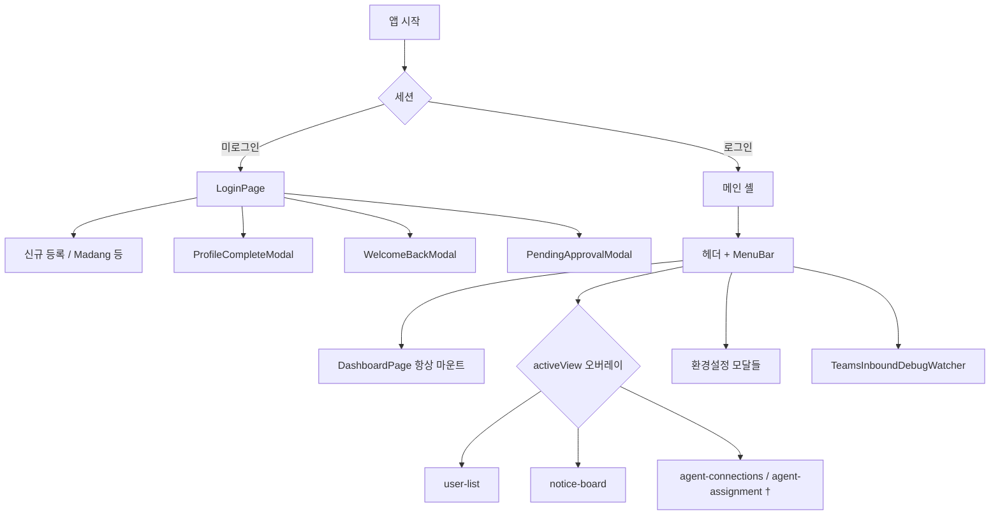
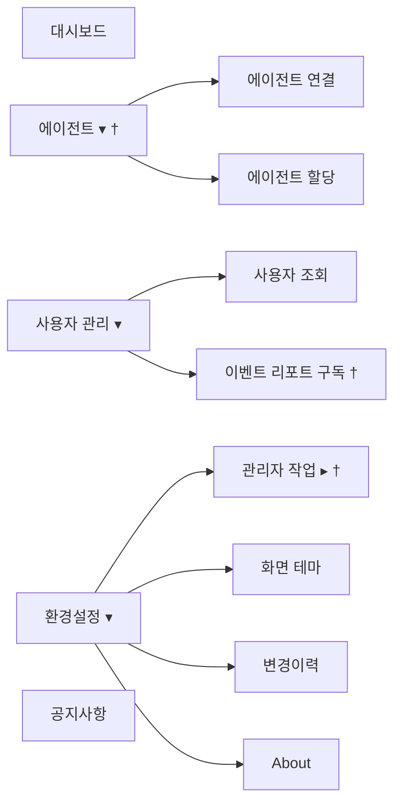

# AX 인프라 운영 콘솔 — 프론트엔드 화면

React SPA. 라우터 없이 `App.tsx`의 `activeView`로 화면을 전환합니다.  
백엔드 계약·mock 제한은 [BACKEND_AGENT_INTERFACE.md](BACKEND_AGENT_INTERFACE.md), [MOCK_RUNTIME.md](MOCK_RUNTIME.md)를 참고하세요.

---

## 1. 전체 흐름



† 관리자 전용. 비관리자 접근 시 `dashboard`로 리다이렉트.

---

## 2. 메인 레이아웃 (로그인 후)

```
┌─────────────────────────────────────────────────────────────────┐
│ 헤더: AX 인프라 운영 콘솔                                        │
│      에이전트 노드와 오른쪽 대화형 터미널로 멀티 에이전트를 관리…   │
├─────────────────────────────────────────────────────────────────┤
│ MenuBar                                                         │
├─────────────────────────────────────────────────────────────────┤
│ DashboardPage (기본 콘솔)  +  activeView 오버레이 페이지         │
└─────────────────────────────────────────────────────────────────┘
│ TeamsInboundDebugWatcher (조건부)                                │
```

| Provider | 파일 | 역할 |
|----------|------|------|
| `ThemeProvider` | `main.tsx` | 다크/라이트 (`localStorage`) |

`TopologyProvider` / StatusBar는 **없음**.

---

## 3. 화면(`AppView`) 목록

`frontend/src/types/navigation.ts`

| `activeView` | 화면 | 컴포넌트 | 권한 |
|---|---|---|---|
| `dashboard` | 메인 콘솔 | `DashboardPage` | 전체 |
| `user-list` | 사용자 조회 | `UserListPage` | 전체 |
| `notice-board` | 공지사항 | `NoticeBoardPage` | 전체 |
| `agent-connections` | 에이전트 연결 목록 | `AgentConnectionListPage` | 관리자 |
| `agent-assignment` | 에이전트 할당 | `AgentAssignmentPage` | 관리자 |

제거됨(문서·코드에 없음): `agent-list`, `inventory-csv`, `token-management`, `job-list`, `job-create`.

---

## 4. 대시보드 패널

```
┌─ 좌측 영역 ─────────────────────────┬─ 우측 ────────────────┐
│ AgentNodeListPanel │ JobNotesPanel  │ IntegratedChatPanel  │
│ 에이전트 노드 목록  │ 작업 노트       │ 대화형 터미널         │
├────────────────────┴────────────────┤  [대화창|작업접수]    │
│ DetailInfoPanel (상세 정보, 접기 가능)│                      │
└─────────────────────────────────────┴──────────────────────┘
```

전체화면(`전체화면`/`원복`): 좌측 숨김, 채팅만 표시. 패널 너비는 드래그 리사이즈.

| 패널 | 파일 | 라벨 |
|------|------|------|
| 에이전트 목록 | `AgentNodeListPanel` → `AgentGrid`/`AgentTile` | 에이전트 노드 목록 |
| 작업 노트 | `JobNotesPanel` | 작업 노트 |
| 상세 | `DetailInfoPanel` | 상세 정보 |
| 채팅 | `IntegratedChatPanel` | 대화형 터미널 |

**AgentTile:** 할당 에이전트만 (`user.agent_ids`). 이름·역할·연결/동작 상태. MCP·토큰 수 미표시.

### JobNotesPanel 탭

| id | 라벨 | 컴포넌트 |
|----|------|----------|
| `review` | 작업 검토 | `JobReviewTab` |
| `my-review` | 나의 검토작업 | `MyJobReviewTab` |
| `my-results` | 나의 작업결과 | `MyJobResultsTab` |
| `whatap-report` | Whatap 이벤트 리포트 | `WhatapEventReportTab` |
| `rejected-jobs` | 반려된 작업 | `RejectedJobsTab` |
| `infra-shape` | 인프라 형상 | `InfraShapeTab` |
| `my-notes` | 나의 노트 | `MyNotesTab` |

### DetailInfoPanel 탭

| id | 라벨 | 내용 |
|----|------|------|
| `workflow` | 작업 진행 | `JobWorkflowPanel` (`/api/jobs/workflow`, 10초 폴링) |
| `whatap` | Whatap 이벤트 감지 | `AgentLogsPanel` (Whatap 소스) |
| `logs` | 대화로그 | `AgentLogsPanel` (그 외) |
| `job-mgmt` | 작업 관리 † | 관리자만, 본문 TBD |

### IntegratedChatPanel

| 탭 | 라벨 | 내용 |
|----|------|------|
| `chat` | 대화창 | SSE 채팅 (`POST /api/agents/{id}/chat`) |
| `job-intake` | 작업접수 | `JobIntakePanel` |

채팅 대상: `chat_enabled` 이고 사용자에게 할당된 에이전트.  
과금 확인이 필요하면 `OpenAiBillingConfirmDialog`. 세션 초기화로 `session_id` 재발급.

### 인프라 형상 · AI갭분석

진입: 작업 노트 → **인프라 형상** (`InfraShapeTab`).

- 인프라 목록 / 요약 / **형상 추이**
- **AI갭분석** → `POST /api/infra-gap-analysis/invoke` → 성공 시 **나의 노트**로 복사 가능
- 클러스터 설정(관리자): 환경설정 → 관리자 작업 → **인프라 구성** (`K8sInfraConfigModal`)

---

## 5. MenuBar



**관리자 작업:** postman · (목업)LLM 변경(`runtime_mode`가 mock/local일 때만) · Whatap 이벤트 테스트 · 인프라 구성 · 메일 서버 설정 · 테스트 메일 발송 · 테이블 조회(디버깅)

**우측:** 시각 · 세션 남은 시간(≤5분 연장) · 사용자명(`ProfileEditModal`) · 로그아웃

상단 **작업관리 ▾** 메뉴는 없음(작업은 작업 노트·작업접수·상세 작업 진행에서 처리).

---

## 6. 에이전트 연결 (`agent-connections`)

- 페이지: `agentruntime/AgentConnectionListPage` — **에이전트 연결 목록** (`agentruntime` 테이블)
- API: `/api/agentruntime` CRUD
- 유형: 목업(0) / 외부연동(1). 기본값은 `/api/health`의 `runtime_mode` (`http`→1)
- 폼: `AgentConnectionFormModal` (추가·수정·복제·삭제)

**에이전트 할당:** `users/AgentAssignmentPage` — agentruntime 목록을 사용자에 드래그 할당.

대시보드 타일은 `/api/agents`(상태), 연결 관리 오버레이는 `/api/agentruntime`.

---

## 7. 모달·오버레이

| 트리거 | 모달 |
|--------|------|
| 화면 테마 / 변경이력 / About | `ThemeSettingsModal`, `ReleaseNotesModal`, `AboutModal` |
| 관리자 작업 | `PostmanDebugModal`, `MockLlmSelectModal`, `WhatapEventTestModal`, `K8sInfraConfigModal`, `MailServerConfigModal`, `MailTestModal`, `TableDebugModal` |
| 사용자 관리 | `EventReportSubscriptionModal` † |
| 사용자명 / 로그아웃 | `ProfileEditModal`, `ConfirmDialog` |
| 로그인 | `RegisterUserModal`, `MadangRegisterModal`, `AdminBypassPasskeyModal`, `PendingApprovalModal`, `ProfileCompleteModal`, `WelcomeBackModal` |
| 채팅 | `OpenAiBillingConfirmDialog` |
| 전역 | `TeamsInboundDebugWatcher` |

페이지 내: `UserFormModal`, `NoticeFormModal`, `AgentConnectionFormModal` 등.

제거됨: Inventory/Job/Signup 알림 카드, InventoryApproval(HITL), InfraCollect/TestJobSend, Topology, PromptDebug.

---

## 8. 로그인 (`LoginPage`)

- 아이디 / 패스워드 → `POST /api/auth/login`
- **신규 등록** (provider `registration_enabled`)
- Madang: 관리자 로그인·bypass, 최초 등록 모달
- `profile_required` → 프로필 완성 → `welcome_back` → WelcomeBack(당일 숨김 가능) → 대시보드
- 401: `installAuthFetchInterceptor`가 세션 클리어

---

## 9. 데이터 갱신

| 영역 | 주기 | API |
|------|------|-----|
| 에이전트·사용자 | 15초 | `/api/agents`, 사용자 관련 |
| 작업 진행 | 10초 | `/api/jobs/workflow` |
| 세션 | 15초 | 로컬 세션 + `/api/auth/me` (부트) |
| Teams 디버그 | 3초 | `/api/debug/teams-power-automate/pending` |

`HealthInfo.runtime_capabilities`는 타입에만 있고 UI 게이팅에는 **미사용**. `runtime_mode`만 목업 LLM 메뉴·연결 유형 기본값에 사용.

---

## 10. 권한 요약

| 기능 | 일반 | 관리자 |
|------|:----:|:------:|
| 대시보드·대화형 터미널 (할당 에이전트) | O | O |
| 작업 노트·작업접수·작업 진행 | O | O |
| 사용자 조회·공지 | O | O |
| 에이전트 연결·할당 | — | O |
| 관리자 작업·상세「작업 관리」탭 | — | O |
| 이벤트 리포트 구독 메뉴 | — | O |

---

## 11. 주요 경로

```
frontend/src/
├── App.tsx / main.tsx
├── types/navigation.ts
├── components/
│   ├── MenuBar.tsx · LoginPage.tsx · DashboardPage.tsx
│   ├── AgentNodeListPanel.tsx · AgentGrid.tsx · AgentTile.tsx
│   ├── JobNotesPanel.tsx · DetailInfoPanel.tsx · IntegratedChatPanel.tsx
│   ├── JobIntakePanel.tsx · JobWorkflowPanel.tsx
│   ├── jobs/          # 검토·결과·형상·노트 등
│   ├── agentruntime/  # 에이전트 연결
│   ├── users/ · notices/ · admin/
└── hooks/useAgentChat.ts   # 현재 미사용(채팅은 IntegratedChatPanel 인라인 SSE)
```
