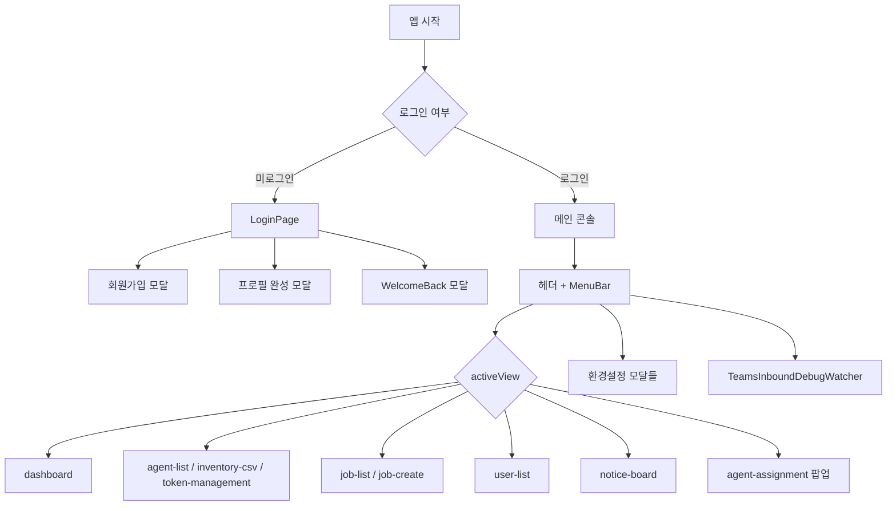
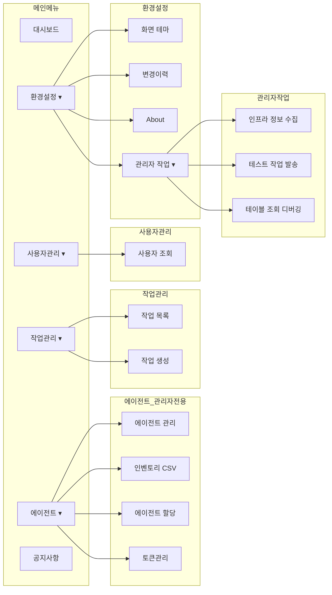

# AX 인프라 운영 콘솔 — 프론트엔드 화면 구성

React SPA 기반 프론트엔드의 화면 구조·네비게이션·모달·권한을 정리한 문서입니다.

라우터 없이 `App.tsx`의 `activeView` 상태로 화면을 전환하는 **단일 페이지(SPA)** 구조입니다.

---

## 1. 전체 흐름



---

## 2. 메인 레이아웃 (로그인 후)

```
┌─────────────────────────────────────────────────────────────────┐
│ 헤더: "AX 인프라 운영 콘솔" + 설명                                │
├─────────────────────────────────────────────────────────────────┤
│ MenuBar                                                         │
│ [대시보드] [에이전트▾] [작업관리▾] [사용자관리▾] [환경설정▾] [공지사항] │
│                                    시각 | 사용자명 | 로그아웃    │
├─────────────────────────────────────────────────────────────────┤
│                                                                 │
│  ← activeView에 따라 아래 본문 영역 교체 →                        │
│                                                                 │
└─────────────────────────────────────────────────────────────────┘
│ TeamsInboundDebugWatcher (전역 오버레이, 조건부)                  │
└─────────────────────────────────────────────────────────────────┘
```

**공통 Provider**

| Provider | 파일 | 역할 |
|----------|------|------|
| `ThemeProvider` | `main.tsx` | 다크/라이트 테마 (`localStorage`) |
| `TopologyProvider` | `context/TopologyContext.tsx` | 토폴로지 맵·채팅 연동용 컨텍스트 |

---

## 3. 화면(View) 목록

| `activeView` | 화면 | 컴포넌트 | 접근 권한 |
|---|---|---|---|
| `dashboard` | 대시보드 (기본) | `DashboardPage` | 전체 |
| `agent-list` | 에이전트 관리 | `AgentListPage` | 관리자 |
| `inventory-csv` | 인벤토리 CSV | `InventoryCsvPage` | 관리자 |
| `token-management` | 토큰 관리 | `TokenManagementPage` | 관리자 |
| `agent-assignment` | 에이전트 할당 | `AgentAssignmentPage` | 관리자 (팝업) |
| `job-list` | 작업 목록 | `JobListPage` | 전체 |
| `job-create` | 작업 생성 | `JobCreatePage` | 전체 |
| `user-list` | 사용자 조회 | `UserListPage` | 전체 |
| `notice-board` | 공지사항 | `NoticeBoardPage` | 전체 |

> 관리자 전용 화면에 일반 사용자가 접근하면 자동으로 `dashboard`로 리다이렉트됩니다.

---

## 4. 대시보드 (`dashboard`) 상세

```
┌──────────────────────────────────────────────────────────────────────────┐
│ StatusBar: API | LLM | Runtime(mock/sandbox) | MCP Kubernetes | ...      │
├────────────────────────────────────┬─────────────────────────────────────┤
│ 좌측 (전체화면 OFF 시)              │ 우측: IntegratedChatPanel (고정)     │
│                                    │                                     │
│ ┌────────────────────────────────┐ │ ┌─────────────────────────────────┐ │
│ │ AgentNodeListPanel             │ │ │ 헤더: 통합 채팅 + 전체화면 토글   │ │
│ │  └ AgentGrid                   │ │ ├─────────────────────────────────┤ │
│ │     └ AgentTile × N            │ │ │ 알림: 작업/가입 승인 카드         │ │
│ │        (할당된 에이전트 타일)    │ │ ├─────────────────────────────────┤ │
│ └────────────────────────────────┘ │ │ 대화창 (SSE 스트리밍)             │ │
│                                    │ │  - 사용자/어시스턴트 메시지       │ │
│ ┌────────────────────────────────┐ │ │  - 인벤토리 승인 카드 (HITL)      │ │
│ │ DetailInfoPanel (탭, 높이 조절)  │ │ ├─────────────────────────────────┤ │
│ │ [Topology][로그][검토][보류]   │ │ │ 에이전트 선택 + 입력창            │ │
│ │ [완료][디버깅†]                 │ │ └─────────────────────────────────┘ │
│ │  †관리자만                      │ │                                     │
│ └────────────────────────────────┘ │                                     │
└────────────────────────────────────┴─────────────────────────────────────┘
```

**전체화면 모드:** 통합 채팅만 표시, 좌측 에이전트 그리드·상세 패널 숨김

### DetailInfoPanel 탭

| 탭 | 내용 | 컴포넌트 |
|---|---|---|
| Topology 맵 | 에이전트·LLM·MCP 관계도 | `TopologyMap` |
| 로그 | 에이전트 로그 | `AgentLogsPanel` |
| 검토 작업 | 승인 대기 작업 | `JobWorkPanel` |
| 보류 작업 | 보류 상태 작업 | `JobWorkPanel` |
| 완료 작업 | 완료된 작업 | `JobWorkPanel` |
| 디버깅 (관리자) | 프롬프트 디버그 | `PromptDebugPanel` |

### AgentTile 표시 정보

- 에이전트명, 역할, MCP 서버
- 연결 상태 (`connected` / `ready` / `mock` 등)
- 동작 상태 (`idle` / `working` / `error`)
- 누적 입력·출력 토큰

---

## 5. MenuBar 메뉴 구조



**MenuBar 우측**

- 현재 시각
- 사용자명 클릭 → `ProfileEditModal`
- 로그아웃 → 확인 다이얼로그

---

## 6. 모달·오버레이 목록

| 트리거 | 모달 | 용도 |
|---|---|---|
| MenuBar → 화면 테마 | `ThemeSettingsModal` | 다크/라이트 테마 선택 |
| MenuBar → About | `AboutModal` | 앱 정보 |
| MenuBar → 변경이력 | `ReleaseNotesModal` | 릴리스 노트 |
| MenuBar → 관리자 작업 | `InfraCollectModal` | K8s 인프라 수집 |
| MenuBar → 관리자 작업 | `TestJobSendModal` | 테스트 작업 발송 |
| MenuBar → 관리자 작업 | `TableDebugModal` | DB 테이블 디버깅 |
| MenuBar → 사용자명 | `ProfileEditModal` | 개인정보 수정 |
| MenuBar → 로그아웃 | `ConfirmDialog` | 로그아웃 확인 |
| 에이전트 할당 메뉴 | `AgentAssignmentPage` | 사용자↔에이전트 드래그 할당 |
| 로그인 화면 | `RegisterUserModal` | 회원가입 |
| 로그인 화면 | `ProfileCompleteModal` | 최초 프로필 입력 |
| 로그인 화면 | `WelcomeBackModal` | 재방문 환영·승인 작업 요약 |
| 채팅 중 | `InventoryApprovalCard` | 인벤토리 조회 승인 (HITL) |
| 채팅 패널 | `JobNotificationCard` | 작업 알림 (검토/승인/반려) |
| 채팅 패널 | `SignupNotificationCard` | 가입 승인 알림 |
| 전역 | `TeamsInboundDebugWatcher` | Teams webhook 디버그 팝업 |

### 서브 페이지 내 모달

| 페이지 | 모달 |
|---|---|
| `AgentListPage` | `AgentFormModal` |
| `InventoryCsvPage` | `InventoryFormModal` |
| `JobListPage` | `JobDetailModal` |
| `UserListPage` | `UserFormModal`, `RegisterUserModal` |
| `NoticeBoardPage` | `NoticeFormModal` |

---

## 7. 로그인 화면 (`LoginPage`)

```
┌─────────────────────────────┐
│   AX 인프라 운영 콘솔        │
│   로그인 폼 (ID/비밀번호)    │
│   [로그인] [회원가입]        │
└─────────────────────────────┘
         ↓ 로그인 성공
   profile_required → ProfileCompleteModal
   welcome_back     → WelcomeBackModal
   그 외            → dashboard
```

---

## 8. 데이터 갱신 주기

| 영역 | 주기 | API |
|---|---|---|
| 대시보드 에이전트/헬스 | 15초 | `/api/agents`, `/api/health` |
| 작업/가입 알림 | 10초 | `/api/jobs/notifications`, `/api/signup/notifications` |
| 세션 유효성 | 15초 | `localStorage` 세션 체크 |

---

## 9. 컴포넌트 파일 구조

```
frontend/src/
├── App.tsx                    # 루트: 뷰 라우팅·인증
├── main.tsx                   # ThemeProvider 래핑
├── components/
│   ├── LoginPage.tsx          # 로그인
│   ├── MenuBar.tsx            # 상단 메뉴
│   ├── StatusBar.tsx          # 연결 상태 바
│   ├── DashboardPage.tsx      # 대시보드 레이아웃
│   ├── AgentGrid.tsx          # 에이전트 타일 그리드
│   ├── AgentTile.tsx          # 개별 에이전트 카드
│   ├── AgentNodeListPanel.tsx # 에이전트 목록 패널
│   ├── DetailInfoPanel.tsx    # 하단 탭 패널
│   ├── IntegratedChatPanel.tsx# 통합 채팅 (우측 고정)
│   ├── TopologyMap.tsx        # 토폴로지 맵
│   ├── agents/                # 에이전트 관리 페이지
│   ├── jobs/                  # 작업 관리 페이지
│   ├── users/                 # 사용자 관리 페이지
│   ├── notices/               # 공지사항 페이지
│   └── admin/                 # 관리자 도구 모달
├── context/
│   ├── ThemeContext.tsx       # 테마 상태
│   └── TopologyContext.tsx    # 토폴로지 하이라이트
└── types/
    ├── navigation.ts          # AppView 정의
    ├── agent.ts               # AgentInfo, HealthInfo
    └── auth.ts                # AuthUser
```

---

## 10. 권한별 화면 요약

| 기능 | 일반 사용자 | 관리자 |
|---|---|---|
| 대시보드·통합 채팅 | O (할당 에이전트만) | O (전체) |
| 작업 목록/생성 | O | O |
| 사용자 조회 | O | O |
| 공지사항 | O | O |
| 에이전트/인벤토리/토큰/할당 | X | O |
| 디버깅 탭·관리자 작업 | X | O |
| 가입 승인 알림 | X | O |
